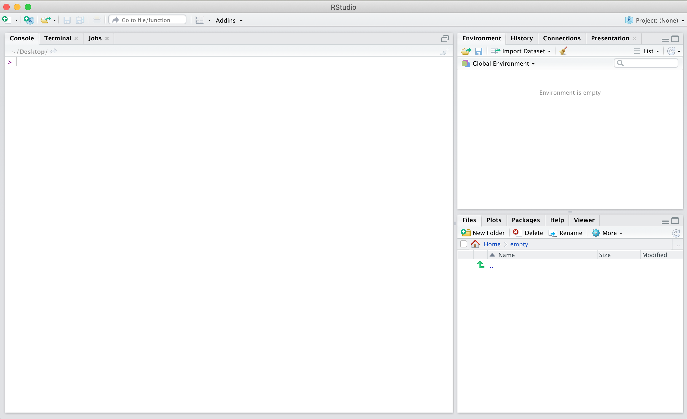
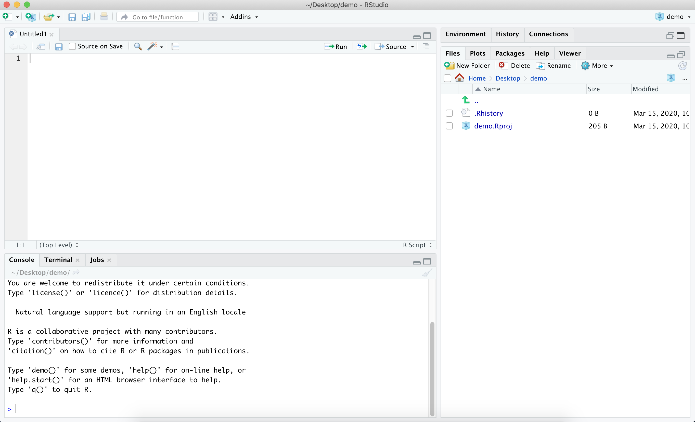
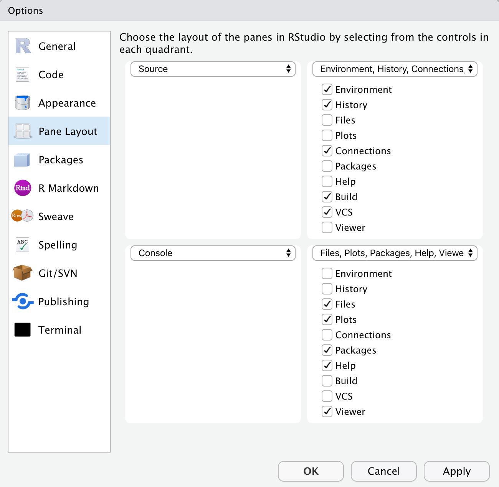
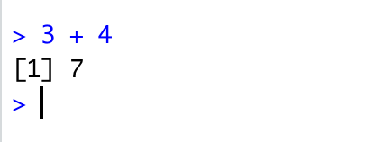

# Getting Started with R and RStudio {#c05}

In this chapter, and the following chapter (on [Foundational Skills](#c06)), and each of the walkthrough chapters, we include a broad overview of the topics emphasized and the functions introduced in the chapter. 

## Topics Emphasized

For all of the topics emphasized sections (like this one), we indicate topics that are unique to each chapter. Especially for the walkthrough chapters, there is a great deal of overlap between chapters in what is emphasized. For example, visualizing data is regularly used as a part of carrying out a data science project in education. Therefore, consider these topics emphasized to be the *particular* focus of the chapters they reference.

- Installing R, RStudio, and R packages

## Functions Introduced

For the "functions introduced" sections, you will notice that some look a little bit different than others. For example, `devtools::install_github()` is different than `install.packages()`. 

The reason is that the `install_github()` function comes from a specific *package* (which we'll discuss in great depth in this and the following chapter). If you had a hunch that this function comes from the `devtools` package, then you'd be correct. The `::` symbols (described more in [Chapter 6](#c06)) mean that a specific function comes from a particular package, something that we wanted to point out so that you will know which package you will need to use if you want to use the function. Not sure what some of these terms mean quite yet? Read on in this chapter to learn more about installing and using packages!

- `install.packages()`
- `devtools::install_github()`
- `library()`
- `print()`
- `readr::read_csv()`
- `here::here()`
- `swirl::swirl()`
- `swirl::install_course()`

## Chapter Overview

This chapter is designed to help you to get started using R and RStudio, assuming no prior use of either. 

We will be covering the following topics in this chapter: 

- Downloading R and RStudio
- RStudio layout and customization
- Writing and running code in RStudio
- Installing the {dataedu} package
- Exploring R with the {swirl} package

*If* you already have experience using R and RStudio, you may find some of the contents of this chapter to be a refresher---or as a chance to learn a few new things about setting up and using them. If you are looking to get started with the very basics of data loading and manipulation using the {tidyverse} [@wickham2019] right now, consider reading this chapter quickly and then starting [Chapter 6](#c06), which covers foundational skills.

## Downloading R and RStudio

First, you will need to download the latest versions of R [@rcoreteam] and RStudio [@rstudio]. 
R is a free environment for statistical computing and graphics using the programming language R. 
RStudio is a set of integrated tools that allow for a more user-friendly experience for using R.

Although you will likely use RStudio as your main console and editor, _you must first install R_ as RStudio uses R behind the scenes. Both R and RStudio are freely available, cross-platform, and open-source.

### To Download R:

- Visit [CRAN](https://cran.r-project.org/) (https:[]()//cran.r-project.org/) to download R 
- Find your operating system (Mac, Windows, or Linux)
- Select the "latest release" on the page for your operating system
- Download and install the application

Don't worry; you will not mess anything up if you download (or even install!) the wrong file. Once you've installed R, you can get started.

### To Download RStudio:

- Visit [RStudio's website](https://www.rstudio.com/products/rstudio/download/) (https[]()://www.rstudio.com/products/rstudio/download/) to download RStudio
- Under the column called "RStudio Desktop FREE", click "Download"
- Find your operating system (Mac, Windows, or Linux)
- Select the "latest release" on the page for your operating system 
- Download and install the application

If you do have issues, consider [the Data Carpentry page](https://datacarpentry.org/R-ecology-lesson/) (https[]()://datacarpentry.org/R-ecology-lesson/) and then reach out for help. Another excellent place to get help is the [RStudio Community forums](https://community.rstudio.com/) (https[]()://community.rstudio.com/).

## RStudio Layout and Customization: Getting to Know R through RStudio

Now that we've installed both R and RStudio, we will be accessing R _through_ RStudio. 
One of the most reliable ways to tell if you're opening R or RStudio is to look at the icons: 

```{r fig5-1, fig.cap = "Icons", echo = FALSE, fig.alt="R Icon and RStudio Icon"}
knitr::include_graphics("./man/figures/Figure 5.1.png")
```

Whenever we want to work with R, we'll open RStudio. RStudio interfaces directly with R, and is an **I**ntegrated **D**evelopment **E**nvironment (IDE). This means that RStudio comes with built-in features that make using R a little easier. If you'd like more information on the difference between R and RStudio, we recommend the "Getting Started" section of the _[Modern Dive](https://moderndive.com/1-getting-started.html#)_ (https[]()://moderndive.com/1-getting-started.html#) textbook [@statisticalinf].

You do not _have_ to use RStudio to access R, and many people don't! 

Other IDEs that work with R include:

- [Jupyter notebook](https://jupyter.org/) (https[]()://jupyter.org/)
- [VisualStudio](https://visualstudio.microsoft.com/services/visual-studio-online/) (https[]()://visualstudio.microsoft.com/services/visual-studio-online/)
- [VIM](https://github.com/jalvesaq/Nvim-R) (https[]()://github.com/jalvesaq/Nvim-R)
- [IntelliJ IDEA](https://plugins.jetbrains.com/plugin/6632-r-language-for-intellij) (https[]()://plugins.jetbrains.com/plugin/6632-r-language-for-intellij)
- [EMACS Speaks Statistics (ESS)](https://ess.r-project.org/) (https[]()://ess.r-project.org/)

This is a non-exhaustive list, and most of these options require a good deal of familiarity with a given IDE.
We bring up alternative IDEs---particularly ESS---because RStudio, as of this writing, is not fully accessible for learners who utilize screen readers. We have chosen to use RStudio in this text in order to standardize the experience, but we encourage you to choose the IDE that best suits your needs!

### RStudio Layout 

When we open RStudio for the first time, we should see something similar to this:

```{r fig5-2, fig.cap = "RStudio Layout", echo = FALSE, fig.alt="Default RStudio layout", fig.alt="RStudio Default Layout with console, environment, and files"}

```

We'll refer to these three "panes" as the "Console pane", the "Environment pane", and the "Files pane". 
The large square on the left is the Console pane, the square in the top right is the Environment pane, and the square in the bottom right is the Files pane.  

As you work with R more, you'll find yourself using the tabs within each of the panes.

When we create a new file, such as an R script, an R Markdown file, or a Shiny app, RStudio will open a fourth pane, known as the "source pane". The source pane should show up as a square in the top left. We can open up an `.R` script in the source pane by going to "File", selecting "New File", and then selecting "R Script":

```{r fig5-3, fig.cap = "Creating a New R Script in RStudio", echo = FALSE, fig.alt="Creating a New Script in RStudio by going to file then R script"}
knitr::include_graphics("./man/figures/Figure 5.3.png")
```

You do not need to do anything specific with this file, but we encourage you to experiment with it if you would like!  

### Customizing RStudio  

One of the balances we've tried to strike in this text is a balance between best practices in your _workflow_ (how you'll use R in your projects) and your _R code_. A best practice for your _workflow_ is to ensure that you're starting with a blank slate every time you open R (through RStudio).  
To accomplish this, go to "Tools", and select "Global Options" from the dropdown menu.

```{r fig5-4, fig.cap = "Selecting Global Options from the Tool Dropdown Menu", echo = FALSE, fig.alt="Selecting Global Options from the Tool Dropdown Menu"}
knitr::include_graphics("./man/figures/Figure 5.4.png")
```

The "General" tab will open, with several checkboxes selected and unselected. The most important thing you can do is select "Never" next to the "Save workspace to .RData on exit:" prompt. After selecting "Never", go through and check and uncheck boxes so that your General tab looks like this: 

```{r fig5-5, fig.cap = "General Tab from Global Options", echo = FALSE, fig.alt="General tab from the Global Options in RStudio"}
knitr::include_graphics("./man/figures/Figure 5.5.png")
```

Last, but certainly not least, click on the "Appearance" tab from within Global Options. From here you can select your RStudio Font, Font Size, and Theme. Go through the options and select an appearance that works best for you, and know that you can _always_ come back and change it!
    
### Minimized and Missing Panes

If, at any point, you find that one of your panes seems to have "disappeared", one of two things has likely happened: 

- A pane has been minimized
- A pane has been closed

Let's look at the Environment pane as an example.
If the Environment pane has been minimized, we'll see something like this:  

```{r fig5-6, fig.cap = "RStudio Layout with the Environment Pane Minimized", fig.alt = "RStudio layout with a minimized Environment Pane", echo = FALSE}

```

We know that the Environment pane has been minimized because although we can see the pane headers in the top right, we can't see the information _within_ the Environment pane. To fix this, we can click on the icon of two squares in the top right of the Environment pane. If you click on the icon of the large square in the top right of the Environment pane, you'll maximize the Environment pane and minimize the Files pane. We do not want to do this, since we would prefer to see all the panes at once.

If the Environment pane has somehow been closed, you can recover it by going to the "View" menu, selecting "Panes", and then selecting "Pane Layout", like so: 

```{r fig5-7, fig.cap = "Accessing the Pane Layout from the View Dropdown Menu", fig.alt = "Accessing the Pane Layout from the View Dropdown Menu", echo = FALSE}
knitr::include_graphics("./man/figures/Figure 5.7.png")
```

When we select Pane Layout, we'll see this: 

```{r fig5-8, fig.cap = "Pane Layout Options within RStudio", echo = FALSE, fig.alt = "Pane Layout Options within RStudio"}

```

From here, you can select which tabs you'd like to appear within each pane, and you can even change where each pane appears within RStudio. If our Environment Pane had been closed, we would select it from the Pane Layout in order to re-open it within RStudio.

## Writing and Running Code in RStudio

Up to this point, we've been exploring the RStudio interface and setting up our preferences.
Now, we'll shift to some basic coding practices.
In order to run code in R, you need to type your code either in the Console or within an `.R` script. 

We generally recommend creating an `.R` script as you're learning, as it allows you to type all of your code, add comments, and then save your `.R` script for reference. If you work entirely in the Console, anything that you type in the Console will disappear as soon as you restart or close R, and you will not be able to reference it in the future.    

### Writing Code in the Console

To run code in the Console, you type your code next to the `>` and hit `Enter`.  
We'll spend a little time practicing running code in the Console by exploring some basic properties of coding in R.  

In the Console, type `3 + 4` and hit `Enter`. 
You should see the following:  

```{r fig5-9, fig.cap = "Using the Console as a Calculator", echo = FALSE, fig.alt = "Adding 3 and 4 on the console"}

```

We've just used R to add the numbers 3 and 4. 
R has returned the sum of `3 + 4` on a new line, next to `[1]`.
The `[1]` tells us that there is one row of data.

We can also use R to print out text.
Type the following in the Console and hit `Enter`: 

```{r, eval = FALSE}
print("I am learning R")
```

We should see this in the Console:

```{r fig5-10, fig.cap = "Printing Text to the Console", fig.alt = "Printing I am learning R on the console", echo = FALSE}
knitr::include_graphics("./man/figures/Figure 5.10.png")
```

There's one error that you're likely going to come across, both when running code in the Console as well as in an R script. 
Let's explore that error now by running the following code in the Console and hitting `Enter`: 

```{r, eval = FALSE}
print("This is going to cause a problem"
```

Make sure that you left off the closing parenthesis! 
What you'll see in the Console is: 

```{r fig5-11, fig.cap = "Incomplete Parentheses Change What R Expects Next", echo = FALSE, fig.alt="Printing this is going to cause a problem with the last parantheses missing"}
knitr::include_graphics("./man/figures/Figure 5.11.png")
```

When we're missing a closing parenthesis, R is expecting us to provide more code.
We know this because instead of seeing a carat `>` in our Console, we see a `+`, and R has not returned the print statement that we were expecting! 
There are two ways to fix this problem: 

- Type the closing `)` in the Console and hit `Enter`
- Hit the `Esc` key

Go ahead and run this intentional error, and try each of the options above.
Compare the output of each, and think about how they're different.
Can you think of when you might want to use one option instead of the other? 

### Writing Code in an R Script

There are three main ways to run code in an `.R` script:  
- Highlight the line(s) of code you'd like to run and press `Ctrl` + `Enter`  
- Highlight the line(s) of code you'd like to run and click the "Run" button in the `R script` pane  
- To run _every_ line of code in your file you can press `Ctrl` + `Shift` + `Enter`

Create a new `.R` script, or open the one you created earlier in this chapter. Next, type in the following code and run it using each of the options listed above.

```{r eval = FALSE}
print("We're going to use R as a calculator.")
print("First up, addition!")
12 + 8
632 + 41
print("Next, subtraction!")
48 - 6
0.65 - 1.42
```

Feel free to spend some more time writing and running code within your `.R` script, or move on to the next section, where we'll add comments to our code.  

### Commenting Your Code in R

It is considered good practice to comment your code when working in an `.R` script. 
Even if you are the only person to ever work on your code, it can be helpful to write yourself notes about what you were trying to do with a specific piece of code. 
Moreover, writing comments in your code as you work through the examples in this book is a great way to help reinforce what you're learning.
Comments are ignored by R when running a script, so they will not affect your code or analysis. 

To comment out a line of code, you can place a pound sign (also called an octothorpe!) `#` in front of the line of code that you want to exclude when you're running your script.
Be careful when excluding certain lines of code, especially in longer files, as it can be easy to forget where you've commented out code. 
It is often better to simply start a new section of code to tinker with until you get it working as expected, rather than commenting out individual lines of code.

We can also write comments in line with our code, like this: 

```{r eval = FALSE}
#' this will be a short code example.
#' you are not expected to know what this does,
#' nor do you need to try running it on your computer.
library(readr)  # load the readr package
library(here)  # load the here package
data <- read_csv(here("file_path", "file_name.csv"))  # save file_name.csv as data
```


If you think you'll be writing more than one line of comments, you can do a pound sign followed by a single quotation mark (`#'`). 
This will continue to comment out lines of text or code each time you hit `Enter`.
You can delete the `#'` on a new line where you want to write code for R to run.
This method is useful when you're writing a long description of what you're doing in R.

_Note: when we refer to "commenting" we're referring to adding in actual text comments, whereas "commenting out" refers to using the pound sign (octothorpe) in front of a line of code so that R ignores it._
_We will also use the phrase "uncomment code", which means you should delete (or omit when typing out) the_ `#` _or_ `#'` _in an example._
    
## Installing the {dataedu} Package 

This next section will briefly go over installing the {dataedu} package that's used throughout this book. We created this package to provide our readers with an opportunity to jump into R however they see fit.

The package serves four main functions:

1. Mass installation of all the packages used in the book
2. Reproducible code for the walkthroughs
3. Access to the data used in each of the walkthroughs  
4. The "dataedu" theme and color palette for reuse

If you feel that you need more information before you're ready to install the package, you can skip this section. Rest assured that we'll cover packages, their installation, and how to load them into R in more depth in [Chapter 6](#c06).
However, if you're feeling a bit adventurous, go ahead and give it a shot by running the code below.

> **Note:** After the publication of this book, we realized using {devtools} to install {dataedu} could create a lot of conflict with readers' existing packages We updated the code to require only the package {remotes} contained within {devtools} so to ease installation. For more info, see the [{dataedu} repository on GitHub](https://github.com/data-edu/dataedu).

```{r, eval = FALSE}
# install {remotes}
install.packages("remotes", repos = "http://cran.us.r-project.org")
# install the {dataedu} package (requires R version 3.6 or higher)
remotes::install_github("data-edu/dataedu")
```

*A special note on {tabulizer}:* 
One of the walkthroughs uses [{tabulizer}](https://github.com/ropensci/tabulizer), created by ROpenSci to read PDFs. 
{tabulizer} requires the installation of [RJava](https://cran.r-project.org/web/packages/rJava/index.html), which can be a tricky process on Mac computers. 
Neither {tabulizer} nor {RJava} are included in `mass_install()` and we recommend reading through the notes on the [{tabulizer} GitHub repository]("https://github.com/ropensci/tabulizer) if you choose to install it.

## Exploring R with the {swirl} Package

If you were able to install the {dataedu} package without any issues or concerns and you're eager to get started exploring everything that R can do, you can supplement your learning through [{swirl}](https://swirlstats.com/students.html) (https[]()://swirlstats.com/students.html).  

You can install {swirl} by running the following code:  
```{r, eval = FALSE}
install.packages("swirl")
```

{swirl} is a set of packages (see more on packages in [Chapter 6](#c06)) that you can download, providing an interactive method for learning R by using R in the RStudio Console.  
Since you've already installed R, RStudio, and the {swirl} package, you can follow the instructions on the {swirl} webpage or run the following code _in your Console pane_ to get started with a beginner-level course in {swirl}:

```{r, eval = FALSE}
library(swirl)
install_course("R_Programming_E")
swirl()
```

There are multiple courses available on {swirl}, and you can access them by installing them and then running the `swirl()` command in your console.
We are not affiliated with {swirl} in any way, nor is {swirl} required to progress through this text, but it's a great resource that we want to make sure is on your radar!  

## Conclusion

Congratulations! At this point in the book, you've installed R and RStudio, explored the RStudio IDE, and even written some basic code. 
At this point, you're set up to either move on to [Chapter 6](#c06), where we'll do a deeper dive into projects, packages, and functions, and how those relate to your future data tasks. We will also introduce help documentation and some skills for when you're working with new or unfamiliar information. 
If that all sounds familiar to you already, you can jump ahead to a walkthrough of your choosing! 
