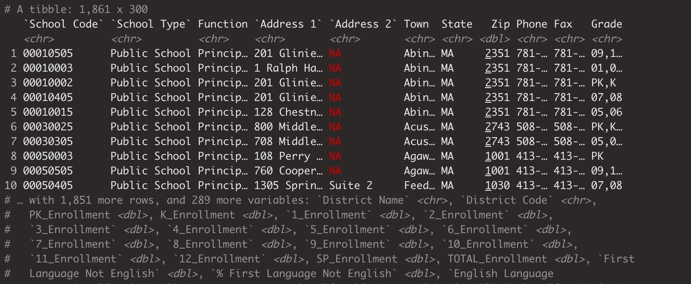

# Foundational Skills {#c06}
No edits in text here. Adding PR to note the following dataedu package issue:
- Tried
 ```{r, eval = FALSE}
# install devtools
install.packages("devtools", repos = "http://cran.us.r-project.org")

# install the dataedu package
devtools::install_github("data-edu/dataedu")
```
However, had to also install RTools, fs, and glue. When installing dataedu, there is a prompt to select for which packages to update that may also need to be included in the installing packages section.

## Chapter Overview

This chapter is designed to give you the skills and knowledge necessary to *get started* in any of the walkthrough chapters. 
Our goal in this chapter is to give you insights into key areas of working with R, help you develop mental models for working with R, and ultimately to get you working with R using the RStudio *I*ntegrated *D*evelopment *E*nvironment (IDE) through a series of introductory applied examples. 
If you have not yet installed R and/or RStudio, please go through the steps outlined in the previous chapter (on getting started with R and RStudio), [Chapter 5](#c05) before beginning this chapter.
Please note that this chapter is not intended to be a full and complete introduction to programming with R, nor for using R for data science. 
There are many excellent resources available which provide this kind of instruction, and we've listed them for you in [Chapter 17](#c17).

We will be covering the following topics in this chapter: 

- The foundational skills framework (understanding projects, functions, packages, and data)
- Using R's help documentation
- Steps for working through new and unfamiliar content
- Getting started with a coding walkthrough

## Foundational Skills Framework
No two data science projects are the same. Even so, we've created a general framework for you to use as a foundation and as a set of concepts to help to to work through the walkthroughs in this book. The four core concepts we will use to build our framework are:

  - **Projects**
  - **Functions**
  - **Packages**
  - **Data**

### Projects

One of the first steps of every workflow should be to set up a **Project** within RStudio. 
A Project is the home for all of the files, images, reports, and code that are used in any given project.
Note that when we capitalize the word **Project**, we're referring to a specific setup within RStudio, while we refer to general projects that you might work on with the lowercase **project**.

We use Projects because they create a self-contained folder for a given analysis in R. 
This means that if you want to share your Project with a colleague, they will not have to reset file paths (or even know anything about file paths!) in order to re-run your analysis.

Furthermore, even if the only person you ever collaborate with is a future version of yourself, using a Project for each of your analyses will mean that you can move the Project folder around on your computer, or even move it to a new computer, and remain confident that the analysis will run in the future (at least in terms of file path structures).

*Setting Up your Project*

Creating a Project is one of the first steps in working on an R-based data science project in RStudio. 
To create a Project you will need to first open RStudio.

From within RStudio, follow these steps:

1. Click on File
1. Select New Project
1. Choose New Directory
1. Click on New Project
1. Enter your Project's name in the box that says "Directory name." We
    recommend choosing a Project name that helps you to remember that this is a
    project that involves data science in education. Avoid using spaces in your
    Project name, and instead separate words with hyphens or underscore
    characters.
1. Choose where to save your Project by clicking on "Browse" next to the box
    labeled "Create project as a subdirectory of: " If you are just using this
    to learn and to test out creating a Project, consider placing it in your
    downloads or another temporary directory so that you remember to remove it
    later.
1. Click "Create Project"

At this point, you should have a Project that will serve as a place to store any `.R` scripts that you create as you work through this text. If you'd like more practice, take a few moments to set up a couple of additional Projects by following the steps listed above. Within each Project, add and save `.R` scripts. Since this is just for practice, feel free to delete these Projects once you have the hang of the procedure.

We should point out that it is not *necessary* to create a Project for your work, although we _strongly_ recommend it. When you utilize Projects in tandem with the {here} package, you will be set up with an easy-to-use workflow. For more on using Projects with the {here} package, read @bryan2017's article, titled [Project-oriented Workflow](https://www.tidyverse.org/blog/2017/12/workflow-vs-script/)(https:[]()//www.tidyverse.org/blog/2017/12/workflow-vs-script/). We will also explain more about the {here} package later in this text. If you choose not to create a Project, you will still be able to navigate the walkthroughs in this text - and even carry out future analyses - relatively easily. However, be aware that at some point you will run into issues with how the files are structured on your computer. 

While we cannot emphasize enough how Projects and the {here} package streamline this process, you can always check where your computer is looking for your `.R` scripts by checking the working directory. To do that, you can run this code: `getwd()`. That code will let you know what file path R is currently pointing towards. If that is not what you wanted, you can then change your working directory manually by running `setwd()` and providing your file path name as an argument. The reason we do not advocate for this `getwd()` and `setwd()` workflow is that if you use it, it becomes impossible for someone on another computer (or you on a future computer) to run your code. The `getwd()` and `setwd()` commands point to a specific location on your own device.

### Functions

A function is a reusable piece of code that allows us to consistently repeat a programming task. Functions in R can be identified by a word followed by a set of parentheses, like so: `word()`.
More often than not, the word is a verb, such as `filter()`, suggesting that we're about to perform an action. Indeed, functions act like verbs: they tell R what to do with our data. 

The word (or set of words) represent the name of the function, and the parentheses are where we can provide arguments to a function, if arguments are needed for the function to run. 
Many functions in R packages do not _require_ arguments, and they will use a set of default arguments unless you provide something different from the default.
There are not any hard and fast rules about when a function needs an argument (or series of arguments). However, if you are having trouble running your code, first check for typos, then check the Help documentation to see if you can provide arguments to more clearly direct R as to what to do.
We'll cover how to access and navigate the Help documentation later in this chapter.

*Writing Your Own Functions*

As you work in R more and more, you may find yourself copying and pasting the same lines of code and then making small modifications. 
This is perfectly fine while you're learning, but eventually you're going to come across a large enough dataset where this approach is going to take a prohibitively large amount of time, not to mention increase the opportunities to accidentally introduce errors. 
This is when you _know_ you need to write a function.

_(We could argue that you need functions **much** sooner! For example, a general premise in programming is DRY, or **D**on't **R**epeat **Y**ourself._
_What this translates to is the idea that once you find yourself copying and pasting code for the third time, it's time to write a function!)_

We'll cover the very basics of writing a function, but we would strongly suggest you check out this [Creating Functions](https://swcarpentry.github.io/r-novice-inflammation/02-func-R/)(https:[]()//swcarpentry.github.io/r-novice-inflammation/02-func-R/) tutorial from [Software Carpentries](https:[]()//software-carpentry.org/)(https://software-carpentry.org/) for more information and practice. 

The template for writing a function is: 

```{r eval = FALSE}
name_of_function <- function(argument_1, argument_2, argument_n){
    code_that_does_something
    code_that_does_something_else
}
```

Functions can be as simple or as complex as you would like.
For example, if we wanted to create a function that adds two numbers together, we would write: 

```{r eval = FALSE}
#' writing our function
#' we've named the function "addition"
#' and asked for two arguments, "number_1" and "number_2"
addition <- function(number_1, number_2) {
    number_1 + number_2
}

#' using our function
#' below are 3 separate examples of utilizing our new function called "addition"
#' note that we provide each argument separated by commas
addition(number_1 = 3, number_2 = 1)

addition(0.921, 12.01)

addition(62, 34)
```

**Challenge Questions**
- For our newly written function "addition," what happens if we only provide one argument?
- What happens if we provide more than two arguments?

### Packages

Packages are shareable collections of R code that can contain functions, data, and/or documentation. 
Packages increase the functionality of R by providing access to additional functions to suit a variety of needs.
While it is entirely possible to do all of your work in R without ever using a package, we do not recommend that approach. There are a wealth of packages available, almost all of which help reduce both the learning curve associated with R and the amount of time spent on any given analytical project. 

*Installing and Loading a package*

**Installing a package**

If you read Chapter 5, you might have noticed at the very end that we installed two packages ({devtools} and {dataedu}), but we didn't talk too much about what we were doing. 
We'll get into more detail on installing and loading packages now!

In order to access the functions within a package, you must first install the package on your computer. There are a collection of R packages hosted on the internet on the CRAN website:  [CRAN](https://cran.r-project.org/)(https:[]()//cran.r-project.org/), the **C**omprehensive **R** **A**rchive **N**etwork. These packages must meet certain quality standards, and they are regularly tested. 

If an R user feels that their package would benefit a broad audience, they may choose to submit their package to CRAN. The process of submitting a package and having it published through CRAN is beyond the scope of this book, but it's important to point out that you - yes, you! - can create a package that you use all for yourself, share with colleagues, or submit to CRAN. Most of the packages we'll be working with in this book are available on CRAN, which means that we can install them using the `install.packages()` function. 

If the package is on CRAN, we can install it by running the following code in the RStudio Console:  

```{r eval = FALSE}
# template for installing a package
install.packages("package_name")

# example of installing a package
install.packages("dplyr")
```

_Note that the name of the package needs to be inside quotation marks when using the `install.packages()` function._  

You can run the `install.packages()` functions within an `.R` script! However if you choose to do this, please make sure to comment out the line(s) of code that install packages after you have installed those packages. Commenting out the install packages commands will save you time in the future, as you will not need to re-install packages each time you run a script.

If you do not want to write code for installing packages, you can also navigate to the Packages tab of the Files pane, click "Install", and then search for and install one or more packages. 

```{r fig6-1, fig.cap = "Image of the Packages pane, which is found in the bottom right corner of the RStudio IDE, along with the Files, Plots, Help, and Viewer panes", echo = FALSE}
knitr::include_graphics("./man/figures/Figure 6.1.png")
```

**Loading a package**

Once a package is installed on your computer, you do not have to re-install it in order to use the functions in the package. However, every time you open RStudio and want to use the package, you will need to load the package into your RStudio environment. In this way, R will know where to look for the functions. We can accomplish loading the package into our R environment using the `library()` function.

> A package is a like a book, a library is like a library; you use library() to check a package out of the library.
> - Hadley Wickham, Chief Scientist, RStudio

Loading a package into our R environment signals to R that we would like to have access to all of the functions available to us in that package. We can load a package, such as the {dplyr} package [@R-dplyr], using the following code:  

```{r eval = FALSE}
# template for loading a package
library(package_name)  

# example of loading a package
library(dplyr)
```

_Note that unlike installing a package, we do not need to put the package name inside quotation marks when we load the package into RStudio using the library() function._  

We only have to install a package once, but to use it, we have to load it each time we start a new R session.

Sometimes you'll see `require()` used instead of `library()`. We strongly advocate for the use of `library()`, as it forces R to load the package. If the package is not installed or if there are issues with the package, RStudio will print out an error message. `require()`, on the other hand, will not give an error if the package is not available or if there are issues with the package. 
Using `library()` will help to eliminate sources of confusion later.  

*How to Find a Package*

As you begin your R learning journey, the bulk of the packages that you will need to use are either already included when you install R, or are available on CRAN. 
[CRAN TaskViews](https://cran.r-project.org/web/views/) (https[]()://cran.r-project.org/web/views/) is one of the best resources for seeing what packages are available and might be relevant to your work.
Other great resources to learn about various R packages are through Twitter (following the #rstats hashtag) as well as through Google searches.
As R has grown in popularity, Google has gotten significantly better at returning R-related results.

*Learning More About a Package*

Sometimes when you look up a package, you're able to identify the function that you need and continue on your way. Other times, you may need (or want!) to learn more about a specific package. Packages on CRAN all come with something called a "vignette," which is a worked example using various functions from within the package. You can access a package's vignette(s) on CRAN TaskViews.


Packages do not need to be submitted to CRAN to be used by the public, and many packages are available directly from their respective developers via GitHub. Package authors may publish vignettes or blog posts about their package, and other R users may _also_ publish tutorials about a specific package. If you find yourself on GitHub looking at information for a package, more often than not, the README file will have good information for getting started with a package. The {dataedu} package we've created is available through GitHub at the time of this publication.

*Installing the {dataedu} package*

In Chapter 5, we provided the following code for installing the {dataedu} package. There are related packages that {dataedu} will install for you when you install the {dataedu} package. If you run into difficulties, a good place to start is reinstalling the package to make sure you have the most updated version.
If you installed the {dataedu} package already, you can skip to the next section. Otherwise, go ahead and run the following code. **Please note that the {dataedu} package requires R version 3.6 or higher to run.**

```{r, eval = FALSE}
# install devtools
install.packages("devtools", repos = "http://cran.us.r-project.org")

# install the dataedu package
devtools::install_github("data-edu/dataedu")

```

Let's take this code apart a bit.
The first function, `install.packages("devtools", repos = "http://cran.us.r-project.org")`, has two arguments, `"devtools"` and `repos = "http://cran.us.r-project.org"`.
The first argument, `"devtools"`, is the name of the package that we want to install.
The second argument, `repos = "http://cran.us.r-project.org"`, tells R the URL of the repository to use. 
For now, all we need to know is that a repository is a place where code can be stored.  
In order for us to load and use the {dataedu} package, we first needed to install the {devtools} package.

The second function, `devtools::install_github("data-edu/dataedu")`, has only one argument, `"data-edu/dataedu"`, but also looks a little different from the first function.
What we're doing here is telling R to go to the {devtools} package to find the `install_github()` function.
The `install_github()` function is telling R to go to a specific repository on GitHub to get the code for the {dataedu} package.
You can also see [the repository for the {dataedu} package on GitHub](https://github.com/data-edu/dataedu)(https:[]()//github.com/data-edu/dataedu) yourself!
We have to take this approach to loading the {dataedu} package because the package is not available on CRAN yet.

*Loading the {dataedu} package*

Now that we've installed the {dataedu} package, we can load it using `library()`.
You can create an `.R` script in your Project to load and explore the {dataedu} package.
We'll load the {dataedu} package by running the following code in an `.R` script: 

```{r}
# loading the dataedu package
library(dataedu)
```

When we work with packages, we _don't_ include the `install.packages()` function in an `.R` script, but we _do_ include any `library()` functions that we use.
This ensures that we know what packages we need to load into our RStudio environment, and signals to anyone else using our code which packages they'll need to use to run our code. 

*Exploring the {dataedu} package*

There are some basic functions in the {dataedu} package that are helpful to know. 

**Installing the packages used throughout this book**

Type and run `dataedu::install_dataedu()` in your Console to install all of the packages used in this book.
If you run into issues, you can follow the prompts that are printed out in the RStudio Console.

If you find that you simply cannot get the packages to install, run the following code in the RStudio Console: `dataedu::dataedu_packages`.

This will print out a list of all the packages we used in the {dataedu} package.
Although this is a monotonous task, you can then install each package individually using `install.packages("package_name")`.

If you still encounter errors, please reach out to us! 
You can file an issue on GitHub, or email us at [datascienceineducation@gmail.com](mailto:datascienceineducation@gmail.com) (datascienceineducation@gmail.com)

**Accessing the datasets used in this book**

All of the datasets are available within the {dataedu} package, as well as through downloadable `.csv` files stored in the `data` folder within [our GitHub repository](https://github.com/data-edu/dataedu)(https:[]()//github.com/data-edu/dataedu).

You can load any of the data files using the following code: `dataedu::dataset_name`. 
We'll practice doing this in a later section of this chapter, but if you want to try it out now, the names of the available datasets are:

- course_data
- course_minutes
- district_merged_df
- district_tidy_df
- longitudinal_data
- ma_data_init
- pre_survey
- sci_mo_processed
- sci_mo_with_text
- tt_tweets

### The Relationship Between Packages and Functions

Packages are a collection of functions, and most packages are designed for a specific data set, a specific field, and/or a specific set of tasks. 
Functions are individual components within a package, and functions are what we use to interact with our data.  

To put it another way, an R user might write a series of functions that they find themselves needing to use repeatedly in a variety of projects. 
Instead of re-writing (or copying and pasting) the functions each time they need to use them, an R user can collect all of these individual functions inside a package. 
The R user can then load the package any time that they want to use the functions, using a single line of code instead of tens to tens of thousands of lines of code.  

### Data

We have **data** that we bring into a Project within RStudio, and you're likely using R because you have some data that you would like to explore.
Throughout this book, you'll see data accessed in a multitude of ways.
Sometimes, we've pulled the data directly from a website, while other times we ask you to load the data from a `.csv` or `.xls` file.
We've also provided each of the datasets used in this book as `.rda` files that are accessible via the {dataedu} package [@R-dataedu].
We've provided additional resources for loading data from Excel, SAV, and Google Sheets in [Appendix A](#c20a).

While it is possible to connect directly to a database from within R, we do not cover those skills in this text. 
For those curious as to how to accomplish this, we recommend starting with the [Databases using R](https://db.rstudio.com/) (https[]()://db.rstudio.com/) resource from RStudio.

## Introduction to Help Documentation

Very few - if any - people in the world know everything there is to know about R. 
This means that we all need to look things up, sometimes every few minutes!
Thankfully, there are some excellent built-in resources that we can leverage as we use R.

From within RStudio, we can access the `Help` documentation by using `?` or `??` in the Console. 
For example, if I wanted to look up information on the `data()` function, I can type `?data` or `?data()` next to the carat `>` in the Console and hit `Enter`. 
Try this now, and you should see the `Help` panel on the bottom right side of your RStudio environment populate with documentation on the `data()` function.

This works because the `data()` function is part of something called **base R** - that is, all of the functions included with R when you first install it. 
R comes with packages like this one pre-installed. However, as you saw in a previous section, we'll be asking you to install additional packages. 
These additional packages extend the functionality of base R and its pre-installed packages by providing us with access to new functions. 
This means that instead of writing a function to do a common data analysis task, such as creating a new variable out of existing variables, you can use a function that someone has written and made available for you to use (almost always at no charge! Don't worry - all of the packages we'll be using in this text are considered **O**pen **S**ource **S**oftware, and you will not have to purchase anything to complete any of the exercises or walkthroughs in this text.)
One of the functions that can accomplish the task of creating a new variable out of existing variables is called `mutate()`. 
What happens when you type `?mutate` (or `?mutate()`) into the Console and hit `Enter`?
We've gotten one of our first error messages!

```{r fig6-2, fig.cap = "Error message when running ?mutate", echo = FALSE}
knitr::include_graphics("./man/figures/Figure 6.2.png")
```

This is a fantastic error message because not only has it told us that something is wrong (there is no documentation for `mutate`), it tells us what we should try to do to solve the error. 
Let's see what happens when we follow the error message instructions by typing `??mutate` (or `??mutate()`) into the Console and hitting `Enter`.

What do you see?

The Help documentation is a great first stop when you've got a question about R. 
The next section will provide you with additional skills for working with new and unfamiliar content!

## Steps for Working Through New and Unfamiliar Content

Great educators have the ability to ask great questions. 
Asking the right questions at the right time of the learners in your classroom can facilitate understanding, uncover misconceptions, and indicate whether or not learners have mastered the material.
However, when you’re learning on your own, you have to simultaneously fill the roles of both learner and educator. This means you must not only know how and when to ask yourself questions, but also answer your questions, evaluate your answers, and redirect your learning path as you progress.
This section is intended to give you a series of steps you can use as you encounter new and unfamiliar content, both in reading this book and in your broader data science learning endeavors.
For this section, we'll use the example of encountering a function for the first time, but you can use these steps with any new piece of information that you encounter!

### Activate Prior Knowledge

You've been reading through a tutorial and have come across the `coalesce()` function in the vignette for the [{janitor} function](https://github.com/sfirke/janitor)(https:[]()//github.com/sfirke/janitor):

```{r eval = FALSE}
library(tidyverse)
library(janitor)

roster <- roster_raw %>% 
    clean_names() %>% 
    remove_empty(c("rows", "cols")) %>% 
    mutate(hire_date = excel_numeric_to_date(hire_date),
           cert = coalesce(certification, certification_1)) %>% 
    select(-certification, -certification_1)
```

_Note: you aren't expected to know what the chunk of code that you've just read does, nor are you expected to run it. By the time you've finished this book, you'll be able to run and understand everything in that code example!_

Take a moment to think through the following questions:

* What does the word "coalesce" mean?
* Have you ever seen the `coalesce()` function before? If so, in what context?

### Look for Context Clues

* Read a couple of lines of code both above and below where the `coalesce()` function appears - are there any clues as to what this function might do?

### Check the Help Documentation

* What information is available in the Help documentation?
* Are there any examples from the Help documentation that seem similar to what you're trying to accomplish? For example, this seems somewhat related to what we're trying to do:

```{r fig6-3, fig.cap = "Example from the `coalesce()` Help documentation", echo = FALSE}
knitr::include_graphics("./man/figures/Figure 6.3.png")
```

### Find the Limits

Work through examples in the Help documentation (or examples that you've found online) and test the limits.

Testing the limits is a way of understanding the code by seeing how it handles different situations.
Ultimately, what you're doing is recognizing a pattern, developing a hypothesis, and testing whether or not that hypothesis is true.

Some methods for testing the limits include:

* What happens if you substitute obviously larger (or smaller values)?
* What happens if you substitute different data types?
* What happens if you introduce `NA` values?
* Is the order of values important?

### Test (and Refine) Your Understanding

Take a moment to think through whether or not you could explain what you've just learned to someone else.
Imagine the questions that they might ask of you, and try to answer them.
If you can't answer them, dig deeper into the documentation, online forums, or even in testing your own knowledge, until you feel like you can!

You won't necessarily have the time (or interest!) in doing this for each new or unfamiliar piece of content that you come across, but we hope that this provides you with a starting framework for furthering your understanding when you _do_ come across content that you want to explore in a bit more depth.

## Bringing It All Together: Getting Started Coding Walkthrough

This section is going to take everything we've talked about so far and walk you through some introductory code. This code does not represent a comprehensive data analysis, but it does use some exploratory data analysis techniques.

At this point, we are assuming that you've installed the {dataedu} package and that you have also run `dataedu::install_dataedu()` to install the associated packages. If you have _not_ installed the {dataedu} package and run `dataedu::install_dataedu()` yet, please do so before continuing. 

### Creating a Project and an `.R` Script, and Setting Up Our RStudio Environment

If you haven't already, set up a Project in RStudio and create a new `.R` script. 
Save your `.R` script as "chapter_6_walkthrough" or another similar name.
Run the following code in the **RStudio Console**:

```{r, eval = FALSE}
# Installing the skimr package, not included in {dataedu}
install.packages("skimr")
```

Now, take a few minutes to type out and run each of the following lines of code in your **`.R` script**, one by one, and notice what you see happening in the **Console** after you run each line.  

```{r eval = FALSE, error = FALSE, message = FALSE}
# Setting up your environment
library(tidyverse)

library(dataedu)

library(skimr)
```

- What do you think running the above lines of code accomplished?
- How do you know?

*Function Conflicts between Packages*

In your Console, you may have noticed the following message: 

```{r fig6-4, fig.cap = "List of attached packages and associated conflicts when loading the Tidyverse", echo = FALSE}
knitr::include_graphics("./man/figures/Figure 6.4.png")
```

This isn't an error, but it is some important information that we need to consider!
When we first open R (via RStudio) we are working with base R -- that is, everything that comes with R and a handful of pre-installed packages. 

These are packages and functions that exist in R that we have access to without needing to first load the package using `library()`. 

```{block}
If you would like to see what functions are available to you in base R, you can run `library(help = "base")` in the Console.
If you would like to see the packages that came pre-installed with R, you can run `installed.packages()[ installed.packages()[,"Priority"] %in% "base", c("Package", "Priority")]` in the Console.
Additionally, if you would like to see a list of _all_ of the packages that have been installed (both pre-installed with base R as well as those that you have installed), you can run `rownames(installed.packages())` in the Console.
```

Due to the broad array of packages that have been created for use in R, it's not uncommon for two (or more!) packages to have functions with the same name.

What this message is telling us, then, is that if we use the `filter()` function, R will use the `filter()` function from the {dplyr} package (a package within the {tidyverse}) rather than the `filter()` function from within the {stats} package (one of the packages that accompanies base R). 

Take a moment to use the Help documentation to explore how these two functions might differ. 

It's important to note that R will give precedence tp the most recently loaded package.

If R gives precedence to the most recently loaded package, you may be wondering what happens if we want to use the `filter()` function from the {stats} package _and_ the `filter()` function from the {dplyr} package in the same R session. 

One solution would be to reload the library you want to use each time you want to change the package you're using the `filter()` function from.
However, this can be tricky for several reasons: 

- It's best practice to keep your `library()` calls at the very top of your R script, so re-loading a package using `library()` throughout your script can clutter things and cause you headaches down the road.
- If you scroll to the top of your script and reload the packages as you need them, it can be difficult to keep track of which one you recently loaded.

Instead, there's an easier way to handle this kind of problem.
When we have conflicting function names from different packages, we can tell R which package we'd like to pull a function from by using `::`.

Using the example of the `filter()` function above, coupled with the examples in the Help documentation, we can specify which package to pull the `filter()` function using `::`, as outlined below: 

_Note: we haven't covered what any of this code does yet, but see what you can learn from running the code and using the Help documentation!_

```{r eval = FALSE}
# using the filter() function from the stats package
x <- 1:100

stats::filter(x, rep(1, 3))

# using the filter() function from the dplyr package
starwars %>% 
    dplyr::filter(mass > 85)
```

### Loading Data from {dataedu} into our R Environment

In this section, we're going to explore not only how to load a dataset from the {dataedu} package into our R Environment, but also how to assign that dataset to an object so that we can use it in downstream analyses.

In [Appendix A](#c20a), we show how to access directly data from a few other sources: Excel, SPSS (via `.SAV` files), and Google Sheets. For now, we will be loading datasets that are already stored in the {dataedu} package.

Take a few minutes to type out and run each of the following lines of code, one by one, and notice what you see happening in the Console after you run each line. 

```{r, eval = FALSE}
dataedu::ma_data_init

dataedu::ma_data_init -> ma_data

ma_data_init <- dataedu::ma_data_init
```

Each of the three code examples above differs slighlty, but two lines of code do almost exactly the same thing. The first example provided loads the data into our R environment, but not in a format that's immediately useful to us. The second and third lines of code read in the data and assign it to a new object,`ma_data` and `ma_data_init` respectively.

In our Environment pane, we can see the data that has been brought into R. We can even click on the table icon on the far right of the row that describes the data to get an interactive table (the data set is rather large, so RStudio may lag slightly as you open the table and manipulate it).

```{r fig6-5, fig.cap = "Loading the `ma_data` Dataset", echo = FALSE}

```

*The Assignment Operator*

The second and third examples in the code chunk above are how you'll most commonly see things in R being saved to a variable. When we save something to a variable, we do so using what's called an "assignment operator," which in R is either a left- or right-facing arrow (`<-` or `->`).

Writing the name of your variable followed by a left-facing arrow is currently the most common convention used in R, but it is also perfectly acceptable to use the right-facing arrow. Intuitively, the right-facing arrow may make more sense for those of us who work predominantly in languages that read left to right, as what we're essentially saying is "take this entire chunk of code and save it to this variable name." 
Regardless of which option you choose, both are different means to the same end.

### Exploring Our Data and Common Errors

This next chunk of code uses functions that help us explore our data, and also introduces us to some common errors in writing R code.

Take a few minutes to type out and run each of the following lines of code, one by one, and notice what you see happening in the Console after you run each line. If you'd like, practice commenting your code by noting what you see happening with each line of code that you run.

_Note: we have intentionally included errors in this and subsequent code chunks to help highlight concepts as well as introduce you to error messages early on!_

```{r, eval = FALSE}
# you probably wrote these 3 library() lines in your R script file earlier
# if you have not yet run them, you will need to run these three lines before running the rest of the chunk
library(tidyverse)
library(dataedu)
library(skimr)
library(janitor)

# Exploring and manipulating your data
names(ma_data_init)

glimpse(ma_dat_init) 

glimpse(ma_data_init)

summary(ma_data_init)

glimpse(ma_data_init$Town)

summary(ma_data_init$Town)

glimpse(ma_data_init$AP_Test Takers)

glimpse(ma_data_init$`AP_Test Takers`)

summary(ma_data_init$`AP_Test Takers`)
```

What differences do you see between each line of code?
What changes in the output to the Console with each line of code that you run?

*Common Errors: Typos, Spaces, and Parentheses*

There were two lines of code that resulted in errors, and both were due to one of the most common sources of error in programming - typos!

The first was `glimpse(ma_dat_init)`. 

This might be a tricky error to spot, because at first glance it might seem like nothing is wrong!
However, we've left off the "a" in "data," which has caused problems with R.

Remember: R will do exactly as you tell it to do. This means if you want to run a function on a dataset, R will only run the function on the datasets that are available in its environment. Looking at our Environment pane, we can see that there is no data set called `ma_dat_init`, which is what R is trying to tell us with its error message of `Error in glimpse(ma_dat_init) : object 'ma_dat_init' not found`. 

The second error was with `glimpse(ma_data_init$AP_Test Takers)`. What do you think the error is here? 

R is unhappy with the space in the file name, and it doesn't know how to read the code. To get around this, there are a couple of things we can do. First, we could make sure that data column names never have spaces in them. This is unlikely to be within our control, unless we are the ones creating every dataset we ever use. A second option would be to use R to manipulate the column names after we import the data, but before we start doing any exploration. Another method for dealing with the spaces in column names is to leave the column names as they are, but to use single backticks `` `` to surround the column header with spaces in it.

_Note: the single backtick key is usually in the top-left of your keyboard. It's common to try and use a set of single quotation marks `' '` instead of the actual backticks `` ``, but they don't work the same way!_

*The `$` Operator*

There are many ways to isolate and explore a single variable within your data set. In this set of examples above, we used the `$` symbol. The pattern for using the `$` symbol is `name_of_dataset$variable_in_dataset`. We can see how this works in the last three lines of code in the code chunk above: it is a way of subsetting.
It's important that the spelling, punctuation, and capitalization that you use in your code match what's in your data set, otherwise R will tell you that it can't find anything.

### Exploring Our Data with the Pipe Operator

This next code chunk is going to introduce a funny little operator known as the pipe (`%>%`).
The pipe operator allows us to link together functions so that we can run our data through multiple sequential functions. The keyboard shortcut for typing the pipe operator is `Ctrl` + `Shift` + `M`.

_Note: You can find additional keyboard shortcuts for RStudio by going to Help in the top bar and then selecting Keyboard Shortcuts Help._

Take a few minutes to type out and run each of the following lines of code, one by one, and notice what you see happening in the Console after you run each line. You will run into an error message in one of the code chunks, but just try to understand what it means and continue. We will explain this code below.

```{r, eval = FALSE}
ma_data_init %>% 
    group_by(District Name) %>%  
    count()

ma_data_init %>% 
    group_by(`District Name`) %>% 
    count()  
    
ma_data_init %>% 
    group_by(`District Name`) %>% 
    count() %>% 
    filter(n > 10)

ma_data_init %>% 
    group_by(`District Name`) %>% 
    count() %>% 
    filter(n > 10) %>% 
    arrange(desc(n))
```

*"Reading" Code*

When you encounter new-to-you code, it's helpful to pause and read through the code to see if you can come up with a hypothesis about what the code is trying to accomplish. Doing this will help you not only understand code a bit better, but also spot errors more quickly when the code doesn't do what you thought it was going to do. 

The way that we would read the last chunk of code we ran is:

> Take the `ma_data_init` data set _and then_ 
> **group** it **by** `District Name` _and then_ 
> **count** (the number of schools in a district) _and then_ 
> **filter** for Districts with more than 10 schools _and then_ 
> **arrange** the list of Districts and the number of schools in each District in descending order, based on the number of schools.

That's a mouthful! But there are a couple of consistent points to make regarding this paragraph.
Every time we see the pipe, we say "and then."  This is because we're starting with our data set, `ma_data_init`, _and then_ doing one thing after another to it.

Because we're using the pipe operator between each function, R knows that all of our functions are being applied to the `ma_data_init` data set. We do not need to call or refer to the `ma_data_init` data with each function on each line of code. When we link together functions using the pipe operator in this manner, we often refer to it as "chaining together functions."

Before we move on, let's go back to the first example in the code chunk we just ran. We got an error here due to an "unexpected symbol." Like the example we went over earlier in the chapter, this error is caused by the space in the variable name. In the second example in the code chunk we just ran, we enclose `District Name` in backticks `` `` to resolve this error.

*The Pipe Operator*

The pipe operator `%>%` can sometimes throw R learners for a loop, until all of a sudden something clicks for them and they decide that they either love it or hate it.
We use the pipe operator throughout this text because we also heavily rely on use of the {tidyverse}, which is a package of packages designed for most data science workflows. 

_Note: As you progress in your R learning journey you will likely find that you need to move well beyond the Tidyverse for accomplishing your analytical goals - and that's OK!_
_We like the Tidyverse for teaching and learning because it relies on the same syntax across packages, so as you learn how to use functions within one package, you're learning the syntax for functions in other Tidyverse packages._  

It's worth taking a few moments to talk about the context for the pipe operator and its package. The pipe operator first appeared in the {magrittr} package, and is a play on a famous painting by the artist Magritte, who painted The Treachery of Images. In these images he would paint an object, such as a pipe, and accompany it with the text "Ceci n'est pas une pipe," which is French for "This is not a pipe." 

```{r fig6-6, fig.cap = "The Treachery of Images by Magritte", echo = FALSE}
knitr::include_graphics("./man/figures/Figure 6.6.png")
```

At the risk of spoiling a joke by over-explaining it, it's common in the R programming world to name a package by choosing a word that represents what the package does (or what the package is for) and either capitalizing the letter R if it appears in the package name, or adding an R to the end of the package ({dplyr}, {tidyr}, {stringr}, and even {purrr}).

In this case, the author of the {magrittr} package created a series of pipe operators, and then collected them in a package named after the artist Magritte.

### Exploring Assignment vs. Equality

We've introduced a couple operators already, namely the assignment operator (`<-` or `->`) and the pipe operator (`%>%`). We're now going to talk a bit more in-depth about `=` and `==`.

Take a few minutes to read through the code below before typing or running anything in R. Try to guess what is happening in each code chunk by writing out a sentence for each line of code so that you have a small paragraph for each chunk of code. Once you've done that, type out and run each of the following lines of code, one by one, and notice what you see happening in the Console after you run each line.

```{r, eval = FALSE}

ma_data_init %>%
    group_by(`District Name`) %>%
    count() %>%
    filter(n = 10) 

ma_data_init %>%
    group_by(`District Name`) %>%
    count() %>%
    filter(n == 10) 

ma_data_init %>% 
    rename(district_name = `District Name`,
           grade = Grade) %>% 
    select(district_name, grade)
```

*The Difference Between `=` and `==`*

We talked earlier about using a left- or right-facing arrow to assign values or code to a variable, but we could also use an equals sign (`=`) to accomplish the same thing. When R encounters an equal sign (`=`) it is looking to create an object by assigning a value to a variable. So when we saw `filter(n = 10)` in the first example in the code chunk above, R didn't understand why we were trying to filter something we were naming, and told us so with an error message.

When we are looking to determine whether or not values are equal, we use a double equals sign (`==`), as we did in `filter(n == 10)`. When R sees a double equals sign (`==`) it is evaluating whether or not the value on the left is equivalent to the value on the right. 

### Basics of Object and Variable Names

Naming things is important! 

The more you use R, the more you'll develop your own sense of how you prefer to name things, either as an organization or an individual programmer. However, there are some hard and fast rules that R has about naming things, and we'll cover them in this section.  In the code chunk below, we will try saving our `ma_data_init` dataset into a few different object names. We will be using the `clean_names()` function from the {janitor} package, which you likely already loaded into your environment using thel `library(janitor)` function earlier in this chapter. Take a few minutes to type out and run each of the following lines of code, one by one, and notice what you see happening in the Console after you run each line. 

```{r, eval = FALSE}

ma data <- 
    ma_data_init %>% 
    clean_names()

01_ma_data <- 
    ma_data_init %>%  
    clean_names()

$_ma_data <- 
    ma_data_init %>%  
    clean_names()

ma_data_01 <- 
    ma_data_init %>% 
    clean_names()

MA_data_02 <- 
    ma_data_init %>% 
    clean_names()
```

As you saw in the above examples, R doesn't like it when you create a name that starts with a number or symbol. In addition, R is going to squawk when you give it a name with a space in it.
As such, when we create variable names in R, they _must_ start with a letter, although it doesn't matter if the letter is capitalized or in lower case.

## Conclusion

It would be impossible for us to cover _everything_ you can do with R in a single chapter of a book, but it is our hope that this chapter gives you a strong foundation from which to explore both subsequent chapters as well as additional R resources. [Appendix A](#c20a)^[We note that we will have a few, other appendies such as this one to expand on some of the content in the walkthrough chapters that follow.] extends some of the techniques introduced in the foundational skills chapter, particularly, reading data from various sources (not only CSV files, but also SAV and XLSX files and spreadsheets from Googlesheets).

In this chapter, we've covered the concepts of Projects, functions, packages, and data. We have also walked through foundational ideas, concepts, and skills related to doing data science in R. It is our hope that you feel well prepared to tackle the subsequent walkthrough chapters, either in sequential order, or in the order that appeals to you!