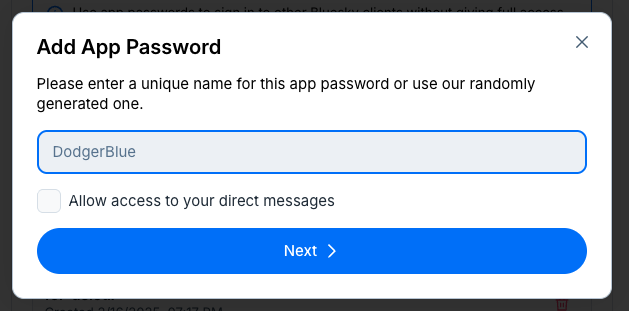
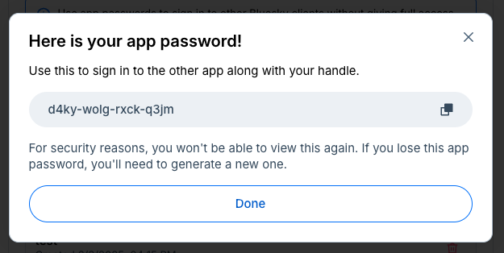

# Walkthrough 6: Exploring relationships using social network analysis with social media data {#c12}

**Abstract**

This chapter explores the use of social network analysis, commonly referred to as SNA. While much of the data that data scientists in education analyze is about individuals, some data are about the relationships between individuals. Examples include friendship between youth or advice-seeking on the part of teachers. This is called network data. Network data can be difficult to analyze, in part due to multiple sources of data about individuals and their relationships to each other. This chapter uses data from the Bluesky #tidyuesday network, an R learning community, to demonstrate how to import data, prepare for social network analysis using the {tidygraph} R package, and visualize it using the {ggraph} R package.

## Topics emphasized

-   Transforming data
-   Visualizing data

## Functions introduced

-   `bskyr::bs_search_posts()`
-   `bskyr::bs_auth()`
-   `bskyr::set_bluesky_user()` and `bskyr::set_bluesky_pass()`
-   `purrr::pluck()`
-   `purrr::map_chr()`
-   `tidyr::unnest()`
-   `dplyr::rowwise()` and `dplyr::ungroup()`
-   `stringr::str_extract()`
-   `tidygraph::tbl_graph()`
-   `tidygraph::activate()`
-   `tidygraph::centrality_degree()`
-   `tidygraph::centrality_betweenness()`
-   `ggraph::ggraph()`
-   `ggraph::geom_edge_link()`
-   `ggraph::geom_node_point()`
-   `ggraph::geom_node_text()`

## Vocabulary

-   Application Programming Interface (API)
-   edgelist
-   edge
-   influence model
-   regex
-   selection model
-   social network analysis
-   sociogram
-   vertex

## Chapter overview

In education, it's common to focus on individuals – students and teachers, especially. You can learn many things from studying individual students or teachers, but sometimes what is interesting lies between individuals. Social network analysis is useful for just this – understanding the relationships between individuals.

For instance, social network analyses is useful for asking questions about social influence [@frank1998chapter], like How does the pattern of interactions among teachers in a professional network explain their continued involvement in the network? [@rosenberg2021advancing] There are alsoquestions about social selection, like Which parents are the most central in a parent teacher association (PTA) group?

In this chapter, you will focus on describing the interactions between #TidyTuesday participants using social network analysis (SNA) techniques as precursors to analyses about influence or selection. #TidyTuesday is a weekly social data project aimed at the R community. Every Monday, a new dataset is posted on social media, and participants create and share visualizations throughout the week, creating a vibrant online learning community.

While useful for asking questions about social relations, social network analyses can be hard. Cleaning and tidying the data, especially, can be tricky. Sometimes it's more challenging than other data sources because data for social network analysis often includes variables about both individuals (information about students or teachers) and their relationships (whether a relationship exists, the strength of the relationship, or the type of the relationship).

This chapter is designed to take you from importing social media data through visualizing it. Though, as we describe next, you can also use self-report survey and other types of data, as well.

For those wishing to dive deeper into the aforementioned selection and influence models, we've included an appendix ([Appendix C](#c20c)) to introduce other social network-related ideas for further exploration; these focus on modeling social network processes. In particular, they include the processes for who chooses to interact with whom, their level of influence, or how the relationships impact behaviors.

You will need a Bluesky account to complete the code outlined in this chapter to access your own Bluesky data. You will use the Bluesky Application Interface \[API\]). If you do not have a Bluesky account, you can create one and keep it private or choose to delete it when you're done with this walkthrough.

## Background

Traditionally, social network analysis was carried out using self-report surveys. An example of this is @frank2004social, where teachers were surveyed about who they turned to for advice about teaching. These data were then used to create a network of advice-seeking relationships among teachers.

More recently, researchers and analysts have used other data sources---especially data from digital tools, including social media [@rosenberg2020idle].

In this chapter, you will access data using the {bskyr} package [@bskyr], providing access to data from the Bluesky social media platform. In the first edition of this book, you used a different data sources---Twitter (X) posts. Due to changes in the accessibility of that data, we have switched to a different social media platform, Bluesky.

There are a few things to know before getting started. First, as with most social media platforms, Bluesky places restrictions on accessing its Application Programming Interface (API). An API is a set of structured http requests that return data in a predictable way. These restrictions limit the number of posts that can be accessed using the API. Bluesky's rate limits are generally generous for typical educational research and #TidyTuesday analysis.

Occasionally, Bluesky will make changes to its API that affect how the `bskyr` package works. When this happens, you may need to wait for the package to be updated. It is a good idea to install the latest version of the package before beginning a new project by running `install.packages("bskyr")` or checking for updates.

In the past, if a teacher wanted advice about how to plan a unit or to design a lesson, they would turn to a trusted peer in their building or district [@spillane2012]. Today they are as likely to turn to someone in a social media network. Social media interactions like the ones tagged with the #tidytuesday hashtag are increasingly common in education. Using data science tools to learn from these interactions is valuable for improving the student experience.

## Packages

Fortunately, it is about as easy to access data from Bluesky as it was from Twitter, using R packages like {bskyr} and others. In addition to the {bskyr} package, you'll load [@R-tidygraph; @R-ggraph] for network analysis and [@R-randomNames] for non-anonymized names. As always, if you have not installed these packages before (you won't have used {bskyr}, {randomNames}, {tidygraph}, and {ggraph} at this stage of the book), do so using the `install.packages()` function. You can read more about installing packages in the ["*Packages*"](#c06p) section of the ["*Foundational Skills*"](#c06) chapter.

Load the packages with the following calls to the `library()` function:

```{r, message = F, warning = F}
library(tidyverse)
library(bskyr)

library(randomNames)
library(tidygraph)
library(ggraph)
library(igraph)
```

## Data sources and import

There are two ways to walk through this chapter. The first is to option is for you to access data from Bluesky on your own. The other is to load the Bluesky data using the {dataedu} R package. The choice is yours! If you'd like to access the Bluesky data through the package, skip ahead to the "Loading already-accessed data" sub-section. 

### Accessing Bluesky data through the Application Programming Interface (API)

A common way to import data from websites, including social media platforms, is using an Application Programming Interface (API). In fact, if you ran the code above, you just accessed an API!

An API is like a special door for a house that has interesting things in it. The home builder doesn't want everyone to walk right in. But they also don't want to make it too hard because, after all, sharing is caring. The door is a special one, just for folks who know how to use them. Users need to know where to find it and once they're there, they have to know the code to open. Once they're through, they have to know how to use the stuff inside. 

An API for social media platforms like Bluesky works the same way. You can download datasets about social media posts using code and authentication credentials organized by the website.

There are advantages to using an API to import data at the start of your analysis. Every time you run the code in your analysis, you'll use the API to contact the social media platform and download a fresh dataset. Now your analysis is updated with the most recent data every time you run it. By using an API to import new data every time you run your code, you repeat the analysis again and again on future datasets.

The Bluesky API, like most social media APIs, has rate limits on how many posts you can collect in a given time period. For typical educational research and #TidyTuesday analysis, these limits are usually sufficient. If you need to collect large amounts of historical data, you may need to spread your data collection over multiple sessions or days.

Let's get started. The first step in using the {bskyr} package is gaining access to the Application Programming Interface. To do so, you'll need to visit <https://bsky.app/settings> in a browser.

Then, go to "Privacy and Security", and click "App passwords" and then "Add App Password". You can use the randomly generated name.



You *do not* need to check, "Allow access to your direct messages".

A password will pop up (see the figure below) that you will copy and use next.



You're almost authenticated. You'll run these two lines of code once. This saves your username and this passcode in a hidden file (called \`.Renviron\`) that you will use for all subsequent analyses.

```{r, eval = FALSE}
set_bluesky_user('YOUR-USERNAME.bsky.social') # your username goes here -- including .bsky.social at the end!
set_bluesky_pass('your-app-password') # the passcode you just copied goes here
```

The next line is one you'll run every time you want to collect new Bluesky data in a fresh R session:

```{r, eval = FALSE}
auth <- bs_auth(user = bs_get_user(), pass = bs_get_pass())
```

We'll next collect some posts for the #tidytuesday hashtag on Bluesky.

Let's start with one month – January, 2025. We need to specify a few things:

-   the *query*

-   the *date range*

-   the *maximum number of posts we want to collect*

-   our *authentication* information

```{r, eval = FALSE}
posts_jan <- bs_search_posts(query = "#tidytuesday", 
                             since = '2025-01-01T00:00:00.000Z', until = '2025-01-31T23:59:59.000Z',
                             limit = 10000,
                             auth = auth)
```

Let's inspect the result:

```{r, eval = FALSE}
posts_jan %>%
    glimpse()
```

This will show us the structure of the data returned by the Bluesky API, including columns for the post's author, content (in the `record` field), and engagement metrics.

Let's continue to collect four more months.

```{r, eval = FALSE}
posts_feb <- bs_search_posts(query = "#tidytuesday", 
                             since = '2025-02-01T00:00:00.000Z', until = '2025-02-28T23:59:59.000Z',
                             limit = 10000,
                             auth = auth)


posts_mar <- bs_search_posts(query = "#tidytuesday", 
                             since = '2025-03-01T00:00:00.000Z', until = '2025-03-31T23:59:59.000Z',
                             limit = 10000,
                             auth = auth)

posts_apr <- bs_search_posts(query = "#tidytuesday", 
                             since = '2025-04-01T00:00:00.000Z', until = '2025-04-30T23:59:59.000Z',
                             limit = 10000,
                             auth = auth)

posts_may <- bs_search_posts(query = "#tidytuesday", 
                             since = '2025-05-01T00:00:00.000Z', until = '2025-05-31T23:59:59.000Z',
                             limit = 10000,
                             auth = auth)
```

Now, we can combine these data frames together and assign the results to a single object, `posts`, and then look at the results:

```{r, eval = FALSE}
bind_rows(posts_jan, posts_feb, posts_mar, posts_apr, posts_may) -> posts

posts %>%
    glimpse()

# Optional: Save the data for future use
# write_rds(posts, "posts.rds")
```

### Loading already-accessed data

The code above shows you how to collect fresh data yourself for your own network analyses. But you can also load already-accessed data for this walkthrough if you'd prefer. The code below allows you to work through the analysis even if you don't have a Bluesky account.

```{r}
# Load the pre-collected data
# library(dataedu)
# posts <- dataedu::bluesky_posts
posts <- read_rds("posts.rds")
```

You can easily change the search term to other hashtags terms. For example, to search for #rstats posts, we can replace #tidytuesday with #rstats.

```{r, eval = FALSE}
rstats_posts <- bs_search_posts(query = "#rstats", 
                                since = '2024-12-01T00:00:00.000Z', 
                                until = '2024-12-31T23:59:59.000Z',
                                limit = 10000,
                                auth = auth)
```

You may notice that the most recent posts containing the #tidytuesday hashtag are returned. What if you wanted to go further back in time? We’ll discuss this topic in the next section and in Appendix B.

## Processing the Data

This data is complex. Unlike the rectangular datasets (like spreadsheets) that you used in earlier chapters, social media data from APIs often comes in a nested, hierarchical structure. Think of it like a filing cabinet where each drawer contains folders, and each folder contains documents. You need to open each level to get to the information you want.

If you take a glimpse at `posts`, we see that many of the columns are "named list"s:

```{r}
posts %>% 
    glimpse()
```

What does this "named list" variable type mean? When you look at what looks like the author variable, you can see it's more complex. That's because the Bluesky API returns data in a format called JSON (JavaScript Object Notation), which isn't always compatible with table data.

In a regular spreadsheet, each cell contains a single value (like "John" or "42"). But in a named list, a single cell can contain multiple related values. For the author list, this includes their username, display name, profile information, and more, all stored together in one complex cell. Take a look at one author's information:

```{r}
posts$author %>% 
    pluck(14)
```

Note that there's a similar situation for the field called "record", which includes the time stamp for the post, its text (i.e., the contents of the post), languages specified, whether hashtags are included, mentions of other users, and whether the post is a reply.

We won't run the following code, as the output is quite lengthy. But please try to run it. Just make sure you've loaded the data, `posts` from earlier.

```{r, eval = FALSE}
posts$record %>% 
    pluck(1)
```

### What *is* our network?

Before you dive into extracting data, let's discuss what our network represents. Recall the discussion at the beginning of this chapter about the wide variety in types of networks. In this analysis, we're creating a network where:

-   **Nodes** (the dots) represent individual Bluesky users who participated in #tidytuesday
-   **Edges** (the connections) represent interactions, like when one user mentions or replies to another user

This type of network can help us answer questions like: Who are the most influential members of the #tidytuesday community? Who connects different sub-groups within the community? Who is most active in engaging with others?

To build this network, you'll need to extract the author's unique identifier (their DID) to identify each person as a node in the network. But you can't use it while it's buried inside this nested list structure—that's the challenge we'll tackle next.

## View data

Start with getting a sense of how much data you're working with. Each row in the `posts` dataset represents one post that used the #tidytuesday hashtag:

```{r}
nrow(posts)
```

That's quite a bit of data to work with. Each of these posts may contain mentions of other users or be replies to other users. These will become the edges (connections) in our network.

## Methods: processing data into network format

The network dataset needs a way to identify each participant's role in the interaction. You'll need to answer questions like: Did someone reach out to another for help? Was someone contacted by another for help? You can process the data by creating an "edgelist".

An edgelist is a special type of table where each row represents a unique interaction between two parties. Think of it like a log of phone calls: each row records who called whom. Each row, which represents a single relationship, is referred to as an "edge".

A note on terminology: You may encounter different terms for the same concepts in network analysis. Edges are sometimes referred to as "ties" or "relations," and the people in a network (nodes) are sometimes called "vertices" or "actors." These terms are generally interchangeable, though they may be used in different contexts or by different research communities.

An edgelist looks like the following example, where the `sender` (sometimes called the "nominator") column identifies who is initiating the interaction and the `receiver` (sometimes called the "nominee") column identifies who receives the interaction:

```{r, include = FALSE}
names_d1 <-
    randomNames(6) %>%
    enframe(name = NULL) %>%
    mutate(sender = 1:6) %>%
    set_names(c("sender2", "sender"))

names_d2 <-
    randomNames(6) %>%
    enframe(name = NULL) %>%
    mutate(receiver = 1:6) %>%
    set_names(c("receiver2", "receiver"))

example_edgelist <-
    tibble(
        sender = c(2, 1, 3, 1, 2, 6, 3, 5, 6, 4, 3, 4),
        receiver = c(1, 2, 2, 3, 3, 3, 4, 4, 4, 5, 6, 6)
    )

example_edgelist <-
    example_edgelist %>%
    left_join(names_d1) %>%
    left_join(names_d2) %>%
    select(sender = receiver2, receiver = sender2)
```

```{r, echo = FALSE}
example_edgelist
```

In this edgelist, the `sender` column might identify someone who nominates another (the receiver) as someone they go to for help. The sender might also identify someone who interacts with the receiver in other ways, like "liking" or "mentioning" their posts. In the following steps, we will work to create an edgelist from the data from #tidytuesday on Bluesky.

### Extracting nodes and edges

Above, you saw that the data is really complex and you saw what an edgelist looks like. To create your own edgelist from the data, you'll need to extract two key pieces of information from `posts`:

1.  **Nodes**: The unique individuals (users) in our network
2.  **Edges**: The interactions between users (replies and mentions)

#### Creating a helper function

First, define a helper function to extract data from the nested list structures in the Bluesky data. Remember that the Bluesky data has information stored in complex nested lists (like boxes within boxes), and you'll need a way to open these boxes and get the information inside. This function "reaches into" nested list structures and pulls out text values. If the value doesn't exist, it returns `NA` instead of causing an error:

```{r helper-function}
pluck_chr <- function(x, ..., .default = NA_character_) {
  purrr::pluck(x, ..., .default = .default) %>% as.character()
}
```

#### Extracting nodes

Now extract the nodes to see the unique users in the network. Each row in `posts` has an `author` column containing nested information. You'll use `map_chr()` to apply the `pluck_chr()` function to each row. The `~` syntax creates a formula, and `.x` represents each individual author:

```{r extract-nodes}
nodes <- posts %>%
  mutate(
    # Extract the DID (a unique identifier like a social security number for accounts)
    did = map_chr(author, ~pluck_chr(.x, "did")),
    # Extract the handle (like @username)
    handle = map_chr(author, ~pluck_chr(.x, "handle")),
    # Extract the display name (the name people see)
    display_name = map_chr(author, ~pluck_chr(.x, "displayName"))
  ) %>%
  # Keep only one row per unique DID (each person appears once)
  distinct(did, .keep_all = TRUE) %>%
  # Create our final node table with just the ID and a readable label
  transmute(
    did = did,
    # coalesce() picks the first non-missing value: tries display_name first,
    # then handle, then DID if both are missing
    label = coalesce(display_name, handle, did)
  )
```

#### Extracting reply edges

Next, you'll extract edges—the replies and mentions between users, specifically.

First, get the reply edges. When someone replies to another user's post, they create a connection from the person replying to the person they're replying to:

```{r extract-reply-edges}
reply_edges <- posts %>%
  mutate(
    # Who is doing the replying? (the "from" person)
    from = map_chr(author, ~pluck_chr(.x, "did")),

    # Who are they replying to? (the "to" person)
    # Reply information is stored in record$reply$parent$uri
    # This URI looks like: "at://did:plc:abc123/app.bsky.feed.post/xyz"
    parent_uri = map_chr(record, ~pluck_chr(.x, "reply", "parent", "uri")),

    # Extract just the DID from the URI using a pattern
    # The pattern "did:[^/]+" means: find "did:" followed by any characters
    # that aren't a forward slash. This extracts "did:plc:abc123" from the full URI
    to = str_extract(parent_uri, "did:[^/]+")
  ) %>%
  # Keep only rows where we found a valid recipient
  filter(!is.na(to), to != "") %>%
  # Keep just the from and to columns for our edgelist
  select(from, to)
```

#### Extracting mention edges

Second, get mention edges from facets in the post record. "Facets" are pieces of a post that have special meaning, like @mentions or #hashtags. When you @mention someone, that creates an interaction (edge) in the network:

```{r extract-mention-edges}
mention_facet_edges <- posts %>%
  mutate(
    # Who wrote the post? (the "from" person)
    from = map_chr(author, ~pluck_chr(.x, "did")),

    # Extract the facets (special features) from each post's record
    # Each post can have multiple facets (e.g., mentioning 3 different people)
    facets = map(record, ~pluck(.x, "facets", .default = list()))
  ) %>%

  # unnest() transforms the data: if a post has 3 facets, we create 3 rows
  # (one row per facet). This lets us examine each mention separately.
  # Think of it like expanding a compressed file
  unnest(facets, keep_empty = FALSE) %>%

  # Now we need to process each row individually to extract mention information
  # rowwise() tells R: "treat each row separately, not as a whole column"
  # This is like processing one student's test at a time instead of the whole class at once
  rowwise() %>%
  mutate(
    # What type of feature is this? (mention, hashtag, link, etc.)
    feature_type = pluck_chr(facets, "features", 1, "$type"),

    # If it's a mention, who was mentioned? (the "to" person)
    to = pluck_chr(facets, "features", 1, "did")
  ) %>%

  # ungroup() tells R we're done processing row-by-row and can work with all rows again
  ungroup() %>%

  # Keep only the mentions (not hashtags or links), and only valid ones
  filter(feature_type == "app.bsky.richtext.facet#mention", !is.na(to), to != "") %>%

  # Keep just the from and to columns for our edgelist
  select(from, to)
```

#### Combining edges and cleaning nodes

Now you'll combine both types of edges (replies and mentions) into one edgelist. The `bind_rows()` function stacks the two data frames on top of each other, and `distinct()` removes any duplicate interactions:

```{r combine-edges}
mention_edges <- bind_rows(reply_edges, mention_facet_edges) %>%
  distinct()
```

Finally, do some cleaning of the nodes data to make sure you don't have any missing or blank IDs:

```{r clean-nodes}
nodes <- nodes %>%
  filter(!is.na(did), did != "") %>%
  # Ensure each person appears only once
  distinct(did, .keep_all = TRUE) %>%
  # Make sure everyone has a label (if display_name and handle are missing, use DID)
  mutate(label = coalesce(label, did))
```

Have a look at what you've created. First, the nodes:

```{r}
nodes %>% 
  glimpse()
```

And then the edges - both replies and mentions.

```{r}
mention_edges %>% 
  glimpse()
```

Great! Now you have the network data structured properly. The next step is to prepare this data for visualization by converting it into a format that the {tidygraph} and {ggraph} packages can work with.

Network visualization packages need edges to reference nodes by their row numbers (like "person in row 5 mentioned person in row 12") rather than by IDs. Think of it like seating charts: instead of saying "Emily mentioned Joshua," we say "person in seat 5 mentioned person in seat 12." This next section converts our edge data to use row numbers.

```{r}
# Step 1: Create a lookup table that matches each DID to its row number
# This is like creating a class roster where each student has a seat number
node_index <- nodes %>%
  mutate(.idx = row_number()) %>%  # Assign row numbers: 1, 2, 3, ...
  select(did, .idx)                # Keep just the ID and row number

# Step 2: Convert edge endpoints from DIDs to row numbers
# We use left_join() to look up the row number for each "from" and "to" person
edges_idx <- mention_edges %>%
  # First, make sure we only have valid, non-empty IDs
  filter(!is.na(from), from != "", !is.na(to), to != "") %>%

  # Look up the row number for the "from" person
  left_join(node_index, by = c("from" = "did")) %>%
  rename(.from_idx = .idx) %>%

  # Look up the row number for the "to" person
  left_join(node_index, by = c("to" = "did")) %>%
  rename(.to_idx = .idx)

# Step 3: Check for edges that reference people not in our nodes list
# This can happen if someone mentioned a user who didn't post with #tidytuesday
bad_edges <- edges_idx %>% filter(is.na(.from_idx) | is.na(.to_idx))
if (nrow(bad_edges) > 0) {
  message("Dropping ", nrow(bad_edges), " edges with unknown endpoints.\n",
          "Examples:\n",
          paste(utils::capture.output(print(head(bad_edges, 5))), collapse = "\n"))
}

# Step 4: Keep only valid edges and remove self-loops
# A "self-loop" is when someone mentions themselves (from_idx == to_idx)
# We filter these out because they're not meaningful interactions
edges_ok <- edges_idx %>%
  filter(!is.na(.from_idx), !is.na(.to_idx)) %>%  # Valid endpoints
  filter(.from_idx != .to_idx) %>%                 # No self-loops
  transmute(from = .from_idx, to = .to_idx)       # Keep only the row numbers

# Step 5: Build the graph object
# tbl_graph() combines our nodes and edges into a single network object
# directed = TRUE means the direction matters (A->B is different from B->A)
g_mentions <- tbl_graph(nodes = nodes, edges = edges_ok, directed = TRUE)

g_mentions
```

We've now created a network graph object (`g_mentions`) that contains both our nodes (users) and edges (interactions). This graph is a directed network, meaning that the direction matters of the interaction—who mentioned or replied to whom—matters.

## Analysis and results

Now that we have our network graph (`g_mentions`), we can analyze and visualize it. We'll use the {tidygraph} and {ggraph} packages to calculate network metrics and create visualizations. We note that network visualizations are often referred to as "sociograms" or a representation of the relationships between individuals in a network. We use this term and the term network visualization interchangeably in this chapter.

### Descriptive statistics

Now we'll calculate some important network measures that tell us about each person's position and importance in the network. These measures are called "centrality" metrics:

-   **In-degree**: How many times was this person mentioned or replied to? This measures popularity or influence—like counting how many people call you for advice.

-   **Out-degree**: How many times did this person mention or reply to others? This measures how active someone is in reaching out to others.

-   **Betweenness**: How often does this person connect different groups? Think of this as being a "bridge" between different friend groups. High betweenness means you connect people who wouldn't otherwise interact. We'll normalize this measure (using `normalized = TRUE`) to put it on a 0-1 scale for easier interpretation.

Let's calculate these metrics for each person in our network. We use `activate(nodes)` to tell {tidygraph} that we want to work with the nodes table (remember, our graph has both nodes and edges, so we need to specify which one):

```{r calculate-metrics}
g_metrics <- g_mentions %>%
  activate(nodes) %>%
  mutate(
    in_deg  = centrality_degree(mode = "in"),
    out_deg = centrality_degree(mode = "out"),
    btw     = centrality_betweenness(directed = TRUE, normalized = TRUE)
  )
```

Now we'll convert the network back to a regular table and add ranking columns. This helps us identify the "top" people by each measure. We use `desc()` to rank from high to low (not low to high):

```{r rank-nodes}
nodes_tbl <- g_metrics %>%
  activate(nodes) %>%
  as_tibble() %>%
  mutate(
    in_deg_rank  = min_rank(desc(in_deg)),
    out_deg_rank = min_rank(desc(out_deg)),
    btw_rank     = min_rank(desc(btw))
  )
```

Let's examine the top users by each centrality measure to see who are the most influential members of the #tidytuesday community:

```{r}
# View the top 10 most-mentioned users (highest in-degree)
nodes_tbl %>%
  arrange(desc(in_deg)) %>%
  select(label, in_deg, out_deg, btw) %>%
  head(10)
```

This table shows us the most-mentioned users in our network. The `in_deg` column shows how many times each person was mentioned or replied to, while `out_deg` shows how many times they mentioned or replied to others. The `btw` (betweenness) score indicates how important they are for connecting different parts of the network.

### Plotting the network

Now let's create a visualization of our network. We'll size nodes by their in-degree (how many mentions they received) and color them by betweenness centrality (how important they are for connecting different parts of the network). To avoid clutter, we'll only label the most-mentioned users:

```{r}
# Prepare labels - we only want to show labels for the top 5% most-mentioned users
# quantile(x, 0.95) finds the value where 95% of data points are below it
# This helps us avoid overcrowding the plot with too many labels
label_threshold <- quantile(nodes_tbl$in_deg, 0.95, na.rm = TRUE)

# Create a label column: show name if person is in top 5%, otherwise NA (no label)
# ifelse() works like: ifelse(condition, value_if_true, value_if_false)
nodes_tbl <- nodes_tbl %>%
  mutate(lbl = ifelse(in_deg >= label_threshold & in_deg > 0, label, NA))

# set.seed() ensures we get the same network layout every time we run this code
# Network layouts use random starting positions, so this makes our results reproducible
set.seed(42)

# Add the label column to our graph object too (we need it in both places)
g_metrics <- g_metrics %>%
  activate(nodes) %>%
  mutate(
    lbl = ifelse(
      in_deg >= quantile(in_deg, 0.95, na.rm = TRUE) & in_deg > 0,
      label, NA_character_
    )
  )

# Create the network visualization
# ggraph works like ggplot2, but for networks
p_net <- ggraph(g_metrics, layout = "fr") +   # "fr" = Fruchterman-Reingold layout
                                               # This algorithm positions nodes so
                                               # connected nodes are close together

  # Draw the edges (connections between people) as gray lines
  geom_edge_link(alpha = 0.8, linewidth = 0.2) +

  # Draw the nodes (people) as points
  # Size represents how many mentions they received (in_deg)
  # Color represents their betweenness (how much they bridge groups)
  geom_node_point(aes(size = in_deg, color = btw), alpha = 0.9) +

  # Add text labels for the most-mentioned users
  # vjust = -0.8 moves labels slightly above the points so they don't overlap
  geom_node_text(aes(label = lbl), size = 3, vjust = -0.8, na.rm = TRUE) +

  # Customize the size legend
  scale_size_continuous(name = "In-degree (mentions)", range = c(2, 12)) +

  # Customize the color legend (showing betweenness as percentages)
  scale_color_continuous(name = "Betweenness", labels = label_percent(accuracy = 0.1)) +

  # Adjust the color legend height for better readability
  guides(color = guide_colorbar(barheight = unit(60, "pt"))) +

  # Use a minimal theme (removes grid lines, axes, etc.)
  theme_void() +

  # Add a title
  ggtitle("Mention Network: size = in-degree, color = betweenness")

p_net
```

This visualization shows the structure of the #TidyTuesday network on Bluesky. Larger nodes represent users who receive more mentions, and the color indicates their betweenness centrality—how crucial they are in connecting different parts of the network.

### Refining the graph – filtering isolated nodes

Looking at the visualization above, you may notice many isolated nodes—users who appear in our dataset but have no connections to others in the network. These isolated nodes can make the visualization cluttered and harder to interpret. Often, we're most interested in the connected parts of the network where interactions actually occur.

Let's create a cleaner version by filtering out these isolated nodes. We can do this by keeping only nodes that have at least one connection (either mentioning someone or being mentioned):

```{r filter-isolated}
# Filter the graph to remove isolated nodes
# centrality_degree(mode = "all") counts both incoming and outgoing connections
# Keeping only nodes with degree > 0 removes anyone with no connections
g_connected <- g_metrics %>%
  activate(nodes) %>%
  filter(centrality_degree(mode = "all") > 0)
```

Now let's recreate our visualization with only the connected nodes:

```{r plot-connected}
set.seed(42)

p_connected <- ggraph(g_connected, layout = "fr") +
  geom_edge_link(alpha = 0.8, linewidth = 0.2) +
  geom_node_point(aes(size = in_deg, color = btw), alpha = 0.9) +
  geom_node_text(aes(label = lbl), size = 3, vjust = -0.8, na.rm = TRUE) +
  scale_size_continuous(name = "In-degree (mentions)", range = c(2, 12)) +
  scale_color_continuous(name = "Betweenness", labels = label_percent(accuracy = 0.1)) +
  guides(color = guide_colorbar(barheight = unit(60, "pt"))) +
  theme_void() +
  ggtitle("Connected #TidyTuesday Network (isolated nodes removed)")

p_connected
```

This filtered visualization is much cleaner and makes it easier to see the structure of interactions within the #TidyTuesday community. We can now more clearly identify central figures, clusters of users who interact frequently, and bridges between different groups.

### Interpreting the network through an educational lens

Social network analysis reveals patterns about learning communities and knowledge sharing that are directly relevant to educational practice. Looking at our #TidyTuesday network, we can identify several key roles:

**Influential members** have high in-degree (larger nodes, like Nicola Rennie). In educational settings, these are the teacher leaders or coaches that others turn to for guidance. Their prominence suggests they're creating valuable content or providing support that resonates with the community.

**Active engagers** have high out-degree—they frequently reach out to others. Users like Jon Harmon exemplify this role. In schools, these connectors maintain community vitality by initiating conversations and fostering collaboration, even if they're not the most "popular" members.

**Bridge-builders** have high betweenness (lighter blue colors), connecting otherwise separate clusters. In educational contexts, these might be teachers who work across departments or administrators who link different communities. They're crucial for information flow and preventing isolated silos.

The network structure itself offers insights: tight clusters might represent communities of practice, while peripheral members reflect newcomers learning through observation before deeper participation. Understanding these patterns can help educators foster inclusive participation, leverage influential voices strategically, cultivate bridge-builders across groups, and monitor overall network health—ensuring the community has stable leadership without over-dependence on a few individuals.

There is much more you can do with {ggraph} (and {tidygraph}); check out the {ggraph} tutorial here: <https://ggraph.data-imaginist.com/> to explore additional layout algorithms, styling options, and advanced network visualizations.

## Conclusion

In this chapter, we used social media data from the #tidytuesday hashtag on Bluesky to prepare and visualize social network data. Sociograms are a useful visualization tool to reveal who is interacting with whom---and, in some cases, to suggest why. In our applications of data science, we have found that the individuals (such as teachers or students) who are represented in a network often like to see what the network (and the relationships in it) *look like*. It can be compelling to think about why networks are the way they are, and how changes could be made to---for example---foster more connections between individuals who have few opportunities to interact. In this way, social network analysis can be useful to the data scientist in education because it provides a technique to communicate with other educational stakeholders in a compelling way.

Social network analysis is a broad (and growing) domain, and this chapter was intended to present some of its foundation. Fortunately for R users, many recent developments are implemented first in R (e.g., @R-amen). If you are interested in some of the additional steps that you can take to model and analyze network data, consider the appendix on two types of models (for selection and influence processes), [Appendix C](#c20c).