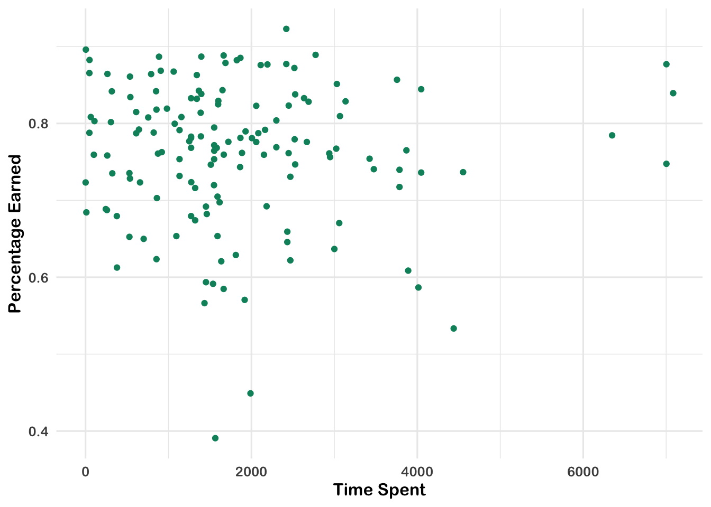
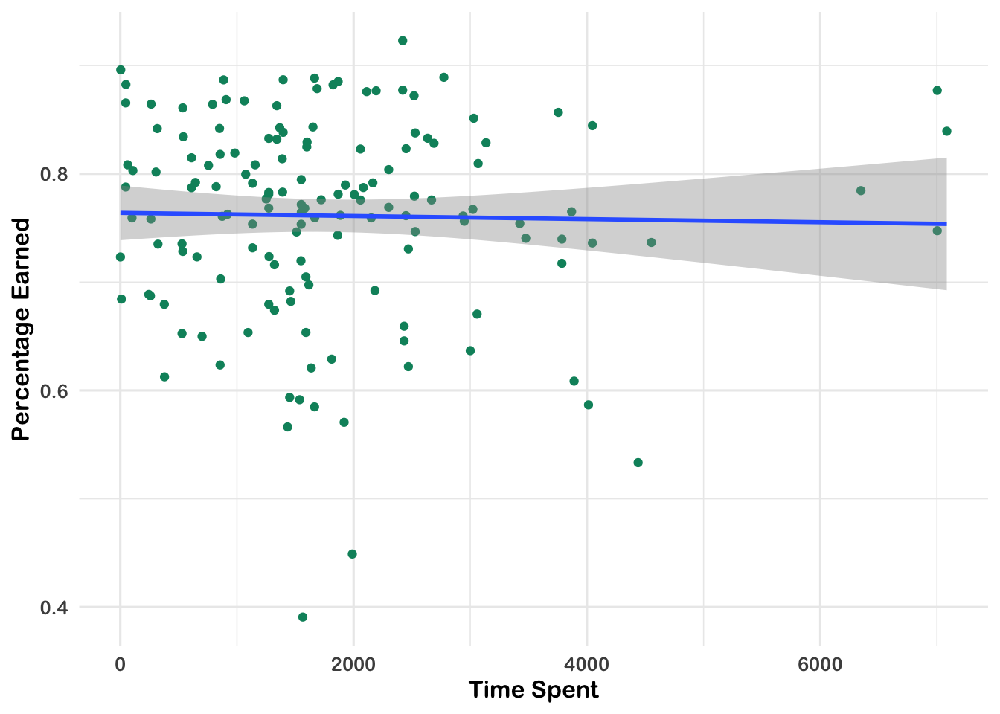

# Walkthrough 1: The Education Dataset Science Pipeline With Online Science Class Data {#c07}


## Vocabulary

## Introduction

### Background

In the 2015-2016 and 2016-2017 school years, researchers carried out a study on
students' motivation to learn in online science classes. The online science
classes were part of a statewide online course provider designed to
supplement(and not replace) students' enrollment in their local school. For
example, students may choose to enroll in an online physics class because one
was not offered at their school (or they were not able to take it given their
schedule).

The study involved a number of different data sources which were explored to
understand students' motivation:

1.  A self-report survey for three distinct but related aspects of students'
    motivation
2.  Log-trace data, such as data output from the learning management system
3.  Discussion board data (not used in this walkthrough)
4.  Achievement-related (i.e., final grade) data

Our *purpose* for this walkthrough is to begin to understand what explains
students' performance in these online courses. To do so, we will focus on a
variable that was available through the learning management system used for the
courses, on he amount of time sudents' spent on the course. We will also explore
how different (science) subjects as well as being in a particular class may help
to explain student performance.

First, these different data sources will be described in terms of how they were
provided by the school.

### Data Sources

#### Data source \#1: Self-report survey about students' motivation

The first data source is a self-report survey. This was data collected before
the start of the course via self-report survey. The survey included 10 items,
each corresponding to one of three *measures*, namely, for interest, utility
value, and perceived competence:

1.  I think this course is an interesting subject. (Interest)
2.  What I am learning in this class is relevant to my life. (Utility value)
3.  I consider this topic to be one of my best subjects. (Perceived competence)
4.  I am not interested in this course. (Interest - reverse coded)
5.  I think I will like learning about this topic. (Interest)
6.  I think what we are studying in this course is useful for me to know.
    (Utility value)
7.  I don’t feel comfortable when it comes to answering questions in this area.
    (Perceived competence)
8.  I think this subject is interesting. (Interest)
9.  I find the content of this course to be personally meaningful. (Utility
    value)
10. I’ve always wanted to learn more about this subject. (Interest)

### Data source \#2: Log-trace data

*Log-trace data* is data generated from our interactions with digital
technologies, such as archived data from social media postings (see
[chapter 11](#c11) and [chapter 12](#c12)). In education, an increasingly common
source of log-trace data is that generated from interactions with learning
management systems and other digital tools [@siemens2012]. The data for this
walk-through is a *summary of* log-trace data, namely, the number of minutes
students spent on the course. Thus, while this data is rich, you can imagine
even more complex sources of log-trace data (i.e. timestamps associated with
when students started and stopped accessing the course!).

### Data source \#3: Achievement-related and gradebook data

This is a common source of data, namely, one associated with graded assignments
students completed. In this walkthrough, we just examine students' final grade.

### Data source \#4: Discussion board data

Discussion board data is both rich and unstructured, in that it is primarily in
the form of written text. We collected discussion board data, too, and highlight
this as a potentially very rich data source.

### Methods

<!-- ### Methods: quick summary of the methods that we’ll use in the analysis -->

## Load Packages

This analysis uses R packages, which are collections of R code that help users
code more efficiently, as you wil recall from [Chapter 1](#c1). We load
these packages with the function `library`. In particular, the packages we'll
use will help us load Excel files, organize the structure of the data, work with
dates in the data, and navigate file directories.


```r
library(readxl)
library(tidyverse)
library(lubridate)
library(here)
library(dataedu)
library(apaTables)
library(sjPlot)
```

## Import Data

This code chunk loads the log trace data using the `read_csv` function. Note that we call `read_csv` three times, once for each of the three logtrace
datasets. We assign each of the datasets a name using `<-`.


```r
# Gradebook and log-trace data for F15 and S16 semesters
course_data <- dataedu::course_data

# Pre-survey for the F15 and S16 semesters

pre_survey <- dataedu::pre_survey

# Log-trace data for F15 and S16 semesters - this is for time spent

course_minutes <- dataedu::course_minutes
```

## View data

Now that we've successfully loaded all three logtrace datasets, we can visually inspect the data by typing the names that we assigned to each dataset.


```r
pre_survey
```

```
## # A tibble: 1,102 x 12
##    RespondentId opdata_CourseID Q1Maincellgroup… Q1Maincellgroup…
##           <dbl> <chr>                      <dbl>            <dbl>
##  1       489226 OcnA-S216-02                   4                4
##  2       434707 BioA-S116-01                   4                3
##  3       436886 BioA-S116-01                   4                3
##  4       483940 FrScA-S216-02                  5                5
##  5       433131 AnPhA-S116-01                  5                5
##  6       432242 OcnA-S116-01                   4                2
##  7       432987 FrScA-S116-01                 NA               NA
##  8       432242 OcnA-S116-01                   4                3
##  9       434209 BioA-S116-01                  NA               NA
## 10       457331 FrScA-S116-01                  5                4
## # … with 1,092 more rows, and 8 more variables: Q1MaincellgroupRow3 <dbl>,
## #   Q1MaincellgroupRow4 <dbl>, Q1MaincellgroupRow5 <dbl>,
## #   Q1MaincellgroupRow6 <dbl>, Q1MaincellgroupRow7 <dbl>,
## #   Q1MaincellgroupRow8 <dbl>, Q1MaincellgroupRow9 <dbl>,
## #   Q1MaincellgroupRow10 <dbl>
```

```r
course_data
```

```
## # A tibble: 29,711 x 5
##    CourseSectionOrigID Bb_UserPK Points_Possible Points_Earned Gender
##    <chr>                   <dbl>           <dbl>         <dbl> <chr> 
##  1 AnPhA-S116-01           60186               5           5   F     
##  2 AnPhA-S116-01           60186              30          27.4 F     
##  3 AnPhA-S116-01           60186              10          10   F     
##  4 AnPhA-S116-01           60186               5           3   F     
##  5 AnPhA-S116-01           60186               5           5   F     
##  6 AnPhA-S116-01           60186              30          27   F     
##  7 AnPhA-S116-01           60186               5           4   F     
##  8 AnPhA-S116-01           60186             597         575.  F     
##  9 AnPhA-S116-01           60186              10          NA   M     
## 10 AnPhA-S116-01           60186              10          10   F     
## # … with 29,701 more rows
```

```r
course_minutes
```

```
## # A tibble: 598 x 3
##    Bb_UserPK CourseSectionOrigID TimeSpent
##        <dbl> <chr>                   <dbl>
##  1     88596 FrScA-S216-01            886.
##  2     95957 AnPhA-S216-01           4013.
##  3     72287 PhysA-S116-01            920.
##  4     87489 FrScA-S116-01           1452.
##  5     78002 FrScA-S116-01           1464.
##  6     96871 FrScA-S216-02           1671.
##  7     90996 PhysA-S116-01           1303.
##  8     91175 FrScA-S116-04           1589.
##  9     86267 AnPhA-S216-01           1632.
## 10     86277 AnPhA-S116-01           2528.
## # … with 588 more rows
```

## Process data

Often, survey data needs to be processed in order to be (most) useful. Here, we
process the self-report items into three scales, for: interest, self-efficacy,
and utility value. We do this by

- Renaming the question variables to something more managable
- Reversing the response scales on questions 4 and 7
- Categorizing each question into a measure
- Computing the mean of each measure

Let's take these steps in order:

1.  Rename the question columns to something much simpler:


```r
pre_survey  <-
  pre_survey  %>%
  # Rename the qustions something easier to work with because R is case sensitive
  # and working with variable names in mix case is prone to error
  rename(
    q1 = Q1MaincellgroupRow1,
    q2 = Q1MaincellgroupRow2,
    q3 = Q1MaincellgroupRow3,
    q4 = Q1MaincellgroupRow4,
    q5 = Q1MaincellgroupRow5,
    q6 = Q1MaincellgroupRow6,
    q7 = Q1MaincellgroupRow7,
    q8 = Q1MaincellgroupRow8,
    q9 = Q1MaincellgroupRow9,
    q10 = Q1MaincellgroupRow10
  ) %>%
  # Convert all question responses to numeric
  mutate_at(vars(q1:q10), list( ~ as.numeric(.)))
```

Let's take a moment to discuss the `dplyr` function `mutate_at`. `mutate_at` is a version of `mutate`, which changes the values in an existing column or creates new columns. It's useful in education datasets because you'll often need to transform your data before analyzing it. Try this example, where we create a new `total_students` column by adding the number of `male` students and `female` students: 


```r
# Dataset of students
df <- tibble(
  male = 5, 
  female = 5
)

df %>% mutate(total_students = male + female)
```

```
## # A tibble: 1 x 3
##    male female total_students
##   <dbl>  <dbl>          <dbl>
## 1     5      5             10
```

`mutate_at` is a special version of `mutate`, which conveniently changes the values of multiple columns. In our dataset `pre_survey`, we let `mutate` know we want to change the variables `q1` through `q10`. We do this with the argument `vars(q1:q10)`

2.  Next we'll reverse the scale of the survey responses on questions 4 and 7 so
the responses for all questions can be interpreted in the same way. Rather
than write a lot of code once to reverse the scales for question 4 then
writing it again to reverse the scales on question 7, we'll build a function
that does that job for us. Then we'll use the same function for question 4
and question 7. This will result in much less code, plus it will make it
easier for us to change in the future.


```r
# This part of the code is where we write the function:
# Function for reversing scales 
reverse_scale <- function(question) {
  # Reverses the response scales for consistency
  #   Args:
  #     question: survey question
  #   Returns: a numeric converted response
  # Note: even though 3 is not transformed, case_when expects a match for all
  # possible conditions, so it's best practice to label each possible input
  # and use TRUE ~ as the final statement returning NA for unexpected inputs
  x <- case_when(
    question == 1 ~ 5,
    question == 2 ~ 4,
    question == 4 ~ 2,
    question == 5 ~ 1,
    question == 3 ~ 3,
    TRUE ~ NA_real_
  )
  x
}

# And here's where we use that function to reverse the scales
# Reverse scale for questions 4 and 7
pre_survey <-
  pre_survey %>%
  mutate(q4 = reverse_scale(q4),
         q7 = reverse_scale(q7))
```

3.  We'll accomplish the last two steps in one chunk of code. First we'll create a column called `measure` and we'll fill that column with one of three question categories:

- `int`: interest
- `uv`: utility value
- `pc`: self efficacy

After that we'll find the mean response of each category using `mean` function.


```r
# Add measure variable 
measure_mean <-
  pre_survey %>%
  # Gather questions and responses
  pivot_longer(cols = q1:q10,
               names_to = "question",
               values_to = "response") %>%
  # Here's where we make the column of question categories
  mutate(
    measure = case_when(
      question %in% c("q1", "q4", "q5", "q8", "q10") ~ "int",
      question %in% c("q2", "q6", "q9") ~ "uv",
      question %in% c("q3", "q7") ~ "pc",
      TRUE ~ NA_character_
    )
  ) %>%
  group_by(measure) %>%
  # Here's where we compute the mean of the responses
  summarise(
    # Mean response for each measure
    mean_response = mean(response, na.rm = TRUE),
    # Percent of each measure that had NAs in the response field
    percent_NA = mean(is.na(response))
    )

measure_mean
```

```
## # A tibble: 3 x 3
##   measure mean_response percent_NA
##   <chr>           <dbl>      <dbl>
## 1 int              4.25      0.175
## 2 pc               3.65      0.175
## 3 uv               3.77      0.177
```

We will use a similar process later to calculate these variables' correlations.

### Processing the course data

We also can process the course data in order to create new variables which we can use in analyses. 
Information about the course subject, semester, and section are stored in a single column, `CourseSectionOrigID`. If we give each of these their own columns, we'll have more opportunities to analyze them as their own variables. We'll use a function called `separate` to do this. 
This pulls out the subject, semester, and section from the course ID so we can use them later on. 


```r
# split course section into components
course_data <- 
  course_data %>%
  # Give course subject, semester, and section their own columns
  separate(
    col = CourseSectionOrigID,
    into = c("subject", "semester", "section"),
    sep = "-",
    remove = FALSE
  )
```

### Joining the data

To join the course data and pre-survey data, we need to create similar *keys*.
In other words, our goal here is to have one variable that matches across both
datasets, so that we can merge the datasets on the basis of that variable.

For these data, both have variables for the course and the student, though they
have different names in each. Our first goal will be to rename two variables in
each of our datasets so that they will match. One variable will correspond to
the course, and the other will correspond to the student. We are not changing
anything in the data itself at this step - instead, we are just cleaning it up
so that we can look at the data all in one place.

Let's start with the pre-survey data. We will rename RespondentID and opdata_CourseID to be student_id and course_id, respectively.


```r
pre_survey <-
  pre_survey %>%
  rename(student_id = RespondentId,
         course_id = opdata_CourseID)

pre_survey
```

```
## # A tibble: 1,102 x 12
##    student_id course_id    q1    q2    q3    q4    q5    q6    q7    q8    q9
##         <dbl> <chr>     <dbl> <dbl> <dbl> <dbl> <dbl> <dbl> <dbl> <dbl> <dbl>
##  1     489226 OcnA-S21…     4     4     3     4     5     4     4     4     5
##  2     434707 BioA-S11…     4     3     4     4     4     4     5     4     3
##  3     436886 BioA-S11…     4     3     3     5     5     5     4     4     3
##  4     483940 FrScA-S2…     5     5     5     5     5     4     5     5     4
##  5     433131 AnPhA-S1…     5     5     3     5     5     5     3     5     5
##  6     432242 OcnA-S11…     4     2     2     4     5     3     4     5     1
##  7     432987 FrScA-S1…    NA    NA    NA    NA    NA    NA    NA    NA    NA
##  8     432242 OcnA-S11…     4     3     3     4     4     3     3     4     3
##  9     434209 BioA-S11…    NA    NA    NA    NA    NA    NA    NA    NA    NA
## 10     457331 FrScA-S1…     5     4     5     5     5     5     5     5     5
## # … with 1,092 more rows, and 1 more variable: q10 <dbl>
```

Looks better now!

Let's proceed to the course data. Our goal is to rename two variables that
correspond to the course and the student so that we can match with the other
variables we just created for the pre-survey data.


```r
course_data <-
  course_data %>%
  rename(student_id = Bb_UserPK,
         course_id = CourseSectionOrigID)
```

Now that we have two variables that are consistent across both datasets - we
have called them "course\_id" and "student\_id" - we can join these using the
**dplyr** function, `left_join()`.

Let's save our joined data as a new object called "dat."


```r
dat <-
  left_join(course_data,
            pre_survey,
            by = c("student_id", "course_id"))
dat
```

```
## # A tibble: 29,711 x 18
##    course_id subject semester section student_id Points_Possible Points_Earned
##    <chr>     <chr>   <chr>    <chr>        <dbl>           <dbl>         <dbl>
##  1 AnPhA-S1… AnPhA   S116     01           60186               5           5  
##  2 AnPhA-S1… AnPhA   S116     01           60186              30          27.4
##  3 AnPhA-S1… AnPhA   S116     01           60186              10          10  
##  4 AnPhA-S1… AnPhA   S116     01           60186               5           3  
##  5 AnPhA-S1… AnPhA   S116     01           60186               5           5  
##  6 AnPhA-S1… AnPhA   S116     01           60186              30          27  
##  7 AnPhA-S1… AnPhA   S116     01           60186               5           4  
##  8 AnPhA-S1… AnPhA   S116     01           60186             597         575. 
##  9 AnPhA-S1… AnPhA   S116     01           60186              10          NA  
## 10 AnPhA-S1… AnPhA   S116     01           60186              10          10  
## # … with 29,701 more rows, and 11 more variables: Gender <chr>, q1 <dbl>,
## #   q2 <dbl>, q3 <dbl>, q4 <dbl>, q5 <dbl>, q6 <dbl>, q7 <dbl>, q8 <dbl>,
## #   q9 <dbl>, q10 <dbl>
```

`left_join()` is named on the basis of the order of the two data frames that are
being joined - and which data frame is joined to the other. In the above case,
note the order of the data frames passed to our "left" join. Let's focus just on
the first two arguments. Left joins retain all of the rows in the "left" data
frame, and joins every matching row in the right data frame to it.

Note that in the above, after `left_join(`, we see `course_data` and then
`pre_survey`. In this case, `course_data` is the "left" data frame (passed as
the *first* argument), while `pre_survey` is the "right" data frame, passed as
the *second* argument. So, in the above, knowing how `left_join()` works, what
happened? You can run the code yourself to check.

What our aim was - and what should happen - is that all of the rows of
`course_data` are retained in our new data frame, `dat`, with matching rows of
`pre_survey` joined to it. We note that in this case, one key is that there are
not multiple matching rows of pre-survey: in this case, you would end up with
more rows in `dat` than expected. There is a lot packed into one simple function
that we just unpacked. Joins are, however, extremely powerful - and common - in
many data analysis processing pipelines, in education and in any field. Think of
all of the times you have data in more than one data frame, and want them to be
in a single data frame! As a result, we think that joins are well worth
investing the time to be able to use.

With education (and other) data, `left_joins()` are helpful for carrying out
most tasks related to joining datasets. There are, though, functions for other
types of joins, those less important than `left_join()` but still worth
mentioning.

They are the following (note that for all of these, the "left" data frame is
always the first argument, and the "right" data frame is always the second):

#### `semi_join()`

`semi_join()`: joins and retains all of the *matching* rows in the "left" and "right" data frame; useful when you are only interested in keeping the rows (or cases/observations) that are able to be joined. 
`semi_join()` will not create duplicate rows of the left data frame, even when it finds multiple matches on the right data frame. It will also keep only the columns from the left data frame. 

For example, the following returns only the rows that are present in both
`course_data` and `pre_survey`:


```r
dat_semi <- 
  semi_join(course_data,
            pre_survey,
            by = c("student_id", "course_id"))

dat_semi
```

```
## # A tibble: 0 x 8
## # … with 8 variables: course_id <chr>, subject <chr>, semester <chr>,
## #   section <chr>, student_id <dbl>, Points_Possible <dbl>,
## #   Points_Earned <dbl>, Gender <chr>
```

#### `anti_join()`

`anti_join()`: *removes* all of the rows in the "left" data frame that can be
joined with those in the "right" data frame.


```r
dat_anti <-
  anti_join(course_data,
            pre_survey,
            by = c("student_id", "course_id"))

dat_anti
```

```
## # A tibble: 29,711 x 8
##    course_id subject semester section student_id Points_Possible Points_Earned
##    <chr>     <chr>   <chr>    <chr>        <dbl>           <dbl>         <dbl>
##  1 AnPhA-S1… AnPhA   S116     01           60186               5           5  
##  2 AnPhA-S1… AnPhA   S116     01           60186              30          27.4
##  3 AnPhA-S1… AnPhA   S116     01           60186              10          10  
##  4 AnPhA-S1… AnPhA   S116     01           60186               5           3  
##  5 AnPhA-S1… AnPhA   S116     01           60186               5           5  
##  6 AnPhA-S1… AnPhA   S116     01           60186              30          27  
##  7 AnPhA-S1… AnPhA   S116     01           60186               5           4  
##  8 AnPhA-S1… AnPhA   S116     01           60186             597         575. 
##  9 AnPhA-S1… AnPhA   S116     01           60186              10          NA  
## 10 AnPhA-S1… AnPhA   S116     01           60186              10          10  
## # … with 29,701 more rows, and 1 more variable: Gender <chr>
```

#### `right_join()`

`right_join()`: perhaps the least helpful of the three, `right_join()` works the
same as `left_join()`, but by retaining all of the rows in the "right" data
frame, and joining matching rows in the "left" data frame (so, the opposite of
`left_join()`).


```r
dat_right <-
  right_join(course_data,
             pre_survey,
             by = c("student_id", "course_id"))

dat_right
```

```
## # A tibble: 1,102 x 18
##    course_id subject semester section student_id Points_Possible Points_Earned
##    <chr>     <chr>   <chr>    <chr>        <dbl>           <dbl>         <dbl>
##  1 OcnA-S21… <NA>    <NA>     <NA>        489226              NA            NA
##  2 BioA-S11… <NA>    <NA>     <NA>        434707              NA            NA
##  3 BioA-S11… <NA>    <NA>     <NA>        436886              NA            NA
##  4 FrScA-S2… <NA>    <NA>     <NA>        483940              NA            NA
##  5 AnPhA-S1… <NA>    <NA>     <NA>        433131              NA            NA
##  6 OcnA-S11… <NA>    <NA>     <NA>        432242              NA            NA
##  7 FrScA-S1… <NA>    <NA>     <NA>        432987              NA            NA
##  8 OcnA-S11… <NA>    <NA>     <NA>        432242              NA            NA
##  9 BioA-S11… <NA>    <NA>     <NA>        434209              NA            NA
## 10 FrScA-S1… <NA>    <NA>     <NA>        457331              NA            NA
## # … with 1,092 more rows, and 11 more variables: Gender <chr>, q1 <dbl>,
## #   q2 <dbl>, q3 <dbl>, q4 <dbl>, q5 <dbl>, q6 <dbl>, q7 <dbl>, q8 <dbl>,
## #   q9 <dbl>, q10 <dbl>
```

If we wanted this to return exacty the same output as `left_join()` (and so to
create a data frame that is identical to the `dat` data frame above), we could
simply switch the order of the two data frames to be the opposite of those used
for the `left_join()` above:


```r
dat_right <-
  semi_join(pre_survey,
            course_data,
            by = c("student_id", "course_id"))

dat_right
```

```
## # A tibble: 0 x 12
## # … with 12 variables: student_id <dbl>, course_id <chr>, q1 <dbl>, q2 <dbl>,
## #   q3 <dbl>, q4 <dbl>, q5 <dbl>, q6 <dbl>, q7 <dbl>, q8 <dbl>, q9 <dbl>,
## #   q10 <dbl>
```

Just one more data frame to merge:


```r
course_minutes <-
  course_minutes %>%
  rename(student_id = Bb_UserPK,
         course_id = CourseSectionOrigID)

course_minutes <-
  course_minutes %>%
  # Change the data type for student_id in course_minutes so we can match to 
  # student_id in dat
  mutate(student_id = as.integer(student_id))

dat <- 
  dat %>% 
  left_join(course_minutes, 
            by = c("student_id", "course_id"))
```

Note that they're now combined, even though the course data has many more rows:
The pre\_survey data has been joined for each student by course combination.

We have a pretty large data frame! Let's take a quick look.


```r
dat
```

```
## # A tibble: 31,539 x 19
##    course_id subject semester section student_id Points_Possible Points_Earned
##    <chr>     <chr>   <chr>    <chr>        <dbl>           <dbl>         <dbl>
##  1 AnPhA-S1… AnPhA   S116     01           60186               5           5  
##  2 AnPhA-S1… AnPhA   S116     01           60186              30          27.4
##  3 AnPhA-S1… AnPhA   S116     01           60186              10          10  
##  4 AnPhA-S1… AnPhA   S116     01           60186               5           3  
##  5 AnPhA-S1… AnPhA   S116     01           60186               5           5  
##  6 AnPhA-S1… AnPhA   S116     01           60186              30          27  
##  7 AnPhA-S1… AnPhA   S116     01           60186               5           4  
##  8 AnPhA-S1… AnPhA   S116     01           60186             597         575. 
##  9 AnPhA-S1… AnPhA   S116     01           60186              10          NA  
## 10 AnPhA-S1… AnPhA   S116     01           60186              10          10  
## # … with 31,529 more rows, and 12 more variables: Gender <chr>, q1 <dbl>,
## #   q2 <dbl>, q3 <dbl>, q4 <dbl>, q5 <dbl>, q6 <dbl>, q7 <dbl>, q8 <dbl>,
## #   q9 <dbl>, q10 <dbl>, TimeSpent <dbl>
```

It looks like we have 31539 observations from 30 variables.

There is one last step to take. Were we interested in a fine-grained analysis of
how students performed (according to the teacher) on different assignments (see
the `Gradebook_Item` column), we would keep all rows of the data. But,
our goal (for now) is more modest: to calculate the percentage of points
students earned as a measure of their final grade (noting that the teacher may
have assigned a different grade--or weighted their grades in ways not reflected
through the points).


```r
dat <-
  dat %>%
  group_by(student_id, course_id) %>%
  mutate(Points_Earned = as.integer(Points_Earned)) %>%
  summarize(
    total_points_possible = sum(Points_Possible, na.rm = TRUE),
    total_points_earned = sum(Points_Earned, na.rm = TRUE)
  ) %>%
  mutate(percentage_earned = total_points_earned / total_points_possible) %>%
  ungroup() %>%
  # note that we join this back to the original data frame to retain all of the variables
  left_join(dat)
```

### Finding distinct cases at the student-level

This last step calculated a new column, for the percentage of points each
student earned. That value is the same for the same student (an easy way we
would potentially use to check this is `View()`, i.e., `View(dat)`).
But--because we are not carrying out a finer-grained analysis using the
`Gradebook_Item`--the duplicate rows are not necessary. We only want variables
at the student-level (and not at the level of different gradebook items). We can
do this using the `distinct()` function. This function takes the name of the
data frame and the name of the variables used to determine what counts as a
unique case. 
Imagine having a bucket of Halloween candy that has 100 pieces of candy. You know that these 100 pieces are really just a bunch of duplicate pieces from a relatively short list of candy brands. `distinct` takes that bucket of 100 pieces and returns a bucket containing only one of each distinct piece.
Another thing to note about `distinct()` is that it will only
return the variable(s) (we note that you can pass more than one variable to
`distinct()`) you used to determine uniqueness, *unless* you include the
argument `.keep_all = TRUE`. For the sake of making it very easy to view the
output, we omit this argument (only for now).

Were we to run `distinct(dat, Gradebook_Item)`, what do you think would be
returned?


```r
distinct(dat, Gradebook_Item)
```

```
## # A tibble: 31,539 x 22
##    student_id course_id total_points_po… total_points_ea… percentage_earn…
##         <dbl> <chr>                <dbl>            <int>            <dbl>
##  1      43146 FrScA-S2…             1821             1039            0.571
##  2      43146 FrScA-S2…             1821             1039            0.571
##  3      43146 FrScA-S2…             1821             1039            0.571
##  4      43146 FrScA-S2…             1821             1039            0.571
##  5      43146 FrScA-S2…             1821             1039            0.571
##  6      43146 FrScA-S2…             1821             1039            0.571
##  7      43146 FrScA-S2…             1821             1039            0.571
##  8      43146 FrScA-S2…             1821             1039            0.571
##  9      43146 FrScA-S2…             1821             1039            0.571
## 10      43146 FrScA-S2…             1821             1039            0.571
## # … with 31,529 more rows, and 17 more variables: subject <chr>,
## #   semester <chr>, section <chr>, Points_Possible <dbl>, Points_Earned <dbl>,
## #   Gender <chr>, q1 <dbl>, q2 <dbl>, q3 <dbl>, q4 <dbl>, q5 <dbl>, q6 <dbl>,
## #   q7 <dbl>, q8 <dbl>, q9 <dbl>, q10 <dbl>, TimeSpent <dbl>
```

What is every distinct gradebook item is what is returned. You might be
wondering (as we were) whether some gradebook items have the same values across
courses; we can return the unique *combination* of courses and gradebook items
by simply adding another variable to `distinct()`:


```r
distinct(dat, course_id, Gradebook_Item)
```

```
## # A tibble: 26 x 1
##    course_id    
##    <chr>        
##  1 FrScA-S216-02
##  2 OcnA-S116-01 
##  3 FrScA-S216-01
##  4 OcnA-S216-01 
##  5 PhysA-S116-01
##  6 FrScA-S216-03
##  7 AnPhA-S216-01
##  8 FrScA-S116-01
##  9 FrScA-S116-02
## 10 OcnA-S116-02 
## # … with 16 more rows
```

It looks like *a lot* of gradebook items were repeated - likely across the
different sections of the same course (we would be curious to hear what you find
if you investigate this!).

Let's use what we just did, but to find the unique values at the student-level.
Thus, instead of exploring unique gradebook items, we will explore unique
students (still accounting for the course, as students could enroll in more than
one course.) This time, we will add the `keep_all = TRUE` argument.


```r
dat <-
  distinct(dat, course_id, student_id, .keep_all = TRUE)
```

This is a much smaller data frame - with one row for each sudnet in the course
(instead of the 29,701 rows which we would be interested in were we analyzing
this data at the level of specific students' grades for specific gradebook
items). Now that our data are ready to go, we can start to ask some questions of
the data,

## Analysis

In this section, we focus on some initial analyses in the form of visualizations
and some models. We note that we expand on these in a [later chapter'(\#c13).

### The relationship between time spent on course and percentage of points earned

One thing we might be wondering is how time spent on course is related to
students' final grade.

We note that ggplot2, which we use to create these plots, is discussed further in chapter XXX.


```r
dat %>%
  # aes() tells ggplot2 what variables to map to what feature of a plot
  # Here we map variables to the x- and y-axis
  ggplot(aes(x = TimeSpent, y = percentage_earned)) + 
  # Creates a point with x- and y-axis coordinates specified above
  geom_point() + 
  theme_dataedu()
```



There appears to be *some* relationship. What if we added a line of best fit - a linear model?


```r
dat %>%
  ggplot(aes(x = TimeSpent, y = percentage_earned)) +
  geom_point() + # same as above
  # this adds a line of best fit
  # method = "lm" tells ggplot2 to fit the line using linear regression
  geom_smooth(method = "lm") +
  theme_dataedu()
```



So, it appeares that the more time students spent on the course, the more points
they earned.

### Linear model (regression)

We can find out exactly what the relationship is using a linear model. We also
discuss linear models in walkthrough XXX.

Let's use this technique to model the relationship between the time spent on the
course and the percentage of points earned. Here, we predict
`percentage_earned`, or the percentage of the total points that are possible for
a student to earn. Here, percentage earned is the dependent, or *y*-variable,
and so we enter it first, after the `lm()` command, before the tilde (`~`)
symbol. To the right of the tilde is one independent variable, `TimeSpent`, or
the time that students spent on the course. We also pass the data frame, `dat`.
At this point, we're ready to run the model. Let's run this line of code and
save the results to an object - we chose `m_linear`, but any name will work, as
well as the `summary()` function on the output.


```r
m_linear <-
  lm(percentage_earned ~ TimeSpent, data = dat)
```

Another way that we can generate table output is with a function from the
`sjPlot` package, `tab_model`.


```r
sjPlot::tab_model(m_linear)
```

<table style="border-collapse:collapse; border:none;">
<tr>
<th style="border-top: double; text-align:center; font-style:normal; font-weight:bold; padding:0.2cm;  text-align:left; ">&nbsp;</th>
<th colspan="3" style="border-top: double; text-align:center; font-style:normal; font-weight:bold; padding:0.2cm; ">percentage earned</th>
</tr>
<tr>
<td style=" text-align:center; border-bottom:1px solid; font-style:italic; font-weight:normal;  text-align:left; ">Predictors</td>
<td style=" text-align:center; border-bottom:1px solid; font-style:italic; font-weight:normal;  ">Estimates</td>
<td style=" text-align:center; border-bottom:1px solid; font-style:italic; font-weight:normal;  ">CI</td>
<td style=" text-align:center; border-bottom:1px solid; font-style:italic; font-weight:normal;  ">p</td>
</tr>
<tr>
<td style=" padding:0.2cm; text-align:left; vertical-align:top; text-align:left; ">(Intercept)</td>
<td style=" padding:0.2cm; text-align:left; vertical-align:top; text-align:center;  ">0.76</td>
<td style=" padding:0.2cm; text-align:left; vertical-align:top; text-align:center;  ">0.74&nbsp;&ndash;&nbsp;0.79</td>
<td style=" padding:0.2cm; text-align:left; vertical-align:top; text-align:center;  "><strong>&lt;0.001</td>
</tr>
<tr>
<td style=" padding:0.2cm; text-align:left; vertical-align:top; text-align:left; ">TimeSpent</td>
<td style=" padding:0.2cm; text-align:left; vertical-align:top; text-align:center;  ">-0.00</td>
<td style=" padding:0.2cm; text-align:left; vertical-align:top; text-align:center;  ">-0.00&nbsp;&ndash;&nbsp;0.00</td>
<td style=" padding:0.2cm; text-align:left; vertical-align:top; text-align:center;  ">0.801</td>
</tr>
<tr>
<td style=" padding:0.2cm; text-align:left; vertical-align:top; text-align:left; padding-top:0.1cm; padding-bottom:0.1cm; border-top:1px solid;">Observations</td>
<td style=" padding:0.2cm; text-align:left; vertical-align:top; padding-top:0.1cm; padding-bottom:0.1cm; text-align:left; border-top:1px solid;" colspan="3">148</td>
</tr>
<tr>
<td style=" padding:0.2cm; text-align:left; vertical-align:top; text-align:left; padding-top:0.1cm; padding-bottom:0.1cm;">R<sup>2</sup> / R<sup>2</sup> adjusted</td>
<td style=" padding:0.2cm; text-align:left; vertical-align:top; padding-top:0.1cm; padding-bottom:0.1cm; text-align:left;" colspan="3">0.000 / -0.006</td>
</tr>

</table>

This will work well for R Markdown documents (or simply to interpet the model in
R). If you want to save the model for use in a Word document, the
[apaTables](https://cran.r-project.org/web/packages/apaTables/vignettes/apaTables.html)
package may be helpful. To do so, just pass the name of the regression model,
like we did with `sjPlot::tab_model()`. Then, you can save the output to a Word
document, simply by adding a `filename` argument:


```r
apaTables::apa.reg.table(m_linear, filename = "regression-table-output.doc")
```

You might be wondering what else the apaTables package does; we encourage you to
read more about the package here:
<https://cran.r-project.org/web/packages/apaTables/index.html>. The vignette is
especially helpful. One function that may be useful for writing manuscripts is
the following function for creating correlation tables; the function takes, as
an input, a data frame with the variables for which you wish to calculate
correlations. 

Before we proceed to the next code chunk, let's talk about some functions we'll
be using a lot in this book. `filter`, `group_by`, and `summarise` are functions
in the `dplyr` package that you will see a lot in upcoming chapters.

  - `filter` removes rows from the dataset that don't match a criteria. Use it
    for tasks like only keeping records for students in the fifth grade
  - `group_by` groups records together so you can perform operations on those
    groups instead of on the entire dataset. Use it for tasks like getting the
    mean test score of each school instead of a whole school district
  - `summarize` and `summarise` reduce your dataset down to a summary statistic.
    Use it for tasks like turning a datset of student test scores into a datset
    of grade levels and their mean test score

So let's use these `dplyr` functions on our survey analysis. We will create the
same measures (based on the survey items) that we used earlier to understand how
they relate to one another:


```r
survey_responses <-
  pre_survey %>%
  # Gather questions and responses
  pivot_longer(cols = q1:q10,
               names_to = "question",
               values_to = "response") %>%
  mutate(
    # Here's where we make the column of question categories
    measure = case_when(
      question %in% c("q1", "q4", "q5", "q8", "q10") ~ "int",
      question %in% c("q2", "q6", "q9") ~ "uv",
      question %in% c("q3", "q7") ~ "pc",
      TRUE ~ NA_character_
    )
  ) %>%
  group_by(student_id, measure) %>%
  # Here's where we compute the mean of the responses
  summarise(
    # Mean response for each measure
    mean_response = mean(response, na.rm = TRUE)
    ) %>%
  filter(!is.na(mean_response)) %>%
  pivot_wider(names_from = measure, 
              values_from = mean_response)

survey_responses
```

```
## # A tibble: 615 x 4
## # Groups:   student_id [615]
##    student_id   int    pc    uv
##         <dbl> <dbl> <dbl> <dbl>
##  1     430162  4     3.5   3.67
##  2     430222  3.8   3.5   3.67
##  3     431821  3.2   3.5   2.67
##  4     431864  3.63  3.33  3.39
##  5     431909  4.3   4     3   
##  6     431956  2.83  3.5   3   
##  7     431999  4.4   3.75  4.17
##  8     432171  5     5     4.67
##  9     432210  3.9   3.5   2.6 
## 10     432215  4     4     3   
## # … with 605 more rows
```

Now that we've prepared the survey responses, we can use the `apa.cor.table()` function:


```r
survey_responses %>% 
  apa.cor.table()
```

```
## 
## 
## Means, standard deviations, and correlations with confidence intervals
##  
## 
##   Variable      M         SD       1            2          3         
##   1. student_id 461004.34 28674.77                                   
##                                                                      
##   2. int        4.25      0.60     -.15**                            
##                                    [-.22, -.07]                      
##                                                                      
##   3. pc         3.65      0.65     -.16**       .61**                
##                                    [-.24, -.08] [.56, .66]           
##                                                                      
##   4. uv         3.75      0.74     -.13**       .64**      .56**     
##                                    [-.21, -.05] [.59, .69] [.51, .62]
##                                                                      
## 
## Note. M and SD are used to represent mean and standard deviation, respectively.
## Values in square brackets indicate the 95% confidence interval.
## The confidence interval is a plausible range of population correlations 
## that could have caused the sample correlation (Cumming, 2014).
## * indicates p < .05. ** indicates p < .01.
## 
```

The time spent variable is on a very large scale (minutes); what if we transform
it to represent the number of hours that students spent on the course? Let's use
the `mutate()` function we used earlier. We'll end the variable name in
`_hours`, to represent what this variable means.


```r
# creating a new variable for the amount of time spent in hours
dat <- 
  dat %>% 
  mutate(TimeSpent_hours = TimeSpent / 60)

# the same linear model as above, but with the TimeSpent variable in hours
m_linear_1 <- 
  lm(percentage_earned ~ TimeSpent_hours, data = dat)

# viewing the output of the linear model
sjPlot::tab_model(m_linear_1)
```

<table style="border-collapse:collapse; border:none;">
<tr>
<th style="border-top: double; text-align:center; font-style:normal; font-weight:bold; padding:0.2cm;  text-align:left; ">&nbsp;</th>
<th colspan="3" style="border-top: double; text-align:center; font-style:normal; font-weight:bold; padding:0.2cm; ">percentage earned</th>
</tr>
<tr>
<td style=" text-align:center; border-bottom:1px solid; font-style:italic; font-weight:normal;  text-align:left; ">Predictors</td>
<td style=" text-align:center; border-bottom:1px solid; font-style:italic; font-weight:normal;  ">Estimates</td>
<td style=" text-align:center; border-bottom:1px solid; font-style:italic; font-weight:normal;  ">CI</td>
<td style=" text-align:center; border-bottom:1px solid; font-style:italic; font-weight:normal;  ">p</td>
</tr>
<tr>
<td style=" padding:0.2cm; text-align:left; vertical-align:top; text-align:left; ">(Intercept)</td>
<td style=" padding:0.2cm; text-align:left; vertical-align:top; text-align:center;  ">0.76</td>
<td style=" padding:0.2cm; text-align:left; vertical-align:top; text-align:center;  ">0.74&nbsp;&ndash;&nbsp;0.79</td>
<td style=" padding:0.2cm; text-align:left; vertical-align:top; text-align:center;  "><strong>&lt;0.001</td>
</tr>
<tr>
<td style=" padding:0.2cm; text-align:left; vertical-align:top; text-align:left; ">TimeSpent_hours</td>
<td style=" padding:0.2cm; text-align:left; vertical-align:top; text-align:center;  ">-0.00</td>
<td style=" padding:0.2cm; text-align:left; vertical-align:top; text-align:center;  ">-0.00&nbsp;&ndash;&nbsp;0.00</td>
<td style=" padding:0.2cm; text-align:left; vertical-align:top; text-align:center;  ">0.801</td>
</tr>
<tr>
<td style=" padding:0.2cm; text-align:left; vertical-align:top; text-align:left; padding-top:0.1cm; padding-bottom:0.1cm; border-top:1px solid;">Observations</td>
<td style=" padding:0.2cm; text-align:left; vertical-align:top; padding-top:0.1cm; padding-bottom:0.1cm; text-align:left; border-top:1px solid;" colspan="3">148</td>
</tr>
<tr>
<td style=" padding:0.2cm; text-align:left; vertical-align:top; text-align:left; padding-top:0.1cm; padding-bottom:0.1cm;">R<sup>2</sup> / R<sup>2</sup> adjusted</td>
<td style=" padding:0.2cm; text-align:left; vertical-align:top; padding-top:0.1cm; padding-bottom:0.1cm; text-align:left;" colspan="3">0.000 / -0.006</td>
</tr>

</table>

The scale still does not seem quite right. What if we standardized the variable
to have a mean of zero and a standard deviation of one?


```r
# this is to standardize the TimeSpent variable to have a mean of zero and a standard deviation of 1
dat <- 
  dat %>% 
  mutate(TimeSpent_std = scale(TimeSpent))
# the same linear model as above, but with the TimeSpent variable standardized
m_linear_2 <- 
  lm(percentage_earned ~ TimeSpent_std, data = dat) 
# viewing the output of the linear model
sjPlot::tab_model(m_linear_2)
```

<table style="border-collapse:collapse; border:none;">
<tr>
<th style="border-top: double; text-align:center; font-style:normal; font-weight:bold; padding:0.2cm;  text-align:left; ">&nbsp;</th>
<th colspan="3" style="border-top: double; text-align:center; font-style:normal; font-weight:bold; padding:0.2cm; ">percentage earned</th>
</tr>
<tr>
<td style=" text-align:center; border-bottom:1px solid; font-style:italic; font-weight:normal;  text-align:left; ">Predictors</td>
<td style=" text-align:center; border-bottom:1px solid; font-style:italic; font-weight:normal;  ">Estimates</td>
<td style=" text-align:center; border-bottom:1px solid; font-style:italic; font-weight:normal;  ">CI</td>
<td style=" text-align:center; border-bottom:1px solid; font-style:italic; font-weight:normal;  ">p</td>
</tr>
<tr>
<td style=" padding:0.2cm; text-align:left; vertical-align:top; text-align:left; ">(Intercept)</td>
<td style=" padding:0.2cm; text-align:left; vertical-align:top; text-align:center;  ">0.76</td>
<td style=" padding:0.2cm; text-align:left; vertical-align:top; text-align:center;  ">0.75&nbsp;&ndash;&nbsp;0.78</td>
<td style=" padding:0.2cm; text-align:left; vertical-align:top; text-align:center;  "><strong>&lt;0.001</td>
</tr>
<tr>
<td style=" padding:0.2cm; text-align:left; vertical-align:top; text-align:left; ">TimeSpent_std</td>
<td style=" padding:0.2cm; text-align:left; vertical-align:top; text-align:center;  ">-0.00</td>
<td style=" padding:0.2cm; text-align:left; vertical-align:top; text-align:center;  ">-0.02&nbsp;&ndash;&nbsp;0.01</td>
<td style=" padding:0.2cm; text-align:left; vertical-align:top; text-align:center;  ">0.801</td>
</tr>
<tr>
<td style=" padding:0.2cm; text-align:left; vertical-align:top; text-align:left; padding-top:0.1cm; padding-bottom:0.1cm; border-top:1px solid;">Observations</td>
<td style=" padding:0.2cm; text-align:left; vertical-align:top; padding-top:0.1cm; padding-bottom:0.1cm; text-align:left; border-top:1px solid;" colspan="3">148</td>
</tr>
<tr>
<td style=" padding:0.2cm; text-align:left; vertical-align:top; text-align:left; padding-top:0.1cm; padding-bottom:0.1cm;">R<sup>2</sup> / R<sup>2</sup> adjusted</td>
<td style=" padding:0.2cm; text-align:left; vertical-align:top; padding-top:0.1cm; padding-bottom:0.1cm; text-align:left;" colspan="3">0.000 / -0.006</td>
</tr>

</table>

That seems to make more sense. However, there is a different interpretation
now for the time spent variable: for every one standard deviation increase in
the amount of time spent on the course, the percentage of points a student earns
increases by .11, or 11 percentage points.

## Results

Let's extend our regression model and consider the following to be the final
model in this sequence of models: What other variables may matter? Perhaps there
are differences based on the subject of the course. We can add subject as a
variable easily, as follows:


```r
# a linear model with the subject added 
# independent variables, such as TimeSpent_std and subject, can simply be separated with a plus symbol:
m_linear_3 <- 
  lm(percentage_earned ~ TimeSpent_std + subject, data = dat)
```

We can use `sjPlot::tab_model()` once again to view the results:


```r
sjPlot::tab_model(m_linear_3)
```

<table style="border-collapse:collapse; border:none;">
<tr>
<th style="border-top: double; text-align:center; font-style:normal; font-weight:bold; padding:0.2cm;  text-align:left; ">&nbsp;</th>
<th colspan="3" style="border-top: double; text-align:center; font-style:normal; font-weight:bold; padding:0.2cm; ">percentage earned</th>
</tr>
<tr>
<td style=" text-align:center; border-bottom:1px solid; font-style:italic; font-weight:normal;  text-align:left; ">Predictors</td>
<td style=" text-align:center; border-bottom:1px solid; font-style:italic; font-weight:normal;  ">Estimates</td>
<td style=" text-align:center; border-bottom:1px solid; font-style:italic; font-weight:normal;  ">CI</td>
<td style=" text-align:center; border-bottom:1px solid; font-style:italic; font-weight:normal;  ">p</td>
</tr>
<tr>
<td style=" padding:0.2cm; text-align:left; vertical-align:top; text-align:left; ">(Intercept)</td>
<td style=" padding:0.2cm; text-align:left; vertical-align:top; text-align:center;  ">0.75</td>
<td style=" padding:0.2cm; text-align:left; vertical-align:top; text-align:center;  ">0.72&nbsp;&ndash;&nbsp;0.78</td>
<td style=" padding:0.2cm; text-align:left; vertical-align:top; text-align:center;  "><strong>&lt;0.001</td>
</tr>
<tr>
<td style=" padding:0.2cm; text-align:left; vertical-align:top; text-align:left; ">TimeSpent_std</td>
<td style=" padding:0.2cm; text-align:left; vertical-align:top; text-align:center;  ">0.00</td>
<td style=" padding:0.2cm; text-align:left; vertical-align:top; text-align:center;  ">-0.02&nbsp;&ndash;&nbsp;0.02</td>
<td style=" padding:0.2cm; text-align:left; vertical-align:top; text-align:center;  ">0.957</td>
</tr>
<tr>
<td style=" padding:0.2cm; text-align:left; vertical-align:top; text-align:left; ">subject [BioA]</td>
<td style=" padding:0.2cm; text-align:left; vertical-align:top; text-align:center;  ">0.04</td>
<td style=" padding:0.2cm; text-align:left; vertical-align:top; text-align:center;  ">-0.04&nbsp;&ndash;&nbsp;0.11</td>
<td style=" padding:0.2cm; text-align:left; vertical-align:top; text-align:center;  ">0.342</td>
</tr>
<tr>
<td style=" padding:0.2cm; text-align:left; vertical-align:top; text-align:left; ">subject [FrScA]</td>
<td style=" padding:0.2cm; text-align:left; vertical-align:top; text-align:center;  ">0.00</td>
<td style=" padding:0.2cm; text-align:left; vertical-align:top; text-align:center;  ">-0.03&nbsp;&ndash;&nbsp;0.04</td>
<td style=" padding:0.2cm; text-align:left; vertical-align:top; text-align:center;  ">0.872</td>
</tr>
<tr>
<td style=" padding:0.2cm; text-align:left; vertical-align:top; text-align:left; ">subject [OcnA]</td>
<td style=" padding:0.2cm; text-align:left; vertical-align:top; text-align:center;  ">0.02</td>
<td style=" padding:0.2cm; text-align:left; vertical-align:top; text-align:center;  ">-0.03&nbsp;&ndash;&nbsp;0.07</td>
<td style=" padding:0.2cm; text-align:left; vertical-align:top; text-align:center;  ">0.367</td>
</tr>
<tr>
<td style=" padding:0.2cm; text-align:left; vertical-align:top; text-align:left; ">subject [PhysA]</td>
<td style=" padding:0.2cm; text-align:left; vertical-align:top; text-align:center;  ">0.03</td>
<td style=" padding:0.2cm; text-align:left; vertical-align:top; text-align:center;  ">-0.03&nbsp;&ndash;&nbsp;0.09</td>
<td style=" padding:0.2cm; text-align:left; vertical-align:top; text-align:center;  ">0.311</td>
</tr>
<tr>
<td style=" padding:0.2cm; text-align:left; vertical-align:top; text-align:left; padding-top:0.1cm; padding-bottom:0.1cm; border-top:1px solid;">Observations</td>
<td style=" padding:0.2cm; text-align:left; vertical-align:top; padding-top:0.1cm; padding-bottom:0.1cm; text-align:left; border-top:1px solid;" colspan="3">148</td>
</tr>
<tr>
<td style=" padding:0.2cm; text-align:left; vertical-align:top; text-align:left; padding-top:0.1cm; padding-bottom:0.1cm;">R<sup>2</sup> / R<sup>2</sup> adjusted</td>
<td style=" padding:0.2cm; text-align:left; vertical-align:top; padding-top:0.1cm; padding-bottom:0.1cm; text-align:left;" colspan="3">0.017 / -0.018</td>
</tr>

</table>

It looks like subject `FrSc` - forensic science - and subject `Ocn` -
oceanography - are associated with a higher percentage of points earned,
overall. This indicates that students in those two classes earned higher grades
than students in other science classes in this dataset.

## Conclusion

In this walkthrough, we focused on taking unprocessed, or raw data, and loading,
viewing, and then processing it through a series of steps. The result was a data
set which we could use to create visualizations and a simple (but powerful!)
model, a linear model, also known as a regression model. We found that the time
that students spent on the course was positively (and statistically
significantly) related to students' final grades, and that there appeared to be
differences by subject. While we focused on using this model in a traditional,
explanatory sense, it could also (potentially) be used predictively, in that
knowing how long students spent on the course and what subject their course is
could be used to estimate what that students' final grade might be. We focus on
predictive uses of models further in [chapter 14](#c14)).

Also, In the follow-up to this walkthrough (see [chapter 13](#c13)), we will
focus on visualizing and then modeling the data using an advanced methodological
technique, multi-level models, using the data we prepared as a part of this data
processeing pipeline used in this chapter.


```r
write_csv(dat, "data/online-science-motivation/processed/sci_mo_processed.csv")
```
