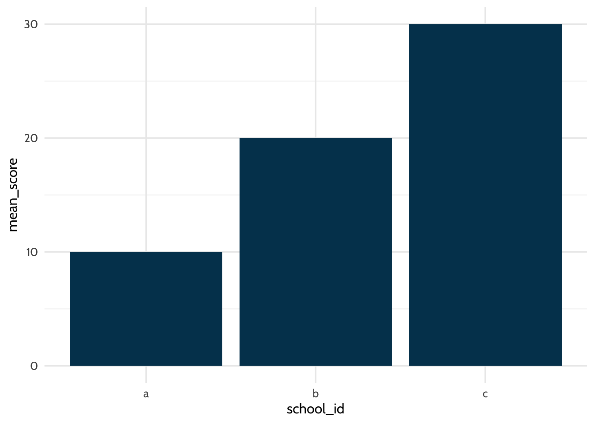
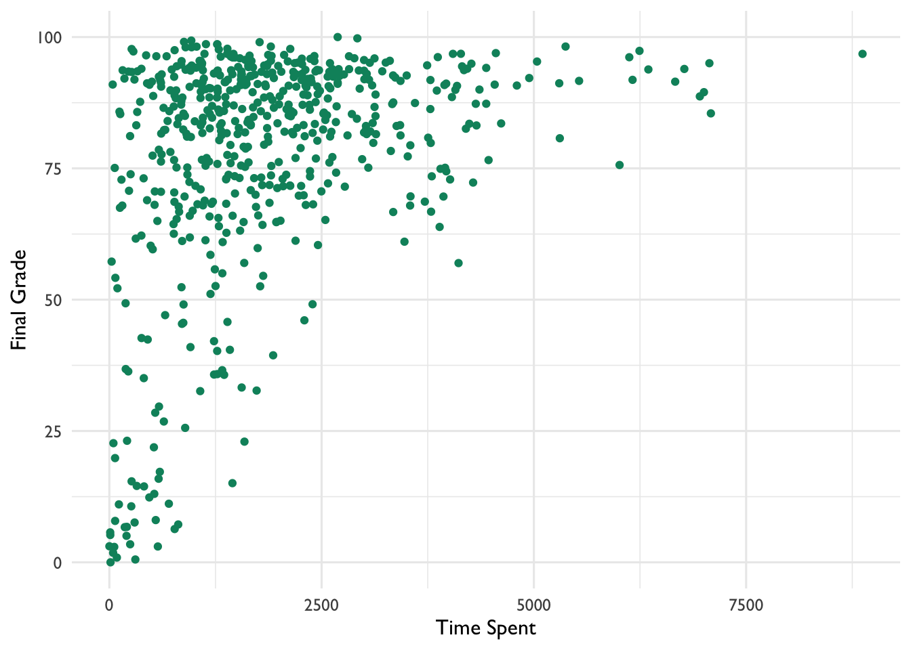
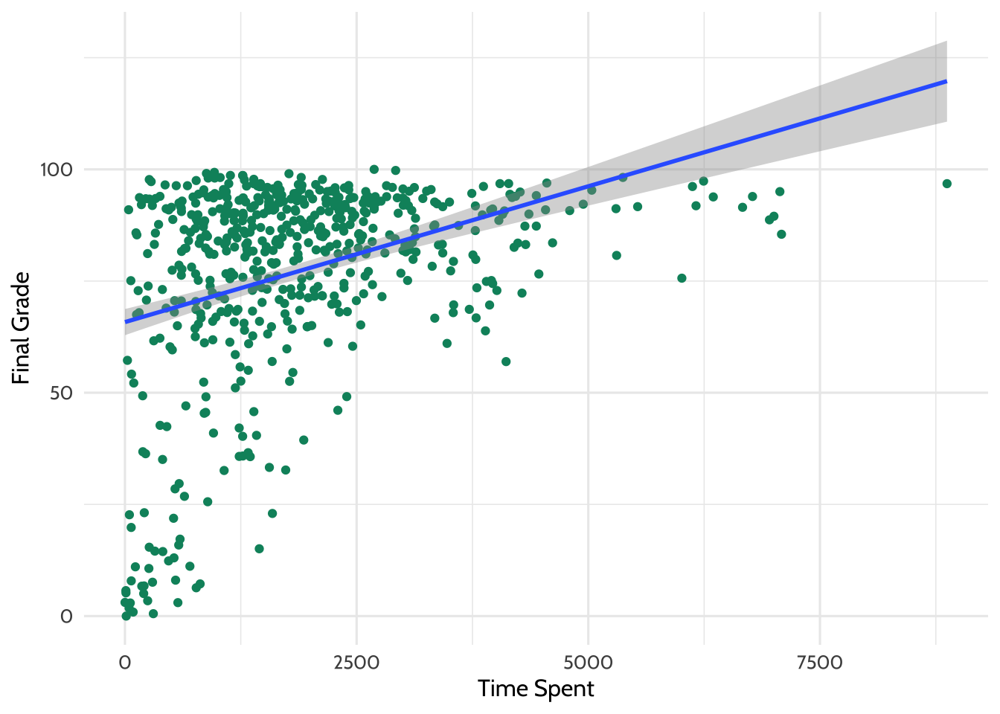

# Walkthrough 1: The Education Data Science Pipeline With Online Science Class Data {#c07}

## Topics Covered

- 

## Functions Introduced

- `lm()`

## Vocabulary

  - data frame
  - item
  - joins
  - keys
  - log-trace data
  - pass
  - reverse scale
  - regression
  - survey
  - tibble
  - vectorize

## Introduction to the Walkthroughs

This chapter is the first of eight walkthroughs included in the book. In it, we
present *one approach* to analyzing a specific dataset. In this chapter, the
approach is what we refer to as the *education data science pipeline*, orsome  the steps taken in many data science projects, including cleaning and tidying data as well as exploring and visualizing or modeling it.

Here, we will be using data from a number of online science classes and will show the process of
working with an education dataset from start to finish. While the walkthroughs
are very different, the structure and section headings will be consistent
throughout the walkthroughs. For example, every walkthrough will begin with a
vocabulary section, followed by an introduction to the dataset and an
introduction to the question or problem explored in the walkthrough. 

We note that this chapter assumes familiarity with the four core concepts that 
comprise the foundational skills framework: projects, functions, packages, and data. If you would 
like a refresher about (or an introduction to) any of those, the foundational skills chapter, 
then reading and writing and running some of the code in the previous chapter [Chapter 6](#06) may be helpful to you.

## Chapter Overview

In this walkthrough, we explore some of the key steps that are a part of many
data science in education projects. In particular, we explore how to process and
prepare data. These steps are sometimes referred to as "data wrangling". To do
so, we rely heavily on a set of tools that we use throughout *all* of the
walkthroughs, those associated with the {tidyverse}.

The {tidyverse} is a set of packages for data manipulation, exploration, and
visualization. that uses the design philosophy of 'tidy' data [@wickham2014].
Tidy data has a specific structure: each variable is a column, each observation
is a row, and each type of observational unit is a table. We'll discuss both the
{tidyverse} and tidy data much more throughout the book. For more information,
see the Foundational Skills chapters or <https://www.tidyverse.org/>.

### Background

The online science classes we explore in this chapter were designed and taught
by instructors through a statewide online course provider designed to supplement
- but not replace - students' enrollment in their local school. For example,
students may have chosen to enroll in an online physics class because one was
not offered at their school. The data were originally collected for a research
study, which utilized a number of different data sources to understand students'
course-related motivation. These datasets included:

1.  A self-report survey assessing three aspects of students' motivation
2.  Log-trace data, such as data output from the learning management system
3.  Discussion board data
4.  Academic achievement data

Our high-level *purpose* for this walkthrough is to conduct an analysis that
helps explain students' performance in these online courses. The *problem* we
are facing is a very common one when it comes to data science in education: the
data are complex and in need of further processing before we can get to the step
of running analyses. We will use this same dataset in the final walkthrough [Walkthrough 8/Chapter 14](#c14), and we will provide more details there about the dataset and the context. 

To understand students' performance, we will focus on a learning management
system (LMS) variable that indicates the amount of time students spent within
the course LMS. We will also explore the effects of the type of science course
and the section in which students are enrolled on student performance.

First, these different data sources will be described in terms of how they were
provided by the school.

### Data Sources

#### Data Source \#1: Self-Report Survey about Students' Motivation

The first data source is a self-report survey. This was data collected before
the start of the course. The survey included ten items, each corresponding to
one of three motivation *measures*: interest, utility value, and perceived
competence. A *measure* is a concept that we try to make concrete and assess
using survey questions. The three motivation measures we explore here come from
Expectancy-Value Theory, which states that students are motivated to learn when
they both believe that they can achieve something (expectancy, also known as
perceived competence) and believe that the concept they are trying to learn is
important (value) [@wigfield2000]. There are multiple types of value, but we
explore two of them here: interest and utility value. Utility value is the
degree to which a person is able to connect the concept being learned with
something they will utilize in their future life. This survey included the
following ten items:

1.  I think this course is an interesting subject. (Interest)
2.  What I am learning in this class is relevant to my life. (Utility value)
3.  I consider this topic to be one of my best subjects. (Perceived competence)
4.  I am not interested in this course. (Interest - reverse coded)
5.  I think I will like learning about this topic. (Interest)
6.  I think what we are studying in this course is useful for me to know.
    (Utility value)
7.  I don’t feel comfortable when it comes to answering questions in this area.
    (Perceived competence - reverse coded)
8.  I think this subject is interesting. (Interest)
9.  I find the content of this course to be personally meaningful. (Utility
    value)
10. I’ve always wanted to learn more about this subject. (Interest)

### Data Source \#2: Log-Trace Data

*Log-trace data* is data generated from our interactions with digital
technologies, such as archived data from social media postings (see
[Chapter 11](#c11) and [Chapter 12](#c12)). In education, an increasingly common
source of log-trace data is that generated from interactions with learning
management systems and other digital tools [@siemens2012]. The data for this
walk-through is a summary type of log-trace data: the number of minutes students
spent on the course. While this data type is fairly straightforward, there are
even more complex sources of log-trace data out there (e.g. time stamps
associated with when students started and stopped accessing the course!).

### Data Source \#3: Academic Achievement and Gradebook Data

This is a common source of data in the education realm: the graded assignments
students completed. In this walkthrough, we examine only students' final grade
for the course.

### Data Source \#4: Discussion Board Data

Discussion board data is both rich and unstructured because it is made up of
large chunks of text that the students wrote. While discussion board data was
collected for this research project, but we do not examine it in this
walkthrough. More information about analyzing text data can be found in
[Chapter 11](#c11).

### Methods

In this walkthrough, we will concentrate on merging different datasets together
by using the different "joins" available in the {dplyr} package. We will also
start exploring how to run linear models in R. 

## Load Packages

This analysis uses R packages, which are collections of R code that help users
code more efficiently, as you will recall from [Chapter 1](#c1). We load these
packages with the function `library()`. The specific packages we'll use here
will help us organize the structure of the data using the {tidyverse}
[@R-tidyverse], work with dates in the data using {lubridate}
[@R-lubridate], create formatted tables using {apaTables} [@R-apaTables] and
{sjPlot} [@R-sjPlot], and export datasets using {readxl} [@R-readxl].


```r
library(dataedu)
library(tidyverse)
library(lubridate)
library(apaTables)
library(sjPlot)
library(readxl)
```

## Import Data

This code chunk loads the log-trace data and self-report survey data from the
{dataedu} package. Note that we assign a dataset to an object three different
times, once for each of the three different datasets. We assign each of the
datasets a name using `<-`.


```r
# Pre-survey for the F15 and S16 semesters

pre_survey <- dataedu::pre_survey

# Gradebook and log-trace data for F15 and S16 semesters

course_data <- dataedu::course_data

# Log-trace data for F15 and S16 semesters - this is for time spent

course_minutes <- dataedu::course_minutes
```

## View Data

Now that we've successfully loaded all three log-trace datasets, we can visually
inspect the data by typing the names that we assigned to each dataset. Running
each line, one at a time, will show the first several rows of each dataset.


```r
pre_survey
```

```
## # A tibble: 1,102 x 12
##    opdata_username opdata_CourseID Q1Maincellgroup… Q1Maincellgroup…
##    <chr>           <chr>                      <dbl>            <dbl>
##  1 _80624_1        FrScA-S116-01                  4                4
##  2 _80623_1        BioA-S116-01                   4                4
##  3 _82588_1        OcnA-S116-03                  NA               NA
##  4 _80623_1        AnPhA-S116-01                  4                3
##  5 _80624_1        AnPhA-S116-01                 NA               NA
##  6 _80624_1        AnPhA-S116-02                  4                2
##  7 _80624_1        AnPhA-T116-01                 NA               NA
##  8 _80624_1        BioA-S116-01                   5                3
##  9 _80624_1        BioA-T116-01                  NA               NA
## 10 _80624_1        PhysA-S116-01                  4                4
## # … with 1,092 more rows, and 8 more variables: Q1MaincellgroupRow3 <dbl>,
## #   Q1MaincellgroupRow4 <dbl>, Q1MaincellgroupRow5 <dbl>,
## #   Q1MaincellgroupRow6 <dbl>, Q1MaincellgroupRow7 <dbl>,
## #   Q1MaincellgroupRow8 <dbl>, Q1MaincellgroupRow9 <dbl>,
## #   Q1MaincellgroupRow10 <dbl>
```

```r
course_data
```

```
## # A tibble: 29,711 x 8
##    CourseSectionOr… Bb_UserPK Gradebook_Item Grade_Category FinalGradeCEMS
##    <chr>                <dbl> <chr>          <chr>                   <dbl>
##  1 AnPhA-S116-01        60186 POINTS EARNED… <NA>                     86.3
##  2 AnPhA-S116-01        60186 WORK ATTEMPTED <NA>                     86.3
##  3 AnPhA-S116-01        60186 0.1: Message … <NA>                     86.3
##  4 AnPhA-S116-01        60186 0.2: Intro As… Hw                       86.3
##  5 AnPhA-S116-01        60186 0.3: Intro As… Hw                       86.3
##  6 AnPhA-S116-01        60186 1.1: Quiz      Qz                       86.3
##  7 AnPhA-S116-01        60186 1.2: Quiz      Qz                       86.3
##  8 AnPhA-S116-01        60186 1.3: Create a… Hw                       86.3
##  9 AnPhA-S116-01        60186 1.3: Create a… Hw                       86.3
## 10 AnPhA-S116-01        60186 1.4: Negative… Hw                       86.3
## # … with 29,701 more rows, and 3 more variables: Points_Possible <dbl>,
## #   Points_Earned <dbl>, Gender <chr>
```

```r
course_minutes
```

```
## # A tibble: 598 x 3
##    Bb_UserPK CourseSectionOrigID TimeSpent
##        <dbl> <chr>                   <dbl>
##  1     44638 OcnA-S116-01            1383.
##  2     54346 OcnA-S116-01            1191.
##  3     57981 OcnA-S116-01            3343.
##  4     66740 OcnA-S116-01             965.
##  5     67920 OcnA-S116-01            4095.
##  6     85355 OcnA-S116-01             595.
##  7     85644 OcnA-S116-01            1632.
##  8     86349 OcnA-S116-01            1601.
##  9     86460 OcnA-S116-01            1891.
## 10     87970 OcnA-S116-01            3123.
## # … with 588 more rows
```

## Process Data

Often, survey data needs to be processed in order to be most useful. We are
going to start with one of the three datasets we just saved as objects into our
environment: the dataset with the pre-survey items. Here, we process the
self-report items into three scales for 1) interest, 2) perceived competence,
and 3) utility value. We do this by:

  - Renaming the question variables to something more manageable
  - Reversing the response scales on questions 4 and 7
  - Categorizing each question into a measure
  - Computing the mean of each measure

Let's take these steps in order:

1.  Take the pre-survey data and save it as a new object with the same name
    "pre\_survey." Rename the question columns to something much simpler. To do
    this, we will use the `rename()` function and will input first the new
    variable name, then the "=" sign, and then the old variable name. You'll
    notice another function at the bottom called `mutate_at()`. We'll explain
    that below this code chunk.


```r
pre_survey  <-
  pre_survey  %>%
  # Rename the qustions something easier to work with because R is case sensitive
  # and working with variable names in mix case is prone to error
  rename(
    q1 = Q1MaincellgroupRow1,
    q2 = Q1MaincellgroupRow2,
    q3 = Q1MaincellgroupRow3,
    q4 = Q1MaincellgroupRow4,
    q5 = Q1MaincellgroupRow5,
    q6 = Q1MaincellgroupRow6,
    q7 = Q1MaincellgroupRow7,
    q8 = Q1MaincellgroupRow8,
    q9 = Q1MaincellgroupRow9,
    q10 = Q1MaincellgroupRow10
  ) %>%
  # Convert all question responses to numeric
  mutate_at(vars(q1:q10), list( ~ as.numeric(.)))
```

Let's take a moment to discuss the {dplyr} function `mutate_at()`. `mutate_at()`
is a version of `mutate()`, which changes the values in an existing column or
creates new columns. It's useful in education datasets because you'll often need
to transform your data before analyzing it. In the code chunk we just ran, we
used `mutate_at()` to convert the data in all ten variables into a numeric
format.

To learn a little more about `mutate()`, try the example below, where we create
a new data frame called "df". A data frame is a two-dimensional structure that stores tables. The table has a header and data rows and each cell stores values. 

We fill this data frame with two columns: "male" and
"female." Each column has only one value, and that value is 5. In the second
part of the code, we add a `total_students` column by adding the number of
`male` students and `female` students.

Note that we create the dataset with `tibble()`, which is from the {tibble} package included in the tidyverse. A tibble is a special type of data frame that makes working with the tidy data a little easier. More information is available in R for Data Science [@grolemund2018].


```r
# Dataset of students
df <- tibble(
  male = 5, 
  female = 5
)

# Use mutate to create a new column called "total_students" 
  # populate that column with the sum of the "male" and "female" variables
df %>% mutate(total_students = male + female)
```

```
## # A tibble: 1 x 3
##    male female total_students
##   <dbl>  <dbl>          <dbl>
## 1     5      5             10
```

To return to our original data, we used `mutate_at()`, a special version of
`mutate()` which conveniently changes the values of multiple columns. In our
dataset `pre_survey`, we let `mutate_at()` know we want to change the variables
`q1` through `q10`. We do this with the argument `vars(q1:q10)`.

2.  Next we'll reverse the scale of the survey responses on questions 4 and 7 so
    the responses for all questions can be interpreted in the same way. As you
    can see from the survey questions we listed earlier in the chapter, the
    phrasing of questions 4 and 7 is opposite the phrasing of the other
    questions. Rather than write a lot of code once to reverse the scales for
    question 4 then writing it again to reverse the scales on question 7, we'll
    build a function that does that job for us. Then we'll use the same function
    that we wrote to recode both question 4 and question 7. This will result in
    much less code, and it will make it easier for us to change in the future.

We'll use the function `case_when()` within our function to reverse the scale of
the item responses. `case_when()` is useful when you need to replace the values
in a column with other values based on some criteria. Education datasets use a
lot of codes to describe demographics, like numerical codes for disability
categories, race groups, or proficiency in a test. When you work with codes like
this, you'll often want to change the codes to values that are easier to
understand. For a example, a consultant analyzing how students did on state
testing might use `case_when()` to replace proficiency codes like 1, 2, or 3 to
more descriptive words like "below proficiency", "proficient", or "advanced."
	
`case_when()` lets you vectorize the rules you want to use to change values in a
column. When a sequence of criteria is vectorized, R will evaluate a value in a
column against each criteria in your `case_when()` sequence. `case_when()` is
helpful because it does this without requiring you to write complicated code
loops. Instead, you can systematically evaluate your criteria using code that is
compact and readable (once you understand how all the arguments work).

The left hand side of each `case_when()` argument will be a formula that returns
either a `TRUE` or a `FALSE`. In the function below, we'll use logical operators
in the left hand side of the formula like this: `question == 1 ~ 5`. Here are
some logical operators you can use in the future:

  - `==`: equal to
  - `>`: greater than
  - `<`: lesser than
  - `>=`: greater than or equal to
  - `<=`: lesser than or equal to
  - `!=`: not equal to
  - `!`: not
  - `&`: and
  - `|`: or

Let's make this all concrete and use it here in our function that reverses the
scale of the survey responses. In the first part of the code chunk below, we
will write our function. Note that by running the first bit of code here, we
won't be changing anything in our data. Instead, we are creating a reusable,
general-purpose code chunk that we will then apply to the specific survey
questions we want to recode.


```r
# This part of the code is where we write the function:
# Function for reversing scales 
reverse_scale <- function(question) {
  # Reverses the response scales for consistency
  #   Arguments:
  #     question - survey question
  #   Returns: 
  #    a numeric converted response
  # Note: even though 3 is not transformed, case_when expects a match for all
  # possible conditions, so it's best practice to label each possible input
  # and use TRUE ~ as the final statement returning NA for unexpected inputs
  x <- case_when(
    question == 1 ~ 5,
    question == 2 ~ 4,
    question == 3 ~ 3, 
    question == 4 ~ 2,
    question == 5 ~ 1,
    TRUE ~ NA_real_
  )
  x
}

# And here's where we use that function to reverse the scales
# We use the pipe operator %>% here
# Reverse scale for questions 4 and 7
pre_survey <-
  pre_survey %>%
  mutate(q4 = reverse_scale(q4),
         q7 = reverse_scale(q7))
```

You'll notice that we call the `reverse_scale()` function we wrote, but we call
it within the `mutate()` function. By doing things this way, we are overwriting
the previous data in the columns for questions 4 and 7 with our newly recoded
values for questions 4 and 7.

3.  Next, we'll use a function called `pivot_longer()` in order to transform our
    `pre_survey` dataset from wide format to long format. That means instead of
    having 1,102 observations of 12 variables, we will now have 11,020
    observations of 4 variables. By using `pivot_longer()`, we make it so that
    each question & response pair has its own line in the data. Therefore, since
    we have 10 question variables (columns) in the `pre_survey` dataset, after
    we use `pivot_longer()`, we will end up with 10 times as many observations
    (rows) as before. Additionally, we no longer need a separate column for each
    individual question, since each question-response pair is now on its own
    line. What was previously one row of data now takes up ten rows of data. so
    `pivot_longer()` automatically deletes those empty columns after condensing
    all the data. We'll save this new dataset as an object called `measure_mean`
    in order to represent new variables we will create in future data processing
    steps.


```r
# Pivot the dataset from wide to long format
measure_mean <-
  pre_survey %>%
  # Gather questions and responses
  pivot_longer(cols = q1:q10,
               names_to = "question",
               values_to = "response")
```

4.  Next, we'll take our new `measure_mean` dataset and create a column called
    `measure`. We'll fill that column with one of three question categories:

  - `int`: interest
  - `uv`: utility value
  - `pc`: perceived competence .

We will use the `case_when()` function we learned earlier in order to do this.
When we pivoted from wide format to long format in the prior step, we ended up
with one variable containing all possible question numbers (q1, q2, etc.). Now,
we want to tell R which question numbers correspond to which categories. To do
this, we will supply `case_when()` with a list of all the question numbers that
correspond to each category: interest, utility value, and perceived competence.
We'll introduce a new operator in order to do this: `%in!%`. Practically, this
operator means that R should look within a list for something. In the code
below, we tell R to use questions 1, 4, 5, 8, and 10 to create the category
`int`. We then tell R to use questions 2, 6, and 9 to calculate `uv` and to use
questions 3 and 7 to calculate `pc`. We indicate the start of each list with the
letter "c" and an open parenthesis, and we indicate the end of each list with a
close parenthesis.


```r
# Add measure variable 
measure_mean <- measure_mean %>% 
  # Here's where we make the column of question categories called "measure"
  mutate(
    measure = case_when(
      question %in% c("q1", "q4", "q5", "q8", "q10") ~ "int",
      question %in% c("q2", "q6", "q9") ~ "uv",
      question %in% c("q3", "q7") ~ "pc",
      TRUE ~ NA_character_)
  )
```

5.  Last, we'll take that same `measure_mean` dataset and create a new variable
    called `mean_response.` Since we are calculating the mean by category, we
    will need to first group the responses together using a function called
    `group_by()`. This function helps us get set up to calculate new columns
    with grouped data. Next, we'll use the function `summarize()` to create two
    new variables: `mean_response` and `percent_NA.` We'll find the mean
    response of each category using the `mean()` function.


```r
# Add measure variable 
measure_mean <- measure_mean %>%
  # First, we group by the new variable "measure"
  group_by(measure) %>%
  # Here's where we compute the mean of the responses
  summarize(
    # Creating a new variable to indicate the mean response for each measure
    mean_response = mean(response, na.rm = TRUE),
    # Creating a new variable to indicate the percent of each measure that 
    # had NAs in the response field
    percent_NA = mean(is.na(response))
    )

measure_mean
```

```
## # A tibble: 3 x 3
##   measure mean_response percent_NA
##   <chr>           <dbl>      <dbl>
## 1 int              4.25      0.178
## 2 pc               3.65      0.178
## 3 uv               3.74      0.178
```

With that last step, we have finished processing the `pre_survey` dataset. We
have renamed the relevant variables and computed some means that we can use
later.

### Processing the Course Data

When we loaded the data earlier in the chapter, we loaded three datasets:
`pre_survey`, `course_data`, and `course_minutes.` Next, we can process the
course data that we already loaded into the environment in order to create new
variables which we can use in analyses.

Information about the course subject, semester, and section are stored in a
single column, `CourseSectionOrigID`. This format of data storage is not ideal.
If we instead give each piece of information its own column, we'll have more
opportunities for later analysis. We'll use a function called `separate()` to do
this. Below, we will load `course_data` and run the `separate()` function to
split up the subject, semester, and section so we can use them later on. 


```r
# split course section into components
course_data <- 
  course_data %>%
  # Give course subject, semester, and section their own columns
  separate(
    col = CourseSectionOrigID,
    into = c("subject", "semester", "section"),
    sep = "-",
    remove = FALSE
  )
```

After running the code chunk above, take a look at the dataset `course_data` to
make sure it looks the way you'd expect it to look. In this case, we are
expecting that we will add 3 new variables, taking the total number of variables
in this dataset from 8 to 11. We will still see the original variable
`CourseSectionOrigID` in the data as well.

### Joining the Data

In this chapter, we are looking at two datasets that are derived from the same
courses. In order for these datasets to be most useful to us, we'd like all that
data to be in one place.

To join the course data and pre-survey data, we need to create similar *keys*.
Our goal here is to have one variable that matches across both datasets. Once we
have that common variable in both datasets, we can merge the datasets on the
basis of that variable.

When we look at the `course_data` and `pre_survey` datasets in our environment,
we see that both have variables for the course and the student. However, this
information is captured in different variable names in each dataset. Our first
goal will be to rename two variables in each of our datasets so that they will
match. One variable will correspond to the course, and the other will correspond
to the student. We are not changing anything in the data itself at this step -
instead, we are just cleaning the column headers up so that we can look at the
data all in one place.

Let's start with the pre-survey data. We will rename `RespondentID` and
`opdata_CourseID` to be `student_id` and `course_id`, respectively. Here, we are
going to use the same `rename()` function we learned earlier in this chapter.


```r
pre_survey <-
  pre_survey %>%
  rename(student_id = opdata_username,
         course_id = opdata_CourseID)

pre_survey
```

```
## # A tibble: 1,102 x 12
##    student_id course_id    q1    q2    q3    q4    q5    q6    q7    q8    q9
##    <chr>      <chr>     <dbl> <dbl> <dbl> <dbl> <dbl> <dbl> <dbl> <dbl> <dbl>
##  1 _80624_1   FrScA-S1…     4     4     4     5     5     4     5     5     5
##  2 _80623_1   BioA-S11…     4     4     3     4     4     4     4     3     4
##  3 _82588_1   OcnA-S11…    NA    NA    NA    NA    NA    NA    NA    NA    NA
##  4 _80623_1   AnPhA-S1…     4     3     3     4     3     3     3     4     2
##  5 _80624_1   AnPhA-S1…    NA    NA    NA    NA    NA    NA    NA    NA    NA
##  6 _80624_1   AnPhA-S1…     4     2     2     4     4     4     5     4     4
##  7 _80624_1   AnPhA-T1…    NA    NA    NA    NA    NA    NA    NA    NA    NA
##  8 _80624_1   BioA-S11…     5     3     3     5     5     4     5     5     3
##  9 _80624_1   BioA-T11…    NA    NA    NA    NA    NA    NA    NA    NA    NA
## 10 _80624_1   PhysA-S1…     4     4     3     4     4     4     4     4     3
## # … with 1,092 more rows, and 1 more variable: q10 <dbl>
```

Those variable names look better now!

When we look at the data more closely, though, we will notice that the
`student_id` variable has another issue - the variable has some additional
characters before and after *the actual ID* that we will need to be able to join
this data with the other data sources we have. Why does this variable have these
additional characters? Why is there a "1" at the end of every 5-digit ID number?
We are not sure! Sometimes, educational data from different systems (used for
different purposes) may have additional "meta"-data added on. In any event, here
is what the variables look like before processing:


```r
head(pre_survey$student_id)
```

```
## [1] "_80624_1" "_80623_1" "_82588_1" "_80623_1" "_80624_1" "_80624_1"
```

What we need is the five characters in between the underscore symbols - these:
`_`.

One way to do this is to use the `str_sub()` function from the {stringr}
package. This function lets us subset *string* variables: variables that store
text data. You can specify the indices of the variables you want the string to
*start* and *end* with.

Here, for example, is how we can select only the content starting with the
second character, skipping the first underscore in the process. This next chunk
of code will not change our data, but will show you how the `str_sub()` function
works by supplying a number-and-underscore combination to the function that is
in the same format as our data.


```r
str_sub("_99888_1", start = 2)
```

```
## [1] "99888_1"
```

We can apply the same thinking to delete characters from the end of a string. We
will use a `-` to indicate that we want to start from the right side of the
string of characters. Interestingly, when we specify the argument `end` below,
we will tell it the placement of the first character we want to INCLUDE. When we
type `end = -3`, we end up deleting only the last 2 characters. Our new
rightmost character will be the final 8.


```r
str_sub("_99888_1", end = -3)
```

```
## [1] "_99888"
```

Putting the pieces together, the following should return what we want. Try
running the code below to see if it yields the 5-digit ID number we are shooting
to extract.


```r
str_sub("_99888_1", start = 2, end = -3)
```

```
## [1] "99888"
```

_Note: you may receive a warning telling you that `NA` values were introduced by coercion. This happens when we change data types, and we will overlook this warning message for the purposes of this walkthrough._

We can apply this process to our data using `mutate()`. We convert the string
into a number using `as.numeric()` in the next portion of the code. This step is
important so the data can be joined to the other, numeric `student_id` variables
(in the other datasets):


```r
# Re-create the variable "student_id" so that it excludes the extraneous characters
pre_survey <- pre_survey %>% 
  mutate(student_id = str_sub(student_id, start = 2, end = -3))

# Save the new variable as numeric so that R no longer thinks it is text 
pre_survey <- pre_survey %>% 
  mutate(student_id = as.numeric(student_id))
```

```
## Warning: NAs introduced by coercion
```

Now that the `student_id` and `course_id` variables are ready to go in the
`pre_survey` dataset, let's proceed to the course data. Our goal is to rename
two variables that correspond to the course and the student so that we can match
with the other variables we just created for the pre-survey data. In the code
chunk below, we will rename both those variables.


```r
course_data <-
  course_data %>%
  rename(student_id = Bb_UserPK,
         course_id = CourseSectionOrigID)
```

Now that we have two variables that are consistent across both datasets - we
have called them `course_id` and `student_id` - we can join the two datasets
using the {dplyr} function, `left_join()`.

`left_join()` is named based on the 'direction' that the data is being joined.
Note the order of the data frames passed to our "left" join. Left joins retain
all of the rows in the data frame on the "left", and joins every matching row in
the right data frame to it. We will use two variables as keys for joining the
datasets, and we will specify those after the word `by`.

Let's save our joined data as a new object called `dat`.


```r
dat <-
  left_join(course_data, pre_survey,
            by = c("student_id", "course_id"))
dat
```

```
## # A tibble: 40,348 x 21
##    course_id subject semester section student_id Gradebook_Item Grade_Category
##    <chr>     <chr>   <chr>    <chr>        <dbl> <chr>          <chr>         
##  1 AnPhA-S1… AnPhA   S116     01           60186 POINTS EARNED… <NA>          
##  2 AnPhA-S1… AnPhA   S116     01           60186 WORK ATTEMPTED <NA>          
##  3 AnPhA-S1… AnPhA   S116     01           60186 0.1: Message … <NA>          
##  4 AnPhA-S1… AnPhA   S116     01           60186 0.2: Intro As… Hw            
##  5 AnPhA-S1… AnPhA   S116     01           60186 0.3: Intro As… Hw            
##  6 AnPhA-S1… AnPhA   S116     01           60186 1.1: Quiz      Qz            
##  7 AnPhA-S1… AnPhA   S116     01           60186 1.2: Quiz      Qz            
##  8 AnPhA-S1… AnPhA   S116     01           60186 1.3: Create a… Hw            
##  9 AnPhA-S1… AnPhA   S116     01           60186 1.3: Create a… Hw            
## 10 AnPhA-S1… AnPhA   S116     01           60186 1.4: Negative… Hw            
## # … with 40,338 more rows, and 14 more variables: FinalGradeCEMS <dbl>,
## #   Points_Possible <dbl>, Points_Earned <dbl>, Gender <chr>, q1 <dbl>,
## #   q2 <dbl>, q3 <dbl>, q4 <dbl>, q5 <dbl>, q6 <dbl>, q7 <dbl>, q8 <dbl>,
## #   q9 <dbl>, q10 <dbl>
```

Let's hone in on how this code is structured. After `left_join()`, we see
`course_data` and then `pre_survey`. In this case, `course_data` is the "left"
data frame (passed as the *first* argument), while `pre_survey` is the "right"
data frame (passed as the *second* argument). So, in the above code, what
happens? You can run the code yourself to check.

Our aim with that code is that all of the rows in `course_data` are retained in
our new data frame, `dat`, with matching rows of `pre_survey` joined to it. An
important note is that there are not multiple matching rows of `pre_survey`;
otherwise, you would end up with more rows in `dat` than expected. There is a
lot packed into this one function. Joins are extremely powerful - and common -
in many data analysis processing pipelines, both in education and in any field.
Think of all of the times you have data in more than one data frame, but you
want everything to be in a single data frame! As a result, we think that joins
are well worth investing the time to be able to use.

With most types of data, `left_join()` is helpful for carrying out most tasks
related to joining datasets. However, there are functions for other types of
joins that we want to make sure you know how to use. They may be less frequently
used than `left_join()`, but they are still worth mentioning. Note that for all
of these, the "left" data frame is always the first argument, and the "right"
data frame is always the second. When running the code chunks below, it can be
helpful to pay attention to the number of observations and variables in the
datasets before and after the joining. Eventually, the obscure names of these
types of joins will start to become more intuitive as you use them more often.

#### `semi_join()`

`semi_join()`: joins and retains all of the *matching* rows in the "left" and
"right" data frame. This is useful when you are only interested in keeping the
rows (or cases/observations) that are able to be joined. `semi_join()` will not
create duplicate rows of the left data frame, even when it finds multiple
matches on the right data frame. It will also keep only the columns from the
left data frame.

For example, the following returns only the rows that are present in both
`course_data` and `pre_survey`:


```r
dat_semi <- 
  semi_join(course_data,
            pre_survey,
            by = c("student_id", "course_id"))

dat_semi
```

```
## # A tibble: 28,655 x 11
##    course_id subject semester section student_id Gradebook_Item Grade_Category
##    <chr>     <chr>   <chr>    <chr>        <dbl> <chr>          <chr>         
##  1 AnPhA-S1… AnPhA   S116     01           60186 POINTS EARNED… <NA>          
##  2 AnPhA-S1… AnPhA   S116     01           60186 WORK ATTEMPTED <NA>          
##  3 AnPhA-S1… AnPhA   S116     01           60186 0.1: Message … <NA>          
##  4 AnPhA-S1… AnPhA   S116     01           60186 0.2: Intro As… Hw            
##  5 AnPhA-S1… AnPhA   S116     01           60186 0.3: Intro As… Hw            
##  6 AnPhA-S1… AnPhA   S116     01           60186 1.1: Quiz      Qz            
##  7 AnPhA-S1… AnPhA   S116     01           60186 1.2: Quiz      Qz            
##  8 AnPhA-S1… AnPhA   S116     01           60186 1.3: Create a… Hw            
##  9 AnPhA-S1… AnPhA   S116     01           60186 1.3: Create a… Hw            
## 10 AnPhA-S1… AnPhA   S116     01           60186 1.4: Negative… Hw            
## # … with 28,645 more rows, and 4 more variables: FinalGradeCEMS <dbl>,
## #   Points_Possible <dbl>, Points_Earned <dbl>, Gender <chr>
```

#### `anti_join()`

`anti_join()`: *removes* all of the rows in the "left" data frame that can be
joined with those in the "right" data frame.


```r
dat_anti <-
  anti_join(course_data,
            pre_survey,
            by = c("student_id", "course_id"))

dat_anti
```

```
## # A tibble: 1,056 x 11
##    course_id subject semester section student_id Gradebook_Item Grade_Category
##    <chr>     <chr>   <chr>    <chr>        <dbl> <chr>          <chr>         
##  1 AnPhA-S1… AnPhA   S116     01           85865 POINTS EARNED… <NA>          
##  2 AnPhA-S1… AnPhA   S116     01           85865 WORK ATTEMPTED <NA>          
##  3 AnPhA-S1… AnPhA   S116     01           85865 0.1: Message … <NA>          
##  4 AnPhA-S1… AnPhA   S116     01           85865 0.2: Intro As… Hw            
##  5 AnPhA-S1… AnPhA   S116     01           85865 0.3: Intro As… Hw            
##  6 AnPhA-S1… AnPhA   S116     01           85865 1.1: Quiz      Qz            
##  7 AnPhA-S1… AnPhA   S116     01           85865 1.2: Quiz      Qz            
##  8 AnPhA-S1… AnPhA   S116     01           85865 1.3: Create a… Hw            
##  9 AnPhA-S1… AnPhA   S116     01           85865 1.3: Create a… Hw            
## 10 AnPhA-S1… AnPhA   S116     01           85865 1.4: Negative… Hw            
## # … with 1,046 more rows, and 4 more variables: FinalGradeCEMS <dbl>,
## #   Points_Possible <dbl>, Points_Earned <dbl>, Gender <chr>
```

#### `right_join()`

`right_join()`: perhaps the least helpful of the three, `right_join()` works the
same as `left_join()`, but by retaining all of the rows in the "right" data
frame, and joining matching rows in the "left" data frame (so, the opposite of
`left_join()`).


```r
dat_right <-
  right_join(course_data,
             pre_survey,
             by = c("student_id", "course_id"))

dat_right
```

```
## # A tibble: 39,593 x 21
##    course_id subject semester section student_id Gradebook_Item Grade_Category
##    <chr>     <chr>   <chr>    <chr>        <dbl> <chr>          <chr>         
##  1 FrScA-S1… <NA>    <NA>     <NA>         80624 <NA>           <NA>          
##  2 BioA-S11… <NA>    <NA>     <NA>         80623 <NA>           <NA>          
##  3 OcnA-S11… <NA>    <NA>     <NA>         82588 <NA>           <NA>          
##  4 AnPhA-S1… <NA>    <NA>     <NA>         80623 <NA>           <NA>          
##  5 AnPhA-S1… <NA>    <NA>     <NA>         80624 <NA>           <NA>          
##  6 AnPhA-S1… <NA>    <NA>     <NA>         80624 <NA>           <NA>          
##  7 AnPhA-T1… <NA>    <NA>     <NA>         80624 <NA>           <NA>          
##  8 BioA-S11… <NA>    <NA>     <NA>         80624 <NA>           <NA>          
##  9 BioA-T11… <NA>    <NA>     <NA>         80624 <NA>           <NA>          
## 10 PhysA-S1… <NA>    <NA>     <NA>         80624 <NA>           <NA>          
## # … with 39,583 more rows, and 14 more variables: FinalGradeCEMS <dbl>,
## #   Points_Possible <dbl>, Points_Earned <dbl>, Gender <chr>, q1 <dbl>,
## #   q2 <dbl>, q3 <dbl>, q4 <dbl>, q5 <dbl>, q6 <dbl>, q7 <dbl>, q8 <dbl>,
## #   q9 <dbl>, q10 <dbl>
```

If we wanted this to return exactly the same output as `left_join()` (and so to
create a data frame that is identical to the `dat` data frame we created above), we could
simply switch the order of the two data frames to be the opposite of those used
for the `left_join()` above:


```r
dat_right <-
  semi_join(pre_survey,
            course_data,
            by = c("student_id", "course_id"))

dat_right
```

```
## # A tibble: 801 x 12
##    student_id course_id    q1    q2    q3    q4    q5    q6    q7    q8    q9
##         <dbl> <chr>     <dbl> <dbl> <dbl> <dbl> <dbl> <dbl> <dbl> <dbl> <dbl>
##  1      85791 FrScA-S1…     3     3     3     3     4     3     3     3     2
##  2      87010 FrScA-S1…     5     3     3     5     4     4     3     5     2
##  3      87027 FrScA-S1…     5     5     4     4     4     5     4     5     4
##  4      85649 FrScA-S1…    NA    NA    NA    NA    NA    NA    NA    NA    NA
##  5      86216 BioA-S11…     5     3     4     4     5     4     3     5     4
##  6      68476 OcnA-S11…     4     4     2     2     3     4     4     4     4
##  7      68476 OcnA-S11…     4     4     4     4     4     4     4     4     4
##  8      87866 FrScA-T1…     5     4     3     5     4     4     3     3     3
##  9      64930 FrScA-T1…     4     3     3     4     4     4     3     4     4
## 10      86280 FrScA-S1…     4     3     2     4     4     4     4     4     3
## # … with 791 more rows, and 1 more variable: q10 <dbl>
```

Now that we've gone through the different types of joins available, we will
return to our main focus: joining our course datasets together. While we didn't
do any data processing steps on it, we still have the `course_minutes` dataset
in our environment from when we loaded it there earlier in the chapter. In the
code chunk below, we will rename the necessary variables in that dataset so that
it is ready to merge. Then, we will merge the `course_minutes` dataset, with its
newly renamed variables `student_id` and `course_id`, with our `dat` dataset.


```r
course_minutes <-
  course_minutes %>%
  rename(student_id = Bb_UserPK,
         course_id = CourseSectionOrigID)

course_minutes <-
  course_minutes %>%
  # Change the data type for student_id in course_minutes so we can match to 
  # student_id in dat
  mutate(student_id = as.integer(student_id))

dat <- 
  dat %>% 
  left_join(course_minutes, 
            by = c("student_id", "course_id"))
```

Note that they're now combined, even though the course data had many more rows.
The pre-survey data has been joined for each student-course combination. We
have a pretty large data frame! Let's take a quick look.


```r
dat
```

```
## # A tibble: 40,348 x 22
##    course_id subject semester section student_id Gradebook_Item Grade_Category
##    <chr>     <chr>   <chr>    <chr>        <dbl> <chr>          <chr>         
##  1 AnPhA-S1… AnPhA   S116     01           60186 POINTS EARNED… <NA>          
##  2 AnPhA-S1… AnPhA   S116     01           60186 WORK ATTEMPTED <NA>          
##  3 AnPhA-S1… AnPhA   S116     01           60186 0.1: Message … <NA>          
##  4 AnPhA-S1… AnPhA   S116     01           60186 0.2: Intro As… Hw            
##  5 AnPhA-S1… AnPhA   S116     01           60186 0.3: Intro As… Hw            
##  6 AnPhA-S1… AnPhA   S116     01           60186 1.1: Quiz      Qz            
##  7 AnPhA-S1… AnPhA   S116     01           60186 1.2: Quiz      Qz            
##  8 AnPhA-S1… AnPhA   S116     01           60186 1.3: Create a… Hw            
##  9 AnPhA-S1… AnPhA   S116     01           60186 1.3: Create a… Hw            
## 10 AnPhA-S1… AnPhA   S116     01           60186 1.4: Negative… Hw            
## # … with 40,338 more rows, and 15 more variables: FinalGradeCEMS <dbl>,
## #   Points_Possible <dbl>, Points_Earned <dbl>, Gender <chr>, q1 <dbl>,
## #   q2 <dbl>, q3 <dbl>, q4 <dbl>, q5 <dbl>, q6 <dbl>, q7 <dbl>, q8 <dbl>,
## #   q9 <dbl>, q10 <dbl>, TimeSpent <dbl>
```

It looks like we have 40348 observations from 22 variables.

### Finding Distinct Cases at the Student-Level

If a student was enrolled in two courses, she will have a different final grade for each of
those two courses. However,  our data in
its current form has many rows representing *each course. An easy way we can visually inspect to make sure every row
is the same for the same student, by course is to use the `glimpse()` function. 
Try it below.


```r
glimpse(dat)
```

```
## Rows: 40,348
## Columns: 22
## $ course_id       <chr> "AnPhA-S116-01", "AnPhA-S116-01", "AnPhA-S116-01", "A…
## $ subject         <chr> "AnPhA", "AnPhA", "AnPhA", "AnPhA", "AnPhA", "AnPhA",…
## $ semester        <chr> "S116", "S116", "S116", "S116", "S116", "S116", "S116…
## $ section         <chr> "01", "01", "01", "01", "01", "01", "01", "01", "01",…
## $ student_id      <dbl> 60186, 60186, 60186, 60186, 60186, 60186, 60186, 6018…
## $ Gradebook_Item  <chr> "POINTS EARNED & TOTAL COURSE POINTS", "WORK ATTEMPTE…
## $ Grade_Category  <chr> NA, NA, NA, "Hw", "Hw", "Qz", "Qz", "Hw", "Hw", "Hw",…
## $ FinalGradeCEMS  <dbl> 86.272, 86.272, 86.272, 86.272, 86.272, 86.272, 86.27…
## $ Points_Possible <dbl> 5, 30, 105, 140, 5, 5, 20, 50, 10, 50, 5, 5, 24, 10, …
## $ Points_Earned   <dbl> 4.050, 24.000, 71.675, 140.970, 5.000, 4.000, NA, 50.…
## $ Gender          <chr> "F", "F", "F", "F", "M", "F", "F", "F", "F", "F", "M"…
## $ q1              <dbl> 5, 5, 5, 5, 5, 5, 5, 5, 5, 5, 5, 5, 5, 5, 5, 5, 5, 5,…
## $ q2              <dbl> 4, 4, 4, 4, 4, 4, 4, 4, 4, 4, 4, 4, 4, 4, 4, 4, 4, 4,…
## $ q3              <dbl> 5, 5, 5, 5, 5, 5, 5, 5, 5, 5, 5, 5, 5, 5, 5, 5, 5, 5,…
## $ q4              <dbl> 5, 5, 5, 5, 5, 5, 5, 5, 5, 5, 5, 5, 5, 5, 5, 5, 5, 5,…
## $ q5              <dbl> 5, 5, 5, 5, 5, 5, 5, 5, 5, 5, 5, 5, 5, 5, 5, 5, 5, 5,…
## $ q6              <dbl> 5, 5, 5, 5, 5, 5, 5, 5, 5, 5, 5, 5, 5, 5, 5, 5, 5, 5,…
## $ q7              <dbl> 5, 5, 5, 5, 5, 5, 5, 5, 5, 5, 5, 5, 5, 5, 5, 5, 5, 5,…
## $ q8              <dbl> 5, 5, 5, 5, 5, 5, 5, 5, 5, 5, 5, 5, 5, 5, 5, 5, 5, 5,…
## $ q9              <dbl> 5, 5, 5, 5, 5, 5, 5, 5, 5, 5, 5, 5, 5, 5, 5, 5, 5, 5,…
## $ q10             <dbl> 5, 5, 5, 5, 5, 5, 5, 5, 5, 5, 5, 5, 5, 5, 5, 5, 5, 5,…
## $ TimeSpent       <dbl> 2087.05, 2087.05, 2087.05, 2087.05, 2087.05, 2087.05,…
```

You can also use `View(dat)` in order to view the data in RStudio's viewer.

Visually inspecting the first several rows of data, we see that they all
correspond to the same student for the same course. As we expected, the
`FinalGradeCEMs` variable (representing students' final grade) is also consistent across these rows. 

Since we are not carrying out a finer-grained analysis using the `Gradebook_Item`, these
duplicate rows are not necessary. We only want variables at the student level,
and not at the level of different gradebook items. We can extract only the
unique student-level data using the `distinct()` function. This function takes
as arguments the name of the data frame and the name of the variables used to
determine what counts as a unique case.

Imagine having a bucket of Halloween candy that has 100 pieces of candy. You
know that these 100 pieces are really just a bunch of duplicate pieces from a
relatively short list of candy brands. `distinct()` takes that bucket of 100
pieces and returns a bucket containing only one of each distinct piece.

Another thing to note about `distinct()` is that it will only return the
variable(s) (it is possible to pass more than one variable to `distinct()`) you
used to determine uniqueness, *unless* you include the argument `.keep_all =
TRUE`. For the sake of making it simple to view the output, we will omit this
argument for now.

Were we to run `distinct(dat, Gradebook_Item)`, what do you think would be
returned? Running the following code returns a one-column data frame that lists the names of
every distinct gradebook item.
 

```r
distinct(dat, Gradebook_Item)
```

```
## # A tibble: 222 x 1
##    Gradebook_Item                                  
##    <chr>                                           
##  1 POINTS EARNED & TOTAL COURSE POINTS             
##  2 WORK ATTEMPTED                                  
##  3 0.1: Message Your Instructor                    
##  4 0.2: Intro Assignment - Discussion Board        
##  5 0.3: Intro Assignment - Submitting Files        
##  6 1.1: Quiz                                       
##  7 1.2: Quiz                                       
##  8 1.3: Create a Living Creature                   
##  9 1.3: Create a Living Creature - Discussion Board
## 10 1.4: Negative Feedback Loop Flowchart           
## # … with 212 more rows
```

You might be wondering whether some gradebook
items have the same names across courses. We can return the unique *combination*
of courses and gradebook items by simply adding another variable to
`distinct()`:


```r
distinct(dat, course_id, Gradebook_Item)
```

```
## # A tibble: 1,269 x 2
##    course_id     Gradebook_Item                                  
##    <chr>         <chr>                                           
##  1 AnPhA-S116-01 POINTS EARNED & TOTAL COURSE POINTS             
##  2 AnPhA-S116-01 WORK ATTEMPTED                                  
##  3 AnPhA-S116-01 0.1: Message Your Instructor                    
##  4 AnPhA-S116-01 0.2: Intro Assignment - Discussion Board        
##  5 AnPhA-S116-01 0.3: Intro Assignment - Submitting Files        
##  6 AnPhA-S116-01 1.1: Quiz                                       
##  7 AnPhA-S116-01 1.2: Quiz                                       
##  8 AnPhA-S116-01 1.3: Create a Living Creature                   
##  9 AnPhA-S116-01 1.3: Create a Living Creature - Discussion Board
## 10 AnPhA-S116-01 1.4: Negative Feedback Loop Flowchart           
## # … with 1,259 more rows
```

The data frame we get when we run the code chunk above yields a much longer (more
observations) dataset. Thus, it looks like *a lot* of gradebook items were
repeated across courses - likely across the different sections of the same
course. If you'd like, you can continue to investigate this: we would be curious
to hear what you find if you do!

Next, let's use a similar process to find the unique values at the student
level. Thus, instead of exploring unique gradebook items, we will explore unique
students (still accounting for the course, as students could enroll in more than
one course.) This time, we will add the `keep_all = TRUE` argument.


```r
dat <-
  distinct(dat, course_id, student_id, .keep_all = TRUE)
```

This is a much smaller data frame - with one row for each student in the course.
Whereas our prior version of the `dat` dataset had over 40,000 rows, that prior
version is only helpful if we wanted to do an analysis at the level of specific
students' grades for specific gradebook items. Our new dataset keeps only the
unique combinations of student and course, leaving us with a more manageable
number of observations: 603. Now that our data are ready to go, we can
start to ask some questions of the data.

Let's take one last step. Since we will be using the final grade variable in 
many of the figures and analyses that follow, let's rename it using the {dplyr} 
`rename()` function to something that is a bit easier to type and remember than
`FinalGradeCEMS`:


```r
dat <- rename(dat, final_grade = FinalGradeCEMS)
```

## Analysis

In this section, we focus on some initial analyses in the form of visualizations
and some models. We expand on these in [Chapter 13](#c13). Before we start
visualizing relationships between variables in our survey dataset, let's
introduce {ggplot2}, a visualization package we'll be using in our walkthroughs.

### About {ggplot2}

{ggplot2} is a package we’ll be using a lot for graphing our education datasets.
{ggplot2} is designed to build graphs layer by layer, where each layer is a
building block for your graph. Making graphs in layers is useful because we can
think of building up our graphs in separate parts: the data comes first, then
the x-axis and y-axis, and finally other components like text labels and graph
shapes. When something goes wrong and your ggplot2 code returns an error, you
can learn about what’s happening by removing one layer at a time and running it
again until the code works properly. Once you know which line is causing the
problem, you can focus on fixing it.

The first two lines of {ggplot2} code look similar for most graphs. The first
line tells R which dataset to graph and which columns the x-axis and y-axis will
represent. The second line tells R which shape to use when drawing the graph.
You can tell R which shape to use in your graphs with a family of {ggplot2}
functions that start with `geom_`. {ggplot2} has many graph shapes you can use,
including points, bars, lines, and boxplots. Here’s a {ggplot2} example using a
dataset of school mean test scores to graph a bar chart:


```r
# make dataset
students <- 
  tibble(
    school_id = c("a", "b", "c"), 
    mean_score = c(10, 20, 30)
  )

# tell R which dataset to plot and which columns the x-axis and y-axis will represent
students %>% 
  ggplot(aes(x = school_id, y = mean_score)) + 
  # draw the plot
  geom_bar(stat = "identity",
           fill = dataedu_colors("darkblue")) +
  theme_dataedu()
```

<div class="figure">

<p class="caption">(\#fig:fig7-1)Example Plot</p>
</div>

The `data` argument in the first line tells R we’ll be using the dataset called
`students`. The `aes` argument tells R we’ll be using values from the
`school_id` column for the x-axis and values from the `mean_score` column for
the y-axis. In the second line, the `geom_bar` function tells R we’ll drawing
the graph using the bar chart format. Each line of {ggplot2} code is connected by a
`+` at the end to tell R the next line of code is an additional {ggplot2} layer to
add.

Writing code is like writing essays. There's a range of acceptable styles and certainly you can practice unusual ways of writing, but other people will find it harder to understand what you want to say. In this book, you'll see variations in {ggplot2} style, but all within what we believe is the range of acceptable conventions. Here are some examples: 

 - Piping data to `ggplot()` using `%>%` vs including it as an argument in `ggplot()` 
 - Using `ggtitle()` for labels vs using `labs()` 
 - Order of `ggplot()` levels 

It's ok if those terms are new to you. The main point is there are multiple ways to make the plot you want. You'll see that in this book and in other peoples' code. As you learn, we encourage you to practice empathy and think about how well your code conveys your ideas to other people, including yourself when you look at it many weeks from when you wrote it. 

### The Relationship between Time Spent on Course and Final Grade

One thing we might be wondering is how time spent on course is related to
students' final grade. Let's make a plot to depict that relationship. Below,
we'll use `geom_point` instead of `geom_bar`.


```r
dat %>%
  # aes() tells ggplot2 what variables to map to what feature of a plot
  # Here we map variables to the x- and y-axis
  ggplot(aes(x = TimeSpent, y = final_grade)) + 
  # Creates a point with x- and y-axis coordinates specified above
  geom_point(color = dataedu_colors("green")) + 
  theme_dataedu() +
  labs(x = "Time Spent",
       y = "Final Grade")
```

<div class="figure">

<p class="caption">(\#fig:fig7-2)Percentage Earned vs. Time Spent</p>
</div>

_Note: you may receive a warning that reads `Warning message: Removed 5 rows containing missing values (geom_point).` This is due to the `NA` values that were introduced through coercion earlier in this walkthrough, and are not a cause for alarm!_

There appears to be *some* relationship. What if we added a line of best fit - a
linear model? The code below is the same plot we just made, but it includes the
addition of another layer called `geom_smooth`. 


```r
dat %>%
  ggplot(aes(x = TimeSpent, y = final_grade)) +
    geom_point(color = dataedu_colors("green")) + # same as above
  # this adds a line of best fit
  # method = "lm" tells ggplot2 to fit the line using linear regression
  geom_smooth(method = "lm") +
  theme_dataedu() +
  labs(x = "Time Spent",
       y = "Final Grade")
```

<div class="figure">

<p class="caption">(\#fig:fig7-3)Adding a Line of Best Fit</p>
</div>

Looking at this plot, it appears that the more time students spent on the
course, the higher that there final grade is. 

What is the line doing in the upper right part of the graph? Based upon the trend
that is observable in the data, the line of best fit predicts that students who spend 
a particular amount of time on the course *earn greater than 100* for their final grade!
Of course, this is not possible, and highlights the importance of understanding your 
data and carefully interpreting lines of best fit (and other, more sophisticated analyses)
carefully, keeping that understanding and knowledge in mind as you present and make sense 
of the results.

### Linear Model (Regression)

We can find out exactly what the relationship between these two variables is
using a linear model. We discuss linear models in more detail in
[Chapter 10](#c10).

Let's use this technique to model the relationship between the time spent on the
course and students' final grade. Here, we predict
`final_grade`. Students' final, reported grade is the dependent, or *y*-variable, and so
we enter it first, after the `lm()` command and before the tilde (`~`) symbol.
To the right of the tilde is one independent variable, `TimeSpent`, or the time
that students spent on the course. We also pass, or provide, the data frame,
`dat`. At this point, we're ready to run the model. Let's run this line of code
and save the results to an object - we chose `m_linear`, but any name will work.
We will then run the `summary()` function on the output.


```r
m_linear <-
  lm(final_grade ~ TimeSpent, data = dat)

summary(m_linear)
```

```
## 
## Call:
## lm(formula = final_grade ~ TimeSpent, data = dat)
## 
## Residuals:
##     Min      1Q  Median      3Q     Max 
## -67.136  -7.805   4.723  14.471  30.317 
## 
## Coefficients:
##              Estimate Std. Error t value Pr(>|t|)    
## (Intercept) 6.581e+01  1.491e+00   44.13   <2e-16 ***
## TimeSpent   6.081e-03  6.482e-04    9.38   <2e-16 ***
## ---
## Signif. codes:  0 '***' 0.001 '**' 0.01 '*' 0.05 '.' 0.1 ' ' 1
## 
## Residual standard error: 20.71 on 571 degrees of freedom
##   (30 observations deleted due to missingness)
## Multiple R-squared:  0.1335,	Adjusted R-squared:  0.132 
## F-statistic: 87.99 on 1 and 571 DF,  p-value: < 2.2e-16
```

Another way that we can generate table output is with a function from the
{sjPlot} package, `tab_model()`. When you run this code, you should see the
results pop up in the "Viewer" pane of RStudio. If you haven't changed the
default settings, this will be in the lower right quadrant of your screen.


```r
tab_model(m_linear,
          title = "Table 7.1")
```

<table style="border-collapse:collapse; border:none;">
<caption style="font-weight: bold; text-align:left;">Table 7.1</caption>
<tr>
<th style="border-top: double; text-align:center; font-style:normal; font-weight:bold; padding:0.2cm;  text-align:left; ">&nbsp;</th>
<th colspan="3" style="border-top: double; text-align:center; font-style:normal; font-weight:bold; padding:0.2cm; ">final grade</th>
</tr>
<tr>
<td style=" text-align:center; border-bottom:1px solid; font-style:italic; font-weight:normal;  text-align:left; ">Predictors</td>
<td style=" text-align:center; border-bottom:1px solid; font-style:italic; font-weight:normal;  ">Estimates</td>
<td style=" text-align:center; border-bottom:1px solid; font-style:italic; font-weight:normal;  ">CI</td>
<td style=" text-align:center; border-bottom:1px solid; font-style:italic; font-weight:normal;  ">p</td>
</tr>
<tr>
<td style=" padding:0.2cm; text-align:left; vertical-align:top; text-align:left; ">(Intercept)</td>
<td style=" padding:0.2cm; text-align:left; vertical-align:top; text-align:center;  ">65.81</td>
<td style=" padding:0.2cm; text-align:left; vertical-align:top; text-align:center;  ">62.88&nbsp;&ndash;&nbsp;68.74</td>
<td style=" padding:0.2cm; text-align:left; vertical-align:top; text-align:center;  "><strong>&lt;0.001</td>
</tr>
<tr>
<td style=" padding:0.2cm; text-align:left; vertical-align:top; text-align:left; ">TimeSpent</td>
<td style=" padding:0.2cm; text-align:left; vertical-align:top; text-align:center;  ">0.01</td>
<td style=" padding:0.2cm; text-align:left; vertical-align:top; text-align:center;  ">0.00&nbsp;&ndash;&nbsp;0.01</td>
<td style=" padding:0.2cm; text-align:left; vertical-align:top; text-align:center;  "><strong>&lt;0.001</td>
</tr>
<tr>
<td style=" padding:0.2cm; text-align:left; vertical-align:top; text-align:left; padding-top:0.1cm; padding-bottom:0.1cm; border-top:1px solid;">Observations</td>
<td style=" padding:0.2cm; text-align:left; vertical-align:top; padding-top:0.1cm; padding-bottom:0.1cm; text-align:left; border-top:1px solid;" colspan="3">573</td>
</tr>
<tr>
<td style=" padding:0.2cm; text-align:left; vertical-align:top; text-align:left; padding-top:0.1cm; padding-bottom:0.1cm;">R<sup>2</sup> / R<sup>2</sup> adjusted</td>
<td style=" padding:0.2cm; text-align:left; vertical-align:top; padding-top:0.1cm; padding-bottom:0.1cm; text-align:left;" colspan="3">0.134 / 0.132</td>
</tr>

</table>


This will work well for R Markdown documents (or simply to interpret the model
in R). If you want to save the model for use in a Word document, the
[{apaTables}](https://cran.r-project.org/web/packages/apaTables/vignettes/apaTables.html)
(https[]()://cran.r-project.org/web/packages/apaTables/vignettes/apaTables.html)
package may be helpful. To save a table in Word format, just pass the name of
the regression model to a function from the `apaTables` package, like we did
with the `tab_model()` function. Then, you can save the output to a Word
document, simply by adding a `filename` argument:


```r
apa.reg.table(m_linear, filename = "regression-table-output.doc")
```

You might be wondering what else the {apaTables} package does. We encourage you
to read more about the package here:
<https://cran.r-project.org/web/packages/apaTables/index.html>. The vignette is
especially helpful. One function that may be useful for writing manuscripts is
the following function for creating correlation tables. This function takes, as
an input, a data frame with the variables for which you wish to calculate
correlations.

Before we proceed to the next code chunk, let's talk about some functions we'll
be using a lot in this book. `filter()`, `group_by()`, and `summarize()` are
functions in the {dplyr} package that you will see a lot in upcoming chapters.
You got a preview of these functions earlier in this chapter, and now that
you've seen how they are used, we want to provide clear definitions for each of
these functions.

  - `filter()` removes rows from the dataset that don't match a criteria. Use it
    for tasks like only keeping records for students in the fifth grade
  - `group_by()` groups records together so you can perform operations on those
    groups instead of on the entire dataset. Use it for tasks like getting the
    mean test score of each school instead of a whole school district
  - `summarize()` and `summarise()` reduce your dataset down to a summary
    statistic. Use it for tasks like turning a dataset of student test scores
    into a dataset of grade levels and their mean test score

Now let's use these {dplyr} functions on our survey analysis. We will create the
same measures (based on the survey items) that we used earlier to understand how
they relate to one another.


```r
survey_responses <-
  pre_survey %>%
  # Gather questions and responses
  pivot_longer(cols = q1:q10,
               names_to = "question",
               values_to = "response") %>%
  mutate(
    # Here's where we make the column of question categories
    measure = case_when(
      question %in% c("q1", "q4", "q5", "q8", "q10") ~ "int",
      question %in% c("q2", "q6", "q9") ~ "uv",
      question %in% c("q3", "q7") ~ "pc",
      TRUE ~ NA_character_
    )
  ) %>%
  group_by(student_id, measure) %>%
  # Here's where we compute the mean of the responses
  summarize(
    # Mean response for each measure
    mean_response = mean(response, na.rm = TRUE)
    ) %>%
    # Filter NA (missing) responses
  filter(!is.na(mean_response)) %>%
  pivot_wider(names_from = measure, 
              values_from = mean_response)

survey_responses
```

```
## # A tibble: 515 x 4
## # Groups:   student_id [515]
##    student_id   int    pc    uv
##         <dbl> <dbl> <dbl> <dbl>
##  1      43146  5     4.5   4.33
##  2      44638  4.2   3.5   4   
##  3      47448  5     4     3.67
##  4      47979  5     3.5   5   
##  5      48797  3.8   3.5   3.5 
##  6      49147  4.25  3.73  3.71
##  7      51943  4.6   4     4   
##  8      52326  5     3.5   5   
##  9      52446  3     3     3.33
## 10      53248  4     3     3.33
## # … with 505 more rows
```

Now that we've prepared the survey responses, we can use the `apa.cor.table()` function:


```r
survey_responses %>% 
  apa.cor.table()
```

```
## 
## 
## Means, standard deviations, and correlations with confidence intervals
##  
## 
##   Variable      M        SD       1           2          3         
##   1. student_id 85966.07 10809.12                                  
##                                                                    
##   2. int        4.22     0.59     .00                              
##                                   [-.08, .09]                      
##                                                                    
##   3. pc         3.60     0.64     .04         .59**                
##                                   [-.05, .13] [.53, .64]           
##                                                                    
##   4. uv         3.71     0.71     .02         .57**      .50**     
##                                   [-.06, .11] [.51, .62] [.43, .56]
##                                                                    
## 
## Note. M and SD are used to represent mean and standard deviation, respectively.
## Values in square brackets indicate the 95% confidence interval.
## The confidence interval is a plausible range of population correlations 
## that could have caused the sample correlation (Cumming, 2014).
## * indicates p < .05. ** indicates p < .01.
## 
```

The time spent variable is on a very large scale (minutes); what if we
transformed it to represent the number of *hours* that students spent on the
course? Let's use the `mutate()` function we used earlier. We'll end the
variable name in `_hours`, to represent what this variable means.


```r
# creating a new variable for the amount of time spent in hours
dat <- 
  dat %>% 
  mutate(TimeSpent_hours = TimeSpent / 60)

# the same linear model as above, but with the TimeSpent variable in hours
m_linear_1 <- 
  lm(final_grade ~ TimeSpent_hours, data = dat)

# viewing the output of the linear model
tab_model(m_linear_1,
          title = "Table 7.2")
```

<table style="border-collapse:collapse; border:none;">
<caption style="font-weight: bold; text-align:left;">Table 7.2</caption>
<tr>
<th style="border-top: double; text-align:center; font-style:normal; font-weight:bold; padding:0.2cm;  text-align:left; ">&nbsp;</th>
<th colspan="3" style="border-top: double; text-align:center; font-style:normal; font-weight:bold; padding:0.2cm; ">final grade</th>
</tr>
<tr>
<td style=" text-align:center; border-bottom:1px solid; font-style:italic; font-weight:normal;  text-align:left; ">Predictors</td>
<td style=" text-align:center; border-bottom:1px solid; font-style:italic; font-weight:normal;  ">Estimates</td>
<td style=" text-align:center; border-bottom:1px solid; font-style:italic; font-weight:normal;  ">CI</td>
<td style=" text-align:center; border-bottom:1px solid; font-style:italic; font-weight:normal;  ">p</td>
</tr>
<tr>
<td style=" padding:0.2cm; text-align:left; vertical-align:top; text-align:left; ">(Intercept)</td>
<td style=" padding:0.2cm; text-align:left; vertical-align:top; text-align:center;  ">65.81</td>
<td style=" padding:0.2cm; text-align:left; vertical-align:top; text-align:center;  ">62.88&nbsp;&ndash;&nbsp;68.74</td>
<td style=" padding:0.2cm; text-align:left; vertical-align:top; text-align:center;  "><strong>&lt;0.001</td>
</tr>
<tr>
<td style=" padding:0.2cm; text-align:left; vertical-align:top; text-align:left; ">TimeSpent_hours</td>
<td style=" padding:0.2cm; text-align:left; vertical-align:top; text-align:center;  ">0.36</td>
<td style=" padding:0.2cm; text-align:left; vertical-align:top; text-align:center;  ">0.29&nbsp;&ndash;&nbsp;0.44</td>
<td style=" padding:0.2cm; text-align:left; vertical-align:top; text-align:center;  "><strong>&lt;0.001</td>
</tr>
<tr>
<td style=" padding:0.2cm; text-align:left; vertical-align:top; text-align:left; padding-top:0.1cm; padding-bottom:0.1cm; border-top:1px solid;">Observations</td>
<td style=" padding:0.2cm; text-align:left; vertical-align:top; padding-top:0.1cm; padding-bottom:0.1cm; text-align:left; border-top:1px solid;" colspan="3">573</td>
</tr>
<tr>
<td style=" padding:0.2cm; text-align:left; vertical-align:top; text-align:left; padding-top:0.1cm; padding-bottom:0.1cm;">R<sup>2</sup> / R<sup>2</sup> adjusted</td>
<td style=" padding:0.2cm; text-align:left; vertical-align:top; padding-top:0.1cm; padding-bottom:0.1cm; text-align:left;" colspan="3">0.134 / 0.132</td>
</tr>

</table>


The scale still does not seem quite right. What if we standardized the variable
to have a mean of zero and a standard deviation of one?


```r
# this is to standardize the TimeSpent variable to have a mean of 0 and a standard deviation of 1
dat <- 
  dat %>% 
  mutate(TimeSpent_std = scale(TimeSpent))

# the same linear model as above, but with the TimeSpent variable standardized
m_linear_2 <- 
  lm(final_grade ~ TimeSpent_std, data = dat)

# viewing the output of the linear model
tab_model(m_linear_2,
          title = "Table 7.3")
```

<table style="border-collapse:collapse; border:none;">
<caption style="font-weight: bold; text-align:left;">Table 7.3</caption>
<tr>
<th style="border-top: double; text-align:center; font-style:normal; font-weight:bold; padding:0.2cm;  text-align:left; ">&nbsp;</th>
<th colspan="3" style="border-top: double; text-align:center; font-style:normal; font-weight:bold; padding:0.2cm; ">final grade</th>
</tr>
<tr>
<td style=" text-align:center; border-bottom:1px solid; font-style:italic; font-weight:normal;  text-align:left; ">Predictors</td>
<td style=" text-align:center; border-bottom:1px solid; font-style:italic; font-weight:normal;  ">Estimates</td>
<td style=" text-align:center; border-bottom:1px solid; font-style:italic; font-weight:normal;  ">CI</td>
<td style=" text-align:center; border-bottom:1px solid; font-style:italic; font-weight:normal;  ">p</td>
</tr>
<tr>
<td style=" padding:0.2cm; text-align:left; vertical-align:top; text-align:left; ">(Intercept)</td>
<td style=" padding:0.2cm; text-align:left; vertical-align:top; text-align:center;  ">76.75</td>
<td style=" padding:0.2cm; text-align:left; vertical-align:top; text-align:center;  ">75.05&nbsp;&ndash;&nbsp;78.45</td>
<td style=" padding:0.2cm; text-align:left; vertical-align:top; text-align:center;  "><strong>&lt;0.001</td>
</tr>
<tr>
<td style=" padding:0.2cm; text-align:left; vertical-align:top; text-align:left; ">TimeSpent_std</td>
<td style=" padding:0.2cm; text-align:left; vertical-align:top; text-align:center;  ">8.24</td>
<td style=" padding:0.2cm; text-align:left; vertical-align:top; text-align:center;  ">6.51&nbsp;&ndash;&nbsp;9.96</td>
<td style=" padding:0.2cm; text-align:left; vertical-align:top; text-align:center;  "><strong>&lt;0.001</td>
</tr>
<tr>
<td style=" padding:0.2cm; text-align:left; vertical-align:top; text-align:left; padding-top:0.1cm; padding-bottom:0.1cm; border-top:1px solid;">Observations</td>
<td style=" padding:0.2cm; text-align:left; vertical-align:top; padding-top:0.1cm; padding-bottom:0.1cm; text-align:left; border-top:1px solid;" colspan="3">573</td>
</tr>
<tr>
<td style=" padding:0.2cm; text-align:left; vertical-align:top; text-align:left; padding-top:0.1cm; padding-bottom:0.1cm;">R<sup>2</sup> / R<sup>2</sup> adjusted</td>
<td style=" padding:0.2cm; text-align:left; vertical-align:top; padding-top:0.1cm; padding-bottom:0.1cm; text-align:left;" colspan="3">0.134 / 0.132</td>
</tr>

</table>


When we look at this output, it seems to make more sense. However, there is a
different interpretation now for the time spent variable: for every one standard
deviation increase in the amount of time spent on the course, students' final
grades increases by 8.24, or around eight percentage points.

## Results

Let's extend our regression model and consider the following to be the final
model in this sequence of models: What other variables may matter? Perhaps there
are differences based on the subject of the course. We can add subject as a
variable easily, as follows:


```r
# a linear model with the subject added 
# independent variables, such as TimeSpent_std and subject, can simply be separated with a plus symbol:
m_linear_3 <- 
  lm(final_grade ~ TimeSpent_std + subject, data = dat)
```

We can use `tab_model()` once again to view the results:


```r
tab_model(m_linear_3,
          title = "Table 7.4")
```

<table style="border-collapse:collapse; border:none;">
<caption style="font-weight: bold; text-align:left;">Table 7.4</caption>
<tr>
<th style="border-top: double; text-align:center; font-style:normal; font-weight:bold; padding:0.2cm;  text-align:left; ">&nbsp;</th>
<th colspan="3" style="border-top: double; text-align:center; font-style:normal; font-weight:bold; padding:0.2cm; ">final grade</th>
</tr>
<tr>
<td style=" text-align:center; border-bottom:1px solid; font-style:italic; font-weight:normal;  text-align:left; ">Predictors</td>
<td style=" text-align:center; border-bottom:1px solid; font-style:italic; font-weight:normal;  ">Estimates</td>
<td style=" text-align:center; border-bottom:1px solid; font-style:italic; font-weight:normal;  ">CI</td>
<td style=" text-align:center; border-bottom:1px solid; font-style:italic; font-weight:normal;  ">p</td>
</tr>
<tr>
<td style=" padding:0.2cm; text-align:left; vertical-align:top; text-align:left; ">(Intercept)</td>
<td style=" padding:0.2cm; text-align:left; vertical-align:top; text-align:center;  ">70.19</td>
<td style=" padding:0.2cm; text-align:left; vertical-align:top; text-align:center;  ">66.76&nbsp;&ndash;&nbsp;73.61</td>
<td style=" padding:0.2cm; text-align:left; vertical-align:top; text-align:center;  "><strong>&lt;0.001</td>
</tr>
<tr>
<td style=" padding:0.2cm; text-align:left; vertical-align:top; text-align:left; ">TimeSpent_std</td>
<td style=" padding:0.2cm; text-align:left; vertical-align:top; text-align:center;  ">9.63</td>
<td style=" padding:0.2cm; text-align:left; vertical-align:top; text-align:center;  ">7.90&nbsp;&ndash;&nbsp;11.37</td>
<td style=" padding:0.2cm; text-align:left; vertical-align:top; text-align:center;  "><strong>&lt;0.001</td>
</tr>
<tr>
<td style=" padding:0.2cm; text-align:left; vertical-align:top; text-align:left; ">subject [BioA]</td>
<td style=" padding:0.2cm; text-align:left; vertical-align:top; text-align:center;  ">-1.56</td>
<td style=" padding:0.2cm; text-align:left; vertical-align:top; text-align:center;  ">-8.64&nbsp;&ndash;&nbsp;5.52</td>
<td style=" padding:0.2cm; text-align:left; vertical-align:top; text-align:center;  ">0.665</td>
</tr>
<tr>
<td style=" padding:0.2cm; text-align:left; vertical-align:top; text-align:left; ">subject [FrScA]</td>
<td style=" padding:0.2cm; text-align:left; vertical-align:top; text-align:center;  ">11.73</td>
<td style=" padding:0.2cm; text-align:left; vertical-align:top; text-align:center;  ">7.38&nbsp;&ndash;&nbsp;16.08</td>
<td style=" padding:0.2cm; text-align:left; vertical-align:top; text-align:center;  "><strong>&lt;0.001</td>
</tr>
<tr>
<td style=" padding:0.2cm; text-align:left; vertical-align:top; text-align:left; ">subject [OcnA]</td>
<td style=" padding:0.2cm; text-align:left; vertical-align:top; text-align:center;  ">1.10</td>
<td style=" padding:0.2cm; text-align:left; vertical-align:top; text-align:center;  ">-3.96&nbsp;&ndash;&nbsp;6.16</td>
<td style=" padding:0.2cm; text-align:left; vertical-align:top; text-align:center;  ">0.670</td>
</tr>
<tr>
<td style=" padding:0.2cm; text-align:left; vertical-align:top; text-align:left; ">subject [PhysA]</td>
<td style=" padding:0.2cm; text-align:left; vertical-align:top; text-align:center;  ">16.04</td>
<td style=" padding:0.2cm; text-align:left; vertical-align:top; text-align:center;  ">10.00&nbsp;&ndash;&nbsp;22.07</td>
<td style=" padding:0.2cm; text-align:left; vertical-align:top; text-align:center;  "><strong>&lt;0.001</td>
</tr>
<tr>
<td style=" padding:0.2cm; text-align:left; vertical-align:top; text-align:left; padding-top:0.1cm; padding-bottom:0.1cm; border-top:1px solid;">Observations</td>
<td style=" padding:0.2cm; text-align:left; vertical-align:top; padding-top:0.1cm; padding-bottom:0.1cm; text-align:left; border-top:1px solid;" colspan="3">573</td>
</tr>
<tr>
<td style=" padding:0.2cm; text-align:left; vertical-align:top; text-align:left; padding-top:0.1cm; padding-bottom:0.1cm;">R<sup>2</sup> / R<sup>2</sup> adjusted</td>
<td style=" padding:0.2cm; text-align:left; vertical-align:top; padding-top:0.1cm; padding-bottom:0.1cm; text-align:left;" colspan="3">0.213 / 0.206</td>
</tr>

</table>


It looks like subject `FrSc` - forensic science - and subject `Ocn` -
oceanography - are associated with a higher final grade. This indicates that students in those two classes earned higher grades
than students in other science classes in this dataset.

## Conclusion

In this walkthrough, we focused on taking unprocessed, or raw data, and loading,
viewing, and then processing it through a series of steps. The result was a data
set which we could use to create visualizations and a simple (but powerful!)
linear model, also known as a regression model. We found that the time that
students spent on the course was positively (and statistically significantly)
related to students' final grades, and that there appeared to be differences by
subject. While we focused on using this model in a traditional, explanatory
sense, it could also potentially be used for predictive analytics, in that
knowing how long students spent on the course and what subject their course is
could be used to estimate what that students' final grade might be. We focus on
uses of predictive models further in [Chapter 14](#c14).

In the follow-up to this walkthrough (see [Chapter 13](#c13)), we will focus on
visualizing and then modeling the data using an advanced methodological
technique, multi-level models, using the data we prepared as a part of this data
processing pipeline used in this chapter.


