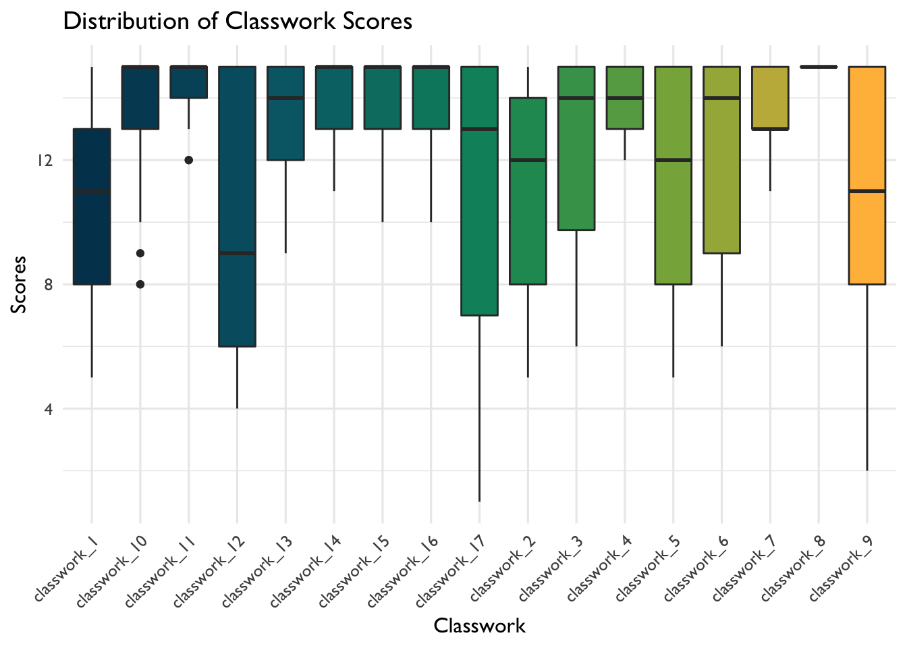
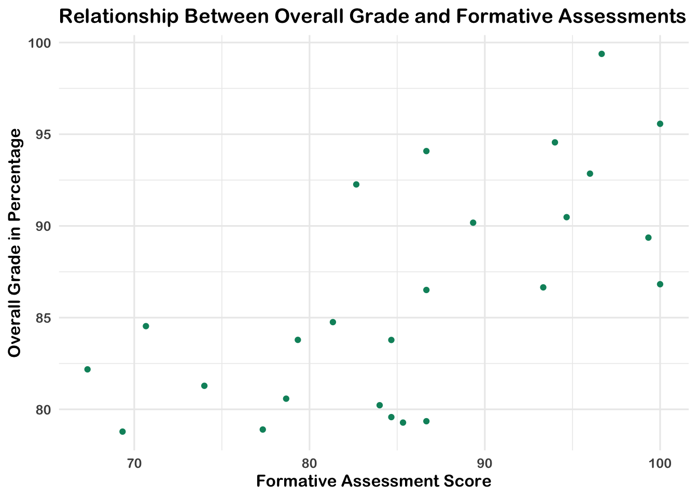
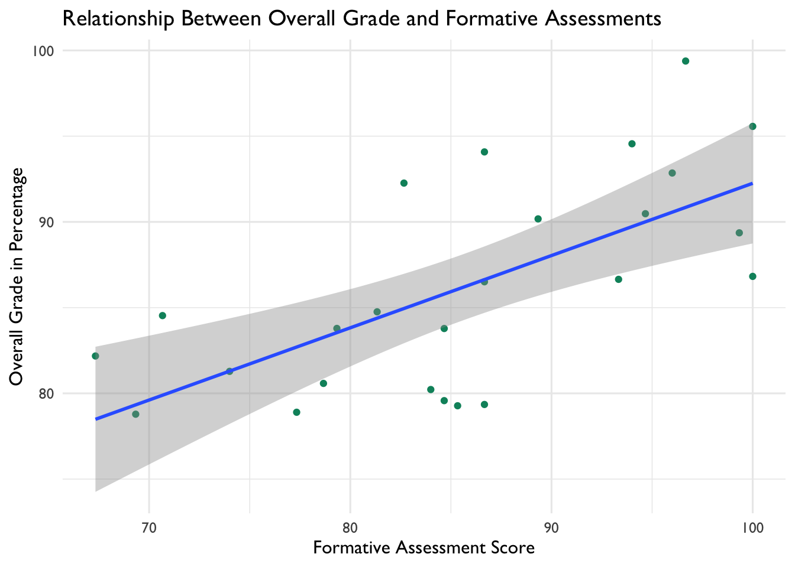
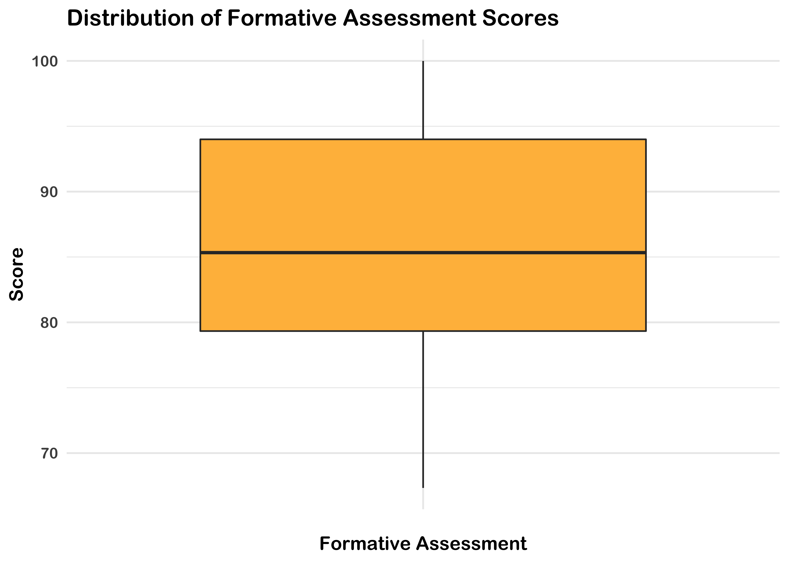

# Walkthrough 2: Approaching Gradebook Data From a Data Science Perspective {#c08}

## Introduction

There are a variety of data sources to explore in the education field. Student assessment scores can be examined for progress towards goals. The text from a teacher’s written classroom observation notes about a particular learner’s in-class behavior or emotional status can be analyzed for trends. We can tap into the exportable data available from common learning software or platforms popular in the K-12 education space.

## Data Sources

This walkthrough goes through a series of analyses using the data science framework. The first analysis centers around a ubiquitous K-12 classroom tool: the gradebook. We use an Excel gradebook template, *Assessment Types - Points* (https://web.mit.edu/jabbott/www/excelgradetracker.html), and simulated student data. On your first read through of this section try using our simulated dataset found in this book's `data/` folder.

## Load Packages

As mentioned in the Foundational Skills chapter, begin by loading the libraries that will be used. We will use the {tidyverse} package mentioned in [Walkthrough 1](06-wt-multilevel-models-1). The {readxl} package is used to read and import Excel spreadsheets since these file types are very common in the education field.

Make sure you have installed the packages in R on your computer before starting (see Foundational Skills chapter). Load the libraries, as they must be loaded each time we start a new project.


```r
# Load libraries
library(tidyverse)
library(here)
library(readxl)
library(janitor)
library(dataedu)
```

## Import Data

Recall how the Foundational Skills chapter recommended favoring CSV files, or comma-separated values files, when working with datasets in R. This is because CSV files, with the .csv file extension, are common in the digital world. However, data won't always come in the preferred file format. Fortunately, R can import a variety of data file types. This walkthrough imports an Excel file because these file types, with the .xlsx or .xls extensions, are very likely to be encountered in the K-12 education world.

This code uses the `read_excel()` function of the {readxl} package to find and read the data of the desired file. Note the file path that `read_excel()` takes to find the simulated dataset file named *ExcelGradeBook.xlsx* which sits in a folder on your computer if you have downloaded it. The function `getwd()` will help locate your current working directory. This tells where on the computer R is currently working with files.


```r
# See the current working directory
getwd()
```

For example, an R user on Linux or Mac might see their working directory as: `/home/username/Desktop`. A Windows user might see their working directory as: `C:\Users\Username\Desktop`.

From this location go deeper into files to find the desired file. For example, if you downloaded the [book repository](https://github.com/data-edu/data-science-in-education) from Github to your Desktop the path to the Excel file might look like one of these below:

* `/home/username/Desktop/data-science-in-education/data/gradebooks/ExcelGradeBook.xlsx` (on Linux & Mac) 
* `C:\Users\Username\Desktop\data-science-in-education\data\gradebooks\ExcelGradeBook.xlsx` (on Windows)

In the code below `ExcelGradeBook <- read_excel("path/to/file.xlsx", sheet = 1, skip = 10)` the part written `path/to/file.xlsx` is just pseudo code to remind you to swap in your own path to the file you want to import. Recall from the Foundational Skills section of this book that directories and file paths are important for finding files on your computer. 

After locating the sample Excel file run the code below to run the function `read_excel()` which reads and saves the data from *ExcelGradeBook.xlsx* to an object also called *ExcelGradeBook*. Note the two arguments specified in this code `sheet = 1` and `skip = 10`. This Excel file is similar to one you might encounter in real life with superfluous features that we are not interested in. This file has 3 different sheets and the first 10 rows contain things we won't need. Thus, `sheet = 1` tells `read_excel()` to just read the first sheet in the file and disregard the rest. While `skip = 10` tells `read_excel()` to skip reading the first 10 rows of the sheet and start reading from row 11 which is where the column headers and data actually start inside the Excel file. Remember to replace `path/to/file.xlsx` your own path to the file you want to import.


```r
# Use readxl package to read and import file and assign it a name
ExcelGradeBook <-
  read_excel(
    here::here("data", "gradebooks", "ExcelGradeBook.xlsx"),
    sheet = 1,
    skip = 10
  )
```

The *ExcelGradeBook* file has been imported into RStudio. Next, assign the data frame to a new name using the code below. Renaming cumbersome filenames can improve the readability of the code and make is easier for the user to call on the dataset later on in the code.


```r
# Rename data frame
gradebook <- ExcelGradeBook
```

Your environment will now have two versions of the dataset. There is *ExcelGradeBook* which was the original dataset imported. There is also *gradebook* which is currently a copy of *ExcelGradeBook*. As you progress through this section, we will work primarily with the *gradebook* dataset. Additionally, while working onward in this section of the book, if you make a mistake and mess up the *gradebook* data frame and are not able to fix it, you can reset the data frame to return to the same state as the original *ExcelGradeBook* data frame by running `gradebook <- ExcelGradeBook` again. This will overwrite your messed up *gradebook* data frame with the originally imported *ExcelGradeBook* data frame. Afterwards, just continue running code from this point in the text.

## Tidy Data

This walkthrough uses an Excel data file because it is one that we are likely to encounter. Moreover, the messy state of this file mirrors what might be encountered in real life. The Excel file contains more than one sheet, has rows we don't need, and uses column names that have spaces between words. All these things make the data tough to work with. The data is **not** tidy. We can begin to overcome these challenges before importing the file into RStudio by deleting the unnecessary parts of the Excel file then saving it as a .csv file. However, if you clean the file outside of R, this means if you ever have to clean it up (say, if the dataset is accidentally deleted and you need to redownload it from the original source) you would have to do everything from the beginning. We recommend cleaning the original data in R so that you can recreate all the steps necessary for your analysis. Also, the untidy Excel file provides realistic practice for tidying up the data programmatically using R itself.

First, modify the column names of the *gradebook* data frame to remove any spaces and replace them with an underscore. Using spaces as column names in R can present difficulties later on when working with the data.

Second, we want the column names of our data to be easy to use and understand. The original dataset has column names with uppercase letters and spaces. We can use the janitor package to quickly change them to a more useable format.


```r
colnames(gradebook) # look at original column names
```

```
##  [1] "Class"                                      
##  [2] "Name"                                       
##  [3] "Race"                                       
##  [4] "Gender"                                     
##  [5] "Age"                                        
##  [6] "Repeated Grades"                            
##  [7] "Financial Status"                           
##  [8] "Absent"                                     
##  [9] "Late"                                       
## [10] "Make your own categories"                   
## [11] "Running Average"                            
## [12] "Letter Grade"                               
## [13] "Homeworks"                                  
## [14] "Classworks"                                 
## [15] "Formative Assessments"                      
## [16] "Projects"                                   
## [17] "Summative Assessments"                      
## [18] "Another Type 2"                             
## [19] "Classwork 1"                                
## [20] "Homework 1"                                 
## [21] "Classwork 2"                                
## [22] "Homework 2"                                 
## [23] "Classwork 3"                                
## [24] "Classwork 4"                                
## [25] "Classwork 5"                                
## [26] "Classwork 6"                                
## [27] "Homework 3"                                 
## [28] "Formative Assessment 1"                     
## [29] "Project 1"                                  
## [30] "Classwork 7"                                
## [31] "Homework 4"                                 
## [32] "Project 2"                                  
## [33] "Classwork 8"                                
## [34] "Homework 5"                                 
## [35] "Project 3"                                  
## [36] "Homework 6"                                 
## [37] "Classwork 9"                                
## [38] "Homework 7"                                 
## [39] "Homework 8"                                 
## [40] "Project 4"                                  
## [41] "Project 5"                                  
## [42] "Formative Assessment 2"                     
## [43] "Project 6"                                  
## [44] "Classwork 10"                               
## [45] "Homework 9"                                 
## [46] "Classwork 11"                               
## [47] "Homework 10"                                
## [48] "Classwork 12"                               
## [49] "Classwork 13"                               
## [50] "Project 7"                                  
## [51] "Classwork 14"                               
## [52] "Classwork 15"                               
## [53] "Homework 11"                                
## [54] "Summative Assessment 1"                     
## [55] "Classwork 16"                               
## [56] "Homework 12"                                
## [57] "Classwork 17"                               
## [58] "Homework 13"                                
## [59] "Project 8"                                  
## [60] "Project 9"                                  
## [61] "Project 10"                                 
## [62] "Summative Assessment 2"                     
## [63] "Assessment | Insert new columns before here"
```

```r
gradebook <- 
  gradebook %>% 
  clean_names()

colnames(gradebook) # look at cleaned column names
```

```
##  [1] "class"                                    
##  [2] "name"                                     
##  [3] "race"                                     
##  [4] "gender"                                   
##  [5] "age"                                      
##  [6] "repeated_grades"                          
##  [7] "financial_status"                         
##  [8] "absent"                                   
##  [9] "late"                                     
## [10] "make_your_own_categories"                 
## [11] "running_average"                          
## [12] "letter_grade"                             
## [13] "homeworks"                                
## [14] "classworks"                               
## [15] "formative_assessments"                    
## [16] "projects"                                 
## [17] "summative_assessments"                    
## [18] "another_type_2"                           
## [19] "classwork_1"                              
## [20] "homework_1"                               
## [21] "classwork_2"                              
## [22] "homework_2"                               
## [23] "classwork_3"                              
## [24] "classwork_4"                              
## [25] "classwork_5"                              
## [26] "classwork_6"                              
## [27] "homework_3"                               
## [28] "formative_assessment_1"                   
## [29] "project_1"                                
## [30] "classwork_7"                              
## [31] "homework_4"                               
## [32] "project_2"                                
## [33] "classwork_8"                              
## [34] "homework_5"                               
## [35] "project_3"                                
## [36] "homework_6"                               
## [37] "classwork_9"                              
## [38] "homework_7"                               
## [39] "homework_8"                               
## [40] "project_4"                                
## [41] "project_5"                                
## [42] "formative_assessment_2"                   
## [43] "project_6"                                
## [44] "classwork_10"                             
## [45] "homework_9"                               
## [46] "classwork_11"                             
## [47] "homework_10"                              
## [48] "classwork_12"                             
## [49] "classwork_13"                             
## [50] "project_7"                                
## [51] "classwork_14"                             
## [52] "classwork_15"                             
## [53] "homework_11"                              
## [54] "summative_assessment_1"                   
## [55] "classwork_16"                             
## [56] "homework_12"                              
## [57] "classwork_17"                             
## [58] "homework_13"                              
## [59] "project_8"                                
## [60] "project_9"                                
## [61] "project_10"                               
## [62] "summative_assessment_2"                   
## [63] "assessment_insert_new_columns_before_here"
```

Review what the *gradebook* data frame looks like now. It shows 25 students and their individual values in various columns like *projects* or *formative_assessments*.


```r
view(gradebook)
```

The data frame looks cleaner now but there still are some things we can remove. For example, there are rows without any names in them. Also, there are entire columns that are unused and contain no data (such as gender). These are called missing values and are denoted by *NA*. Since our simulated classroom only has 25 learners and doesn't use all the columns for demographic information, we can safely remove these to tidy our dataset up even more.

We can remove the extra columns rows that have no data using the janitor package. The handy `remove_empty()` removes columns, rows, or both that have no information in them.


```r
# Removing rows with nothing but missing data
gradebook <- 
  gradebook %>% 
  remove_empty(c("rows", "cols"))
```

Now that the empty rows and columns have been removed, notice there are two columns, *absent* and *late*, where it seems someone started putting data into but then decided to stop. These two columns didn't get removed by the last chunk of code because they technically contained some data in those columns. Since the simulated data enterer of this simulated class decided to abandon using the *absent* and *late* columns in this gradebook, we can remove it from our data frame as well.

In the foundational skills chapter we introduced the `select()` function, which tells R which columns we want to keep. Let's do that again here. This time we'll use negative signs to say we want the dataset without *absent* and *late*.


```r
# Remove a targeted column because we don't use absent and late at this school.
gradebook <- 
  gradebook %>% 
  select(-absent, -late)
```

At last, the formerly untidy Excel sheet has been turned into a useful data frame. Inspect it once more to see the difference.


```r
view(gradebook)
```

## Process Data

R users transform data to facilitate working with the data during later phases of visualization and analysis. A few examples of data transformation include creating new variables, grouping data, and more. This code chunk first creates a new data frame named *classwork_df*, then selects particular variables from our gradebook dataset using `select()`, and finally gathers all the homework data under new variables into new columns.

As mentioned previously, `select()` is very powerful. In addition to explicitly writing out the columns you want to keep, you can also use functions from the package {stringr} within `select()`. The {stringr} package is within {tidyverse}. Here, we'll use the function `contains()` to tell R to select columns that contain a certain string (that is, text). Here, it searches for any column with the string *"classwork_"*. The underscore makes sure the variables from *classwork_1* all the way to *classwork_17* are included in *classwork_df*.

`pivot_longer()` transforms the dataset into tidy data.

Note that *scores* are in character format. We use mutate() to transform them to numerical format.


```r
# Creates new data frame, selects desired variables from gradebook, and gathers all classwork scores into key/value pairs
classwork_df <-
  gradebook %>%
  select(
    name,
    running_average,
    letter_grade,
    homeworks,
    classworks,
    formative_assessments,
    projects,
    summative_assessments,
    contains("classwork_")
  ) %>%
  mutate_at(vars(contains("classwork_")), list(~ as.numeric(.))) %>%
  pivot_longer(
    cols = contains("classwork_"),
    names_to = "classwork_number",
    values_to = "score"
  )
```

View the new data frame and note which columns were selected for this new data frame. Also, note how all the classwork scores were gathered under new columns *classwork_number* and *score*. The `contains()` function. We will use this *classwork_df* data frame later.


```r
view(classwork_df)
```

## Visualize Data

Visual representations of data are more human friendly than just looking at numbers alone. This next line of code shows a simple summary of the data by each column similar to what we did in Walkthrough 1.


```r
# Summary of the data by columns
summary(gradebook)
```

But R can do more than just print numbers to a screen. Use the {ggplot} package within {tidyverse} to graph some of the data to help get a better grasp of what the data looks like. This code uses {ggplot} to graph categorical variables into a bar graph. Here we can see the variable *Letter_grade* is plotted on the x-axis showing the counts of each letter grade on the y-axis. 


```r
# Bar graph for categorical variable
gradebook %>%
  ggplot(aes(x = letter_grade,
             fill = running_average > 90)) +
  geom_bar() +
  labs(title = "Bar Graph of Student Grades",
       x = "Letter Grades",
       y = "Count",
       fill = "A or Better") +
  theme_dataedu() +
  scale_fill_dataedu()
```


Using {ggplot}, we can create many types of graphs. Using our *classwork_df* from earlier, we can see the distribution of scores and how they differ from classwork to classwork using boxplots. We are able to do this because we have made the *classworks* and *scores* columns into tidy formats.


```r
# Scatterplot of continuous variable
classwork_df %>%
  ggplot(aes(x = classwork_number,
             y = score,
             fill = classwork_number)) +
  geom_boxplot() +
  labs(
    title = "Distribution of Classwork Scores",
    x = "Classwork",
    y = "Scores",
    color = "90% or Above"
  ) +
  theme_dataedu() +
  scale_fill_dataedu() +
  theme(legend.position = "none",
        # removes legend
        axis.text.x = element_text(angle = 45, hjust = 1)) # angles the x axis labels
```



## Model Data

### Deciding an Analysis

Using this spreadsheet, we can start to form hypotheses about the data. For example, we can ask ourselves, "Can we predict overall grade using formative assessment scores?" For this, we will try to predict a response variable Y (overall grade) as a function of a predictor variable Y (formative assessment scores). The goal is to create a mathematical equation for overall grade as a function of formative assessment scores when only formative assessment scores are known.

### Visualize Data to Check Assumptions

It's important to visualize data to see any distributions, trends, or patterns before building a model. We use {ggplot} to understand these variables graphically. 

#### Linearity

First, we plot X and Y to determine if we can see a linear relationship between the predictor and response. The x-axis shows the formative assessment scores while the y-axis shows the overall grades. The graph suggests a correlation between overall class grade and formative assessment scores. As the formative scores goes up, the overall grade goes up too.


```r
# Scatterplot between formative assessment and grades by percent
# To determine linear relationship
gradebook %>%
  ggplot(aes(x = formative_assessments,
             y = running_average)) +
  geom_point() +
  labs(title = "Relationship Between Overall Grade and Formative Assessments",
       x = "Formative Assessment Score",
       y = "Overall Grade in Percentage") +
  theme_dataedu()
```



We can layer different types of plots on top of each other in {ggplot}. Here the scatterplot is layered with a line of best fit, that suggests a positive linear relationship.


```r
# Scatterplot between formative assessment and grades by percent
# To determine linear relationship
# With line of best fit
gradebook %>%
  ggplot(aes(x = formative_assessments,
             y = running_average)) +
  geom_point() +
  geom_smooth(method = "lm",
              se = TRUE) +
  labs(title = "Relationship Between Overall Grade and Formative Assessments",
       x = "Formative Assessment Score",
       y = "Overall Grade in Percentage") +
  theme_dataedu()
```



#### Outliers

Now we use boxplots to determine if there are any outliers in formative assessment scores or overall grades. For linear regression, we're hoping to see no outliers in the data. We don't see any for these two variables, so we can proceed with the model.


```r
# Boxplot of formative assessment scores
# To determine if there are any outliers
gradebook %>%
  ggplot(aes(x = "",
             y = formative_assessments)) +
  geom_boxplot() +
  labs(title = "Distribution of Formative Assessment Scores",
       x = "Formative Assessment",
       y = "Score") +
  theme_dataedu()
```


```r
# Boxplot of overall grade scores in percentage
# To determine if there are any outliers
gradebook %>%
  ggplot(aes(x = "",
             y = running_average)) +
  geom_boxplot() +
  labs(title = "Distribution of Overall Grade Scores",
       x = "Overall Grade",
       y = "Score in Percentage") +
  theme_dataedu()
```



### Correlation Analysis

We want to know the strength of the relationship between the two variables formative assessment scores and overall grade percentage. The strength is denoted by the "correlation coefficient." The correlation coefficient goes from -1 to 1. If one variable consistently increases with the increasing value of the other, then they have a positive correlation (towards 1). If one variable consistently decreases with the increasing value of the other, then they have a negative correlation (towards -1). If the correlation coefficient is 0, then there is no relationship between the two variables.

Correlation is good for finding relationships but it does *not* imply that one variable causes the other (correlation does not mean causation).


```r
cor(gradebook$formative_assessments, gradebook$running_average)
```

```
## [1] 0.6632553
```

### Build Linear Model

In the multi-level modeling walkthrough, we introduced the concept of linear models. Let's use that same technique here. Now that you've checked your assumptions and seen a linear relationship, we can build a linear model, that is, a mathematical formula that calculates your running average as a function of your formative assessment score. This is done using the lm() function, where the arguments are:

* Your predictor (formative_assessments)
* Your response (running_average)
* The data (gradebook)


```r
linear_mod <- 
  lm(running_average ~ formative_assessments, data = gradebook)

summary(linear_mod)
```

```
## 
## Call:
## lm(formula = running_average ~ formative_assessments, data = gradebook)
## 
## Residuals:
##     Min      1Q  Median      3Q     Max 
## -7.2814 -2.7925 -0.0129  3.3179  8.5353 
## 
## Coefficients:
##                       Estimate Std. Error t value Pr(>|t|)    
## (Intercept)           50.11511    8.54774   5.863 5.64e-06 ***
## formative_assessments  0.42136    0.09914   4.250 0.000302 ***
## ---
## Signif. codes:  0 '***' 0.001 '**' 0.01 '*' 0.05 '.' 0.1 ' ' 1
## 
## Residual standard error: 4.657 on 23 degrees of freedom
## Multiple R-squared:  0.4399,	Adjusted R-squared:  0.4156 
## F-statistic: 18.06 on 1 and 23 DF,  p-value: 0.0003018
```

The formula reads as follows: 

```{}
running_average = 50.11511 + 0.42136*formative_assessments
```

