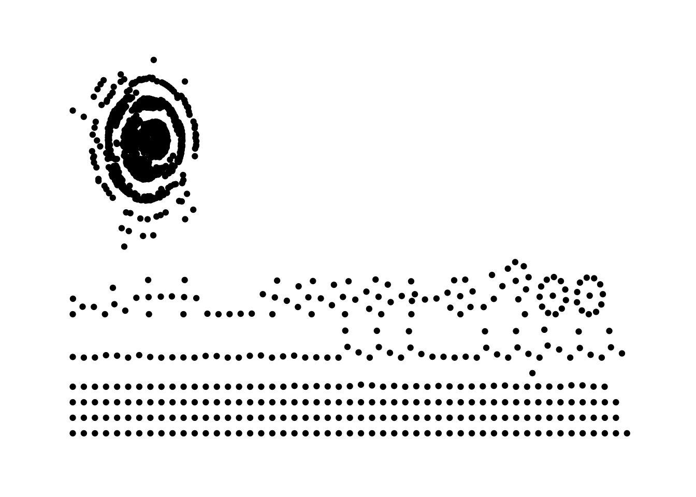
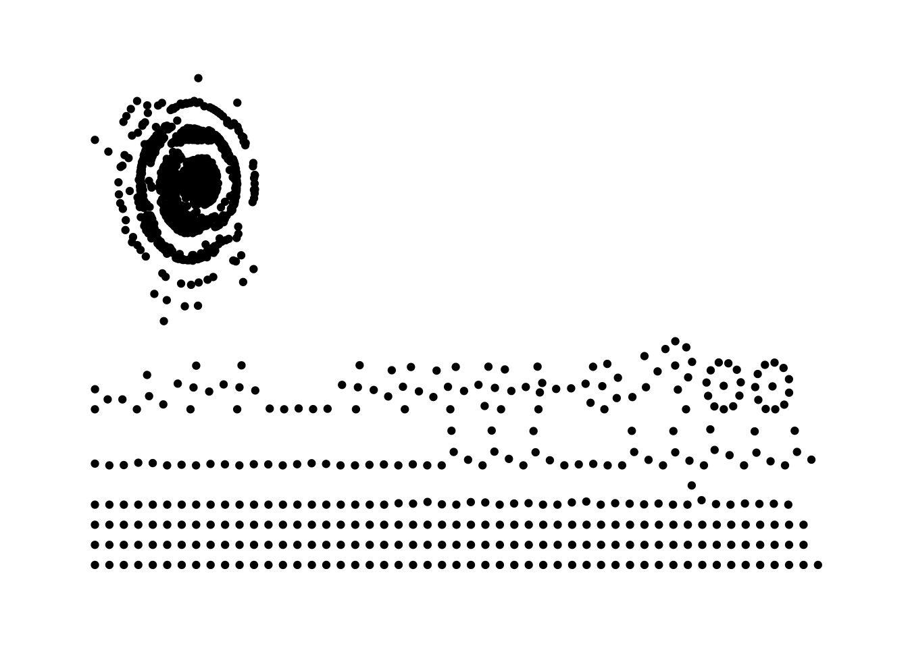

# 16-walkthrough-sna

In the past, if a teacher wanted advice about how to plan a unit or to design a lesson, they would likely turn to a trusted peer in their building or district [@spillane2012]. In the present, though, they are as likely to turn to someone in the professional learning network [@trust2016].

There are a few reasons to be interested in social media. For example, if you work in a school district, you may be interested in who is interacting with the content you share. If you are a researcher, you may wish to investigate what teachers, administrators, and others do through state-based hashtags (e.g., @rosenberg2016). Social media-based data can also be interesting because it provides new contexts for learning to take place, such as learning through informal communities.

In this chapter, we focus on a source of data that could be used to understand how one new community functions. That community, #tidytuesday is one sparked by the work of one of the *Data Science in Education Using R* co-authors, Jesse Mostipak, who created the #r4ds community from which #tidytuesday was created. #tidytuesday is a weekly data visualization challenge. A great place to see examples from past #tidytuesday challenges is an interactive Shiny application (https://github.com/nsgrantham/tidytuesdayrocks). 

In this walkthrough, we focus on a) accessing data on #tidytuesday from Twitter and b) trying to understand the nature of the interactions that take place through #tidytuesday. We note that while we focused on #tidytuesday because we think it exemplifies the new kinds of learning that a data science toolkit allows an analyst to try to understand (through new data sources), we also chose this because it is straightforward to access data from Twitter, and we think you may find other opportunities to analyze data from Twitter in other cases.

## Accessing data

In this chapter, we access data using the rtweet package [@kearney2016]. Through rtweet, it is easy to access data from Twitter as long as one has a Twitter account. We will load the tidyverse and rtweet packages to get started. Here is an example of searching the most recent 1,000 tweets which include the hashtag #rstats. When you run this code, you will be prompted to authenticate your access via Twitter. 


```r
library(tidyverse)
library(rtweet)
library(dataedu)
library(randomNames)
library(tidygraph)
library(ggraph)
```


```r
rstats_tweets <- 
  search_tweets("#rstats")
```

The search term can be easily changed to other hashtags - or other terms. To search for #tidytuesday tweets, we can simply replace #rstats with #tidytuesday. 


```r
tidytuesday_tweets <- 
  search_tweets("#tidytuesday")
```

A key point--and limitation--for how Twitter allows access to their data for the seven most recent days. There are a number of ways to access older data, which we discuss at the end of this chapter, though we focus on one way here: having access to the URLs to (or the status IDs for) tweets. We used this technique, which we describe in this chapter's *Appendix A*, along with other strategies for collecting historical data from Twitter. The data that we processed is available in the dataedu R package as the `tt-tweets` dataset.


```r
tt_tweets
```

```
## # A tibble: 4,418 x 90
##    user_id status_id created_at          screen_name text  source
##    <chr>   <chr>     <dttm>              <chr>       <chr> <chr> 
##  1 115921… 11631542… 2019-08-18 18:22:42 MKumarYYC   "Fir… Twitt…
##  2 107332… 11632475… 2019-08-19 00:33:11 cizzart     "El … Twitt…
##  3 107332… 11450435… 2019-06-29 18:57:17 cizzart     "Pro… Twitt…
##  4 107332… 11168648… 2019-04-13 00:45:15 cizzart     "#Ar… Twitt…
##  5 107332… 11228824… 2019-04-29 15:17:02 cizzart     "Pes… Twitt…
##  6 107332… 11176387… 2019-04-15 04:00:17 cizzart     "Dat… Twitt…
##  7 107332… 11245531… 2019-05-04 05:55:32 cizzart     "El … Twitt…
##  8 107332… 11407021… 2019-06-17 19:25:50 cizzart     "#da… Twitt…
##  9 107332… 11325299… 2019-05-26 06:12:46 cizzart     "El … Twitt…
## 10 107332… 11233585… 2019-04-30 22:48:43 cizzart     "Vis… Twitt…
## # … with 4,408 more rows, and 84 more variables: display_text_width <dbl>,
## #   reply_to_status_id <chr>, reply_to_user_id <chr>,
## #   reply_to_screen_name <chr>, is_quote <lgl>, is_retweet <lgl>,
## #   favorite_count <int>, retweet_count <int>, quote_count <int>,
## #   reply_count <int>, hashtags <list>, symbols <list>, urls_url <list>,
## #   urls_t.co <list>, urls_expanded_url <list>, media_url <list>,
## #   media_t.co <list>, media_expanded_url <list>, media_type <list>,
## #   ext_media_url <list>, ext_media_t.co <list>, ext_media_expanded_url <list>,
## #   ext_media_type <chr>, mentions_user_id <list>, mentions_screen_name <list>,
## #   lang <chr>, quoted_status_id <chr>, quoted_text <chr>,
## #   quoted_created_at <dttm>, quoted_source <chr>, quoted_favorite_count <int>,
## #   quoted_retweet_count <int>, quoted_user_id <chr>, quoted_screen_name <chr>,
## #   quoted_name <chr>, quoted_followers_count <int>,
## #   quoted_friends_count <int>, quoted_statuses_count <int>,
## #   quoted_location <chr>, quoted_description <chr>, quoted_verified <lgl>,
## #   retweet_status_id <chr>, retweet_text <chr>, retweet_created_at <dttm>,
## #   retweet_source <chr>, retweet_favorite_count <int>,
## #   retweet_retweet_count <int>, retweet_user_id <chr>,
## #   retweet_screen_name <chr>, retweet_name <chr>,
## #   retweet_followers_count <int>, retweet_friends_count <int>,
## #   retweet_statuses_count <int>, retweet_location <chr>,
## #   retweet_description <chr>, retweet_verified <lgl>, place_url <chr>,
## #   place_name <chr>, place_full_name <chr>, place_type <chr>, country <chr>,
## #   country_code <chr>, geo_coords <list>, coords_coords <list>,
## #   bbox_coords <list>, status_url <chr>, name <chr>, location <chr>,
## #   description <chr>, url <chr>, protected <lgl>, followers_count <int>,
## #   friends_count <int>, listed_count <int>, statuses_count <int>,
## #   favourites_count <int>, account_created_at <dttm>, verified <lgl>,
## #   profile_url <chr>, profile_expanded_url <chr>, account_lang <lgl>,
## #   profile_banner_url <chr>, profile_background_url <chr>,
## #   profile_image_url <chr>
```

## Preparing the data for the analysis

Network data, in general, and network data from Twitter, particularly, requires some processing before it can be used in subsequent analyses. In particular, we are going to create an edgelist, a data structure that is especially helpful for understanding the nature of relationships. 

An edgelist looks like the following, where the sender denotes who is initiating the interaction or relationship, and the receiver is who is the recipient of it:


```
## # A tibble: 12 x 2
##    sender               receiver                
##    <chr>                <chr>                   
##  1 Turner, Katie        Young, Lavelle          
##  2 el-Noori, Aaida      Sasiratna, Elizabeth    
##  3 el-Noori, Aaida      Carrillo Romero, Thunder
##  4 Nam, Anna            Sasiratna, Elizabeth    
##  5 Nam, Anna            Young, Lavelle          
##  6 Nam, Anna            Edmund, Rina-Beth       
##  7 Duran, Larry-Matthew Carrillo Romero, Thunder
##  8 Duran, Larry-Matthew Nichols, Andrew         
##  9 Duran, Larry-Matthew Edmund, Rina-Beth       
## 10 Davis, Michael       Staite, Jared           
## 11 Pasang, Emmett       Carrillo Romero, Thunder
## 12 Pasang, Emmett       Staite, Jared
```

In this edgelist, the sender could indicate, for example, someone who nominates someone else (the receiver) as someone they go to for help. The sender could also indicate someone who interacted with the receiver, such as by recognizing one of their tweets with a favorite (or a mention). In the following steps, we will work to create an edgelist from the data from #tidytuesday on Twitter.

## Extracting mentions

Let's extract the mentions. There is a lot going on in the code below; let's break it down line-by-line, starting with the `mutate()`:

- `mutate(all_mentions = str_extract_all(text, regex))`: this line uses a regex, or regular expression, to identify all of the usernames in the tweet (*note*: the regex comes from from [this page](https://stackoverflow.com/questions/18164839/get-twitter-username-with-regex-in-r))
- `mutate(has_mention = ifelse(!is.na(all_mentions), TRUE, FALSE))`: this line simply determines there are any mentions at all (or not); it is true if there is one or more mention
- `unnest(all_mentions)` this line uses a tidyr function, `unnest()` to move every mention to its own line, while keeping all of the other information the same (see more about `unnest()` here: https://tidyr.tidyverse.org/reference/unnest.html)
 

```r
regex <- "@([A-Za-z]+[A-Za-z0-9_]+)(?![A-Za-z0-9_]*\\.)"

tt_tweets <-
  tt_tweets %>%
  mutate(all_mentions = str_extract_all(text, regex)) %>%
  mutate(has_mention = if_else(!is.na(all_mentions), TRUE, FALSE)) %>%
  unnest(all_mentions)
```

Let's put these into their own data frame, called `mentions`.


```r
mentions <-
  tt_tweets %>%
  filter(has_mention) %>%
  mutate(all_mentions = str_trim(all_mentions)) %>%
  select(sender = screen_name, all_mentions)
```

## Putting the edgelist together

An edgelist is a common social network analysis data structure that has columns for the "sender" and "receiver" of interactions, or relations. For example, someone "sends" the mention to someone who is mentioned, who can be considered to "receive" it. This will require one last processing step. Let's look at our data as it is now.


```r
mentions
```

```
## # A tibble: 2,447 x 2
##    sender  all_mentions    
##    <chr>   <chr>           
##  1 cizzart @eldestapeweb   
##  2 cizzart @INDECArgentina 
##  3 cizzart @ENACOMArgentina
##  4 cizzart @tribunalelecmns
##  5 cizzart @CamaraElectoral
##  6 cizzart @INDECArgentina 
##  7 cizzart @tribunalelecmns
##  8 cizzart @CamaraElectoral
##  9 cizzart @AgroMnes       
## 10 cizzart @AgroindustriaAR
## # … with 2,437 more rows
```

What needs to happen to these to make them easier to work with in an edgelist? One step is to remove the "@" symbol from the columns we created and to save the results to a new tibble, `edgelist`.


```r
edgelist <- 
  mentions %>% 
  mutate(all_mentions= str_sub(all_mentions, start = 2)) %>% 
  select(sender, receiver = all_mentions)
```

## Plotting the network

Now that we have our edgelist, it is straightforward to plot the network. We'll use the {tidygraph} and {ggraph} packages to visualize the data.

We'll use the `as_tbl_graph()` function, which (by default) identified the first column as the "sender" and the second as the "receiver." Let's look at the object it creates, too.


```r
g <- 
  as_tbl_graph(edgelist)

g
```

```
## # A tbl_graph: 1340 nodes and 2447 edges
## #
## # A directed multigraph with 130 components
## #
## # Node Data: 1,340 x 1 (active)
##   name           
##   <chr>          
## 1 cizzart        
## 2 dgwinfred      
## 3 davidmasp      
## 4 datawookie     
## 5 jvaghela4      
## 6 FournierJohanie
## # … with 1,334 more rows
## #
## # Edge Data: 2,447 x 2
##    from    to
##   <int> <int>
## 1     1   619
## 2     1   620
## 3     1   621
## # … with 2,444 more rows
```

Next, we'll use the `ggraph()` function. Run the code below, and then uncomment, one at a time, the next two lines (the two beginning `geom_()`, running the code after uncommenting each line).


```r
g %>%
  ggraph() +
  geom_node_point() +
  # geom_node_text(aes(label = name)) +
  # geom_edge_link() +
  theme_graph()
```

```
## Using `stress` as default layout
```



Finally, lets size the points based on a measure of centrality, typically a measure of how (potentially) influence an individual may be, based on the interactions observed.


```r
g %>% 
  mutate(centrality = centrality_authority()) %>% 
  ggraph() +
  geom_node_point(aes(size = centrality, color = centrality)) +
  scale_color_continuous(guide = 'legend') + 
  geom_node_text(aes(label = name)) +
  geom_edge_link() +
  theme_graph()
```

```
## Using `stress` as default layout
```



There is much more you can do with **ggraph** (and **tidygraph**); check out the **ggraph** tutorial here: https://ggraph.data-imaginist.com/

## Selection and influence models

Behind these visualizations, though, there are also statistical models and methods that can help to understand what is going on with respect to particular relationships in a network in additional ways.

One way to consider these models and methods is in terms of two *processes* at play in our relationships (cite). These two processes are commonly (though not exclusively) the focus of statistical analyses of networks. In addition to not being exclusive, they do not interact independently: they affect each other reciprocally (Xu, Frank, & Penuel, 2018). They are:

- *Selection*: the processes regarding who chooses to have a relationship with whom
- *Infuence*: the processes regarding how who we have relationships with affects our behavior

While these are complex, they can be studied with the type of data collected from asking people about their relationships (and possibly asking them about or studying their behavior--or measuring some outcome). Happily, the use of these methods has expanded along with R: many of the best tools for studying social networks are in the form of long-standing R packages. Additionally, while there are many potential nuances to studying selection and influence, these are models that can fundamentally be carried out with regression, or the linear model (or extensions of it). We describe these in *Appendix B* for this chapter, as they do not use the tidytuesday dataset and are likely to be of interest to readers only after having mastered preparing and visualizing network data.

## Appendix A

<!-- Note - proposing moving this to the text analysis tidytuesday walkthrough -->

### Accessing historical data using status URLs

Because the creator of the interactive web application for exploring #tidytuesday content, #tidytuesday.rocks, searched for (and archived) #tidytuesday tweets on a regular basis, a large data set from more than one year of weekly #tidytuesday challenges is available through [the GitHub repository](https://github.com/nsgrantham/tidytuesdayrocks) for the Shiny application. These Tweets (saved in the `data` directory) can be read with the following function


```r
raw_tidytuesday_tweets <-
  read_delim(
    "https://raw.githubusercontent.com/nsgrantham/tidytuesdayrocks/master/data/tweets.tsv",
    "\t",
    escape_double = FALSE,
    trim_ws = TRUE
  )
```

```
## Parsed with column specification:
## cols(
##   status_url = col_character(),
##   screen_name = col_character(),
##   created_at = col_datetime(format = ""),
##   favorite_count = col_double(),
##   retweet_count = col_double(),
##   dataset_id = col_character()
## )
```

Then the URL for the tweet (the `status_url` column) can be passed to a different rtweet function than the one we used, `lookup_statuses()`. Before we do this, there is one additional step to take. Because most of the Tweets are from more than seven days ago, Twitter requires an additional authentication step. In short, you need to use keys and tokens for the Twitter API, or application programming interface. The rtweet vignette on accessing keys and tokens (https://rtweet.info/articles/auth.html) explains the process. The end result will be that you will create a token using rtweet that you will use along with your rtweet function (in this case, `lookup_statuses()`):


```r
token <-
  create_token(
    consumer_key = < add - your - key - here > ,
    consumer_secret = < add - your - secret - here >
  )

# here, we pass the status_url variable from raw_tidytuesday_tweets as the statuses to lookup in the lookup_statuses() function, as well as our token

tidytuesday_tweets <-
  lookup_statuses(raw_tidytuesday_tweets$status_url,
                  token = token)
```

The end result will be a tibble, like that above for #rstats, for #tidytuesday tweets.

### Accessing historical data when you do not have access to status URLs

In the above case, we had access to the URLs for tweets because they were saved for the #tidytuesday.rocks Shiny. But, in many cases, historical data will not be available. There are two strategies that may be helpful.

First is [TAGS](https://tags.hawksey.info/). TAGS is based in, believe it or not, Google Sheets, and it works great for collecting Twitter data over time - even a long period of time The only catch is that you need to setup and start to use a TAGS sheet *in advance of the period for which you want to collect data*. For example, you can start a TAGS archiver in August of one year, with the intention to collect data over the coming academic year; or, you can start a TAGS archiver before an academic conference for which you want to collect Tweets.

A second option is the Premium API through Twitter. This is an expensive option, but is one that can be done through rtweet, and can also access historical data, even if you haven not started a TAGS sheet and do not otherwise have access to the status URLs.

## Appendix B

As noted above, there is much more to understanding interactions, and network analysis, beyond creating edgelists and visualizing network data (through the use of an edgelist). Two processes that are particularly important (and able to be studied with network data using R) are for influence and selection. 

### An example of influence

First, let's look at an example of influence. To do so, let's create three different data frames. Here is what they should, at the end of the process, contain:

- A data frame indicating who the *nominator* and *nominee* for the relation (i.e., if Stefanie says that José is her friend, then Stefanie is the nominator and José the nominee) - as well as an optional variable indicating the weight, or strength, of their relation.
- This data frame and its type can be considered the basis for many types of social network analysis and is a common structure for network data: it is an *edgelist*.
- Data frames indicating the values of some behavior - an outcome - at two different time points.

In this example, we create some example data that can be used to explore questions about how influence works.

Let's take a look at the merged data. What this data now contains is the first data frame, `data1`, with each nominees' outcome at time 1 (`yvar1`). Note that we will find each nominators' outcome at time 2 later on.


```r
data1 <-
  data.frame(
    nominator = c(2, 1, 3, 1, 2, 6, 3, 5, 6, 4, 3, 4),
    nominee = c(1, 2, 2, 3, 3, 3, 4, 4, 4, 5, 6, 6),
    relate = c(1, 1, 1, 1, 1, 1, 1, 1, 1, 1, 1, 1)
  )

data2 <-
  data.frame(nominee = c(1, 2, 3, 4, 5, 6),
             yvar1 = c(2.4, 2.6, 1.1, -0.5, -3, -1))

data3 <-
  data.frame(nominator = c(1, 2, 3, 4, 5, 6),
             yvar2 = c(2, 2, 1, -0.5, -2, -0.5))
```

### Joining the data

Next, we'll join the data into one data frame. Note that while this (and data wrangling, in general) is sometimes tedius, especially with large (and messy) sources of network data, it is a key step for being able to carry out network analysis - often, even for creating visualiations that are informative.

Next, we'll join the data into one data frame. Note that while this is sometimes tedius and time-consuming, especially with large sources of network data, it is a key step for being able to carry out network analysis - often, even for creating visualiations that are informative.


```r
data <-
  left_join(data1, data2, by = "nominee")

data <-
  data %>% 
  mutate(nominee = as.character(nominee)) # this makes merging later easier

# calculate indegree in tempdata and merge with data
tempdata <- data.frame(table(data$nominee))

tempdata <-
  tempdata %>%
  rename("nominee" = "Var1", # rename the column "Var1" to "nominee"
         "indegree" = "Freq") %>% # rename the column "Freq" to "indegree"
  mutate(nominee = as.character(nominee)) # makes nominee a character data type, instead of a factor, which can cause problems

data <- 
  left_join(data, tempdata, by = "nominee")
```

#### Calculating an exposure term

This is the key step that makes this model - a regression, or linear, model - one that is special. It is creating an exposure term. The idea is that the exposure term "captures" how your interactions with someone, over some period of time (between the first and second time points) impact some outcome. This model accounts for an individual's initial report of the outcome, i.e., their time 1 prior value, so it is a model for *change* in some outcome.


```r
# Calculating exposure
data <-
  data %>% 
  mutate(exposure = relate * yvar1)

# Calculating mean exposure
mean_exposure <-
  data %>%
  group_by(nominator) %>%
  summarize(exposure_mean = mean(exposure))
```

What this data frame - `mean_exposure` - contains is the mean of the outcome (in this case, `yvar1`) for all of the individuals the nominator had a relation with.

As we need a final data set with `mean_exposure`,`degree`, `yvar1`, and `yvar2` added, we'll process the data a bit more.


```r
data2 <-
  data2 %>% 
  rename("nominator" = "nominee") # rename nominee as nominator to merge these

final_data <-
  left_join(mean_exposure, data2, by = "nominator")

final_data <- 
  left_join(final_data, data3, by = "nominator") # data3 already has nominator, so no need to change
```

#### Regression (linear model)

Calculating the exposure term is the most distinctive and important step in carrying out influence models. Now, we can simply use a linear model to find out how much relations - as captured by the influence term - affect some outcome.


```r
model1 <-
  lm(yvar2 ~ yvar1 + exposure_mean, data = final_data)

summary(model1)
```

```
## 
## Call:
## lm(formula = yvar2 ~ yvar1 + exposure_mean, data = final_data)
## 
## Residuals:
##        1        2        3        4        5        6 
##  0.02946 -0.09319  0.09429 -0.02730 -0.02548  0.02222 
## 
## Coefficients:
##               Estimate Std. Error t value Pr(>|t|)    
## (Intercept)    0.11614    0.03445   3.371   0.0434 *  
## yvar1          0.67598    0.02406  28.092  9.9e-05 ***
## exposure_mean  0.12542    0.03615   3.470   0.0403 *  
## ---
## Signif. codes:  0 '***' 0.001 '**' 0.01 '*' 0.05 '.' 0.1 ' ' 1
## 
## Residual standard error: 0.08232 on 3 degrees of freedom
## Multiple R-squared:  0.9984,	Adjusted R-squared:  0.9974 
## F-statistic: 945.3 on 2 and 3 DF,  p-value: 6.306e-05
```

So, the influence model is used to study a key process for social network analysis, but it is one that is useful, because you can quantify, given what you measure and how you measure it, *the network effect*, something that is sometimes not considered, especially in education (Frank, 2009). It's also fundamentally a regression. That's really it, as the majority of the work goes into calculating the exposure term.

### An example of selection

Selection models are also commonly used - and are commonly of interest not only to researchers but also to administrators and teachers (and even to youth and students). 

Here, we briefly describe a few possible approaches for using a selection model.

At its core, the selection model is a regression - albeit, one that is a generalization of one, namely, a logistic regression (sometimes termed a generalized linear model, because it is *basically* a regression but is one with an outcome that consists just of 0's and 1's). Thus, the most straight-away way to use a selection model is to use a logistic regression where all of the relations (note the `relate` variable in `data1` above) are indicated with a 1. But, here is the important and challenging step: all of the *possible relations* (i.e., all of the relations that are possible between all of the individuals in a network) are indicated with a 0 in an edgelist. Note that, again, an edgelist is the preferred data structure for carrying out this analysis. This step involves some data wrangling, especially the idea of widening or lengthening a data frame.

Once all of the relations are indicated with a 1 or a 0, then a simple linear regression can be used. Imagine that we are interested in whether individuals from the *same* group are more or less likely to interact than those from different groups; same could be created in the data frame based upon knowing which group both nominator and nominee are from:


```r
m_selection <- 
  glm(relate ~ 1 + same, data = edgelist1)
```

While this is a straightforward way to carry out a selection model, there are some limitations to it. Namely, it does not account for individuals who send more (or less) nominations overall--and not considering this may mean other effects, like the one associated with being from the *same* group, are not accurate. A few extensions of the linear model - including those that can use data for which relationships are indicated with weights, not just 1's and 0's, have been developed. 

One type of model extends the logistic regression. It can be used for data that is not only 1's and 0's but also data that is normally distributed . It is the amen package available [here](https://cran.r-project.org/web/packages/amen/index.html).

A particularly common one is an Exponential Random Graph Model, or an ERGM. An R package that makes estimating these easy is available [here](https://cran.r-project.org/web/packages/ergm/index.html). That R package, **ergm**, is part of a powerful and often-used collection of packages, including those for working with network data (data that can begin with an edgelist, but may need additional processing that is challenging to do with edgelist data), **statnet**. A link to the statnet packages is [here](https://statnet.org/).

Trust, T., Krutka, D. G., & Carpenter, J. P. (2016). “Together we are better”: Professional learning networks for teachers. Computers & education, 102, 15-34.
