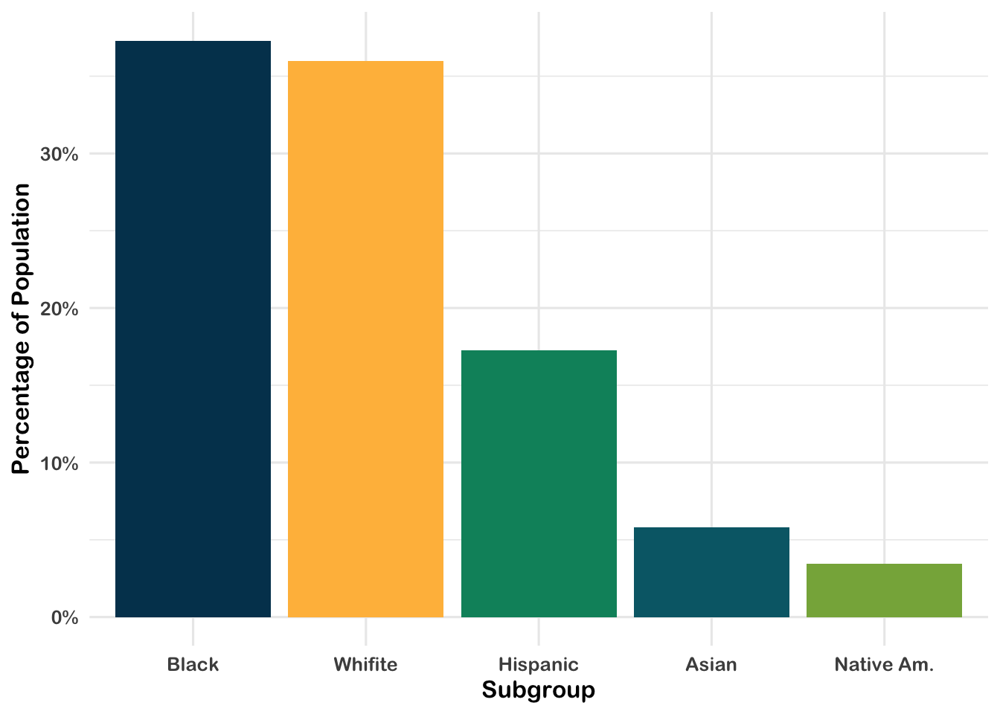
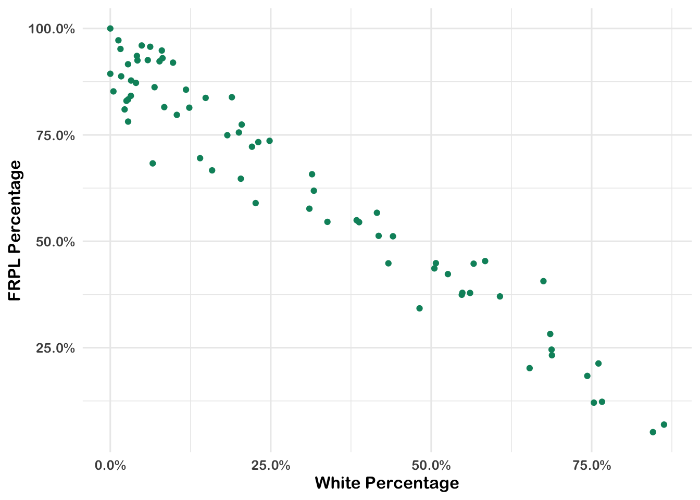

# Walkthrough 05: Introduction to Aggregate Data

## Introduction

### Background

A common situation encountered when using data for analyzing the education sector, particularly by analysts who are not directly working with schools or districts, is the prevalence of publicly available, aggregate data. Aggregate data refers to numerical or non-numerical information that is (1) collected from multiple sources and/or on multiple measures, variables, or individuals and (2) compiled into data summaries or summary reports, typically for the purposes of public reporting or statistical analysis [@greatschools2014]. Example of publicly available aggregate data include school-level graduation rates, state test proficiency scores by grade and subject, or averaged survey responses.

Aggregated datasets are essential both for accountability purposes and for providing useful information about schools and districts to those who are monitoring them. For example, district administrators might aggregate row-level (also known as individual-level or student-level) enrollment reports over time. This allows them to see how many students enroll in each school, in the district overall, and any grade-level variation. Depending on their state, the district administrator might submit these aggregate data to their state education agency for reporting purposes. These datasets might be posted on the state's department of education website for anybody to download and use.

Federal and international education datasets provide additional context for evaluating education systems. In the US, some federal datasets aim to consolidate important metrics from all states. This can be quite useful because each state has its own repository of data and to go through each state to download a particular metric is a significant effort. The federal government also funds assessments and surveys which are disseminated to the public. However, the federal datasets often have more stringent data requirements than the states, so the datasets may be less usable. 

For education data practitioners, these reports and datasets can be analyzed to answer questions related to their field of interest. However, publicly available, aggregate datasets are large and often suppressed to protect privacy. Sometimes they are already a couple of years old by the time they're released. Because of their coarseness, they can be difficult to interpret and use. Generally, aggregated data are generally used to surface of broader trends and patterns in education as opposed to diagnosing underlying issues or making causal statements. It is very important that we consider the limitations of aggregate data before analyzing them.

Analysis of aggregate data can help us identify patterns that may not have previously been known. When we have gained new insight, we can create research questions, craft hypotheses around our findings, and make recommendations on how to make improvements for the future.

#### Disaggregating Aggregated Data

Aggregated data can tell us many things, but in order for us to examine subgroups and their information, we must have data _disaggregated_ by the subgroups we hope to analyze. This data is still aggregated from row-level data but provides data on smaller components than the grand total. Common disaggregations for students include gender, race/ethnicity, socioeconomic status, English learner designation, and whether they are served under the Individuals with Disabilities Education Act (IDEA).

#### Disaggregating Data and Equity

Disaggregated data is essential to monitor equity in educational resources and outcomes. If only aggregate data is provided, we are unable to distinguish how different groups of students are doing and what support they need. With disaggregated data, we can identify where solutions are needed to solve disparities in opportunity, resources, and treatment.

It is important to define what equity means to your team so you know whether you are meeting your equity goals.

## Data Sources

There are many education-related, publicly available aggregate datasets. On the international level, perhaps the most well known is:

- [Programme for International Student Assessment (PISA)](http://www.oecd.org/pisa/), which measures 15-year-old school pupils' scholastic performance on mathematics, science, and reading.

On the federal level, examples include:

- [Civil Rights Data Collection (CRDC)](https://www2.ed.gov/about/offices/list/ocr/data.html), which reports many different variables on educational program and services disaggregated by race/ethnicity, sex, limited English proficiency, and disability. These data are school-level.

- [Common Core of Data (CCD)](https://nces.ed.gov/ccd/), which is the US Department of Education's primary database on public elementary and secondary education.

- [EdFacts](https://www2.ed.gov/about/inits/ed/edfacts/data-files/index.html), which includes state assessments and adjusted cohort graduation rates. These data are school- and district-level.

- [Integrated Postsecondary Education Data System (IPEDS)](https://nces.ed.gov/ipeds/), which is the US Department of Education's primary database on postsecondary education.

- [National Assessment for Educational Progress (NAEP) Data](https://nces.ed.gov/nationsreportcard/researchcenter/datatools.aspx), an assessment of educational progress in the United States. Often called the "nation's report card." The NAEP reading and mathematics assessments are administered to a representative sample of fourth- and eighth-grade students in each state every two years.

On the state and district level, examples include:

- [California Department of Education](https://www.cde.ca.gov/ds/), which is the state department of education website. It includes both downloadable CSV files and "Data Quest", which lets you query the data online.

- [Minneapolis Public Schools](https://mpls.k12.mn.us/reports_and_data), which is a district-level website with datasets beyond those listed in the state website.

#### Selecting Data

For the purposes of this walkthrough, we will be looking at a particular school district's data. This district reports their student demographics in a robust, complete way. Not only do they report the percentage of students in a subgroup, but they also include the number of students in each subgroup. This allows a deep look into their individual school demographics. Their reporting of the composition of their schools provides an excellent opportunity to explore inequities in a system. 

### Methods

In this chapter, we will walk through how running analyses on a publicly available dataset can help education data practitioners understand the landscape of needs and opportunities in the field of education. As opposed to causal analysis, which aims to assess the root cause of an phenomenon or the effects of an intervention, we use analysis on an aggregate dataset to find out whether there _is_ a phenomenon, _what_ it is, and _what_ we'd be trying to solve through interventions.

## Load Packages

As usual, we begin our code by calling the libraries we will use.


```r
library(tidyverse)
library(janitor)
library(dataedu)
```

ROpenSci created the [{tabulizer} package](https://github.com/ropensci/tabulizer) which provides R bindings to the Tabula java library, which can be used to computationaly extract tables from PDF documents. {RJava} is a required package to load {tabulizer}. Unfortunately, installing {RJava} on Macs can be very tedious. If you find yourself unable to install {tabulizer}, or would like to skip to the data processing, the data pulled from the PDFs is also saved so we can skip the steps requiring {RJava}.


```r
library(tabulizer)
```

## Import Data

{tabulizer} pulls the PDF data into lists using `extract_tables()`.


```r
# race data
race_pdf <-
  extract_tables("https://studentaccounting.mpls.k12.mn.us/uploads/mps_fall2018_racial_ethnic_by_school_by_grade.pdf")
```

It is important to consistently check what we're doing with the actual PDF's to ensure we're getting the data that we need. 

* We then transform the list to a data frame with `map(as_tibble)`.
* The `slice()` in `map_df()` removes unnecessary rows from the PDF.
* Now we create readable column names using `set_names()`.


```r
race_df <-
  race_pdf %>%
  # turn each page into a tibble
  map(as_tibble) %>% 
  # remove unnecessary rows
  map_df( ~ slice(.,-1:-2)) %>%
  # use descriptive column names
  set_names(
    c(
      "school_group",
      "school_name",
      "grade",
      "na_num",
      # native american number of students
      "na_pct",
      # native american percentage of students
      "aa_num",
      # african american number of students
      "aa_pct",
      # african american percentage
      "as_num",
      # asian number of students
      "as_pct",
      # asian percentage
      "hi_num",
      # hispanic number of students
      "hi_pct",
      # hispanic percentage
      "wh_num",
      # white number of students
      "wh_pct",
      # white percentage
      "pi_pct",
      # pacific islander percentage
      "blank_col",
      "tot" # total number of students
    )
  )
```

For the Race/Ethnicity table, we want the totals for each district school as we won't be looking at grade-level variation. When analyzing the PDF, we see the totals have "Total" in the School Name.

We clean up this dataset by:

1. Removing unnecessary or blank columns using `select()`. Negative selections means those columns will be removed.
2. Removing all Grand Total rows (otherwise they'll show up in our data, when we just want district-level data) using `filter()`. We keep schools that have "Total" in the name but remove any rows that are Grand Total.
3. Then we trim white space from strings.
4. The data in the "percentage" columns are provided with a percentage sign. This means we will have to remove all of them to be able to do math on these columns (for example, adding them together). Also, we want to divide the numbers by 100 so they are true percentages.


```r
race_clean <-
  race_df %>%
  # remove unnecessary columns
  select(-school_group,-grade,-pi_pct,-blank_col) %>%
  # filter to get grade-level numbers
  filter(str_detect(school_name, "Total"),
         school_name != "Grand Total") %>%
  # clean up school names
  mutate(school_name = str_replace(school_name, "Total", "")) %>%
  # remove white space
  mutate_if(is.character, trimws) %>%
  # turn numbers into percentages
  mutate_at(vars(contains("pct")), list( ~ as.numeric(str_replace(., "%", "")) / 100))
```

We will import the Free Reduced Price Lunch (FRPL) PDF's now.

> FRPL stands for Free/Reduced Price Lunch, [often used as a proxy for poverty]((https://nces.ed.gov/blogs/nces/post/free-or-reduced-price-lunch-a-proxy-for-poverty). Students from a household with an income up to 185 percent of the poverty threshold are eligible for free or reduced price lunch. (Sidenote: Definitions are very important in disaggregated data. FRPL is used because it’s ubiquitous and reporting is mandated but there is debate as to whether it actually reflects the level of poverty among students.)


```r
frpl_pdf <-
  extract_tables("https://studentaccounting.mpls.k12.mn.us/uploads/fall_2018_meal_eligiblity_official.pdf")
```

Similar to the Race/Ethnicity PDF, there are rows that we don't need from each page, which we remove using `slice()`.


```r
frpl_df <-
  frpl_pdf %>%
  map(as_tibble) %>%
  map_df( ~ slice(.,-1)) %>%
  set_names(
    c(
      "school_name",
      "not_eligible_num",
      # number of non-eligible students,
      "reduce_num",
      # number of students receiving reduced price lunch
      "free_num",
      # number of students receiving free lunch
      "frpl_num",
      # total number of students
      "frpl_pct" # free/reduced price lunch percentage
    )
  )
```

To clean it up, we remove the rows that are blank. When looking at the PDF, we notice that there are aggregations inserted into the table that are not district-level. For example, they have included ELM K_08, presumably to aggregate FRPL numbers up to the K-8 level. Although this is useful data, we don't need it for this district-level analysis. There are different ways we can remove these rows but we will just filter them out.


```r
frpl_clean <-
  frpl_df %>%
  filter(
    # remove blanks
    school_name != "",
    # filter out the rows in this list
    school_name %in% c(
      "ELM K_08",
      "Mid Schl",
      "High Schl",
      "Alt HS",
      "Spec Ed Total",
      "Cont Alt Total",
      "Hospital Sites Total",
      "Dist Total"
    )
  ) %>%
  # turn numbers into percentages
  mutate(frpl_pct = as.numeric(str_replace(frpl_pct, "%", "")) / 100)
```

Because we want to look at race/ethnicity data in conjunction with free/reduced price lunch percentage, we join the two datasets by the name of the school. 

* Use `mutate_at()` to specify columns to which to apply a function (in this case, `as.numeric`.)


```r
# create full dataset, joined by school name
joined_df <-
  left_join(race_clean, frpl_clean, by = c("school_name")) %>%
  mutate_at(2:17, as.numeric)
```

> **Did you notice?** The total number of students from the Race/Ethnicity table does **not** match the total number of students from the FRPL table, even though they're referring to the same districts in the same year. Why? Perhaps the two datasets were created by different people, who used different rules when aggregating the dataset. Perhaps the counts were taken at different times of the year, when students may have moved around in the meantime. We don't know but it does require us to make strategic decisions about which data we consider the 'truth' for our analysis.

Now we move on to the fun part of creating new columns based on the merged dataset. 

1. We want to calculate, for each race, the number of students in 'high poverty' schools. This is defined by NCES as schools that are over 75% FRPL. When a school has over 75% FRPL, we count the number of students for that particular race under the variable `[racename]_povnum`.
2. The {janitor} package has a handy `adorn_totals()` function that sums the columns for you. This is important because we want a weighted average of students in each category, so we need the total number of students in each group.
3. We create the weighted average of the percentage of each race by dividing the number of students by race by the total number of students.
4. To get FRPL percentage for all schools, we have to recalculate `frpl_pct.`
5. To calculate the percentage of students by race who are in high poverty schools, we must divide the number of students in high poverty schools by the total number of students in that race.


```r
merged_df <-
  joined_df %>%
  # calculate high poverty numbers
  mutate(
    hi_povnum = case_when(frpl_pct > .75 ~ hi_num),
    aa_povnum = case_when(frpl_pct > .75 ~ aa_num),
    wh_povnum = case_when(frpl_pct > .75 ~ wh_num),
    as_povnum = case_when(frpl_pct > .75 ~ as_num),
    na_povnum = case_when(frpl_pct > .75 ~ na_num)
  ) %>%
  adorn_totals() %>%
  # create percentage by demographic
  mutate(
    na_pct = na_num / tot,
    aa_pct = aa_num / tot,
    as_pct = as_num / tot,
    hi_pct = hi_num / tot,
    wh_pct = wh_num / tot,
    frpl_pct = (free_num + reduce_num) / frpl_num,
    # create percentage by demographic and poverty
    hi_povsch = hi_povnum / hi_num[which(school_name == "Total")],
    aa_povsch = aa_povnum / aa_num[which(school_name == "Total")],
    as_povsch = as_povnum / as_num[which(school_name == "Total")],
    wh_povsch = wh_povnum / wh_num[which(school_name == "Total")],
    na_povsch = na_povnum / na_num[which(school_name == "Total")]
  )
```

To facilitate the creation of ggplots later on, we put this data in tidy format.


```r
tidy_df <-
  merged_df %>%
  pivot_longer(cols = -matches("school_name"),
               names_to = "category",
               values_to = "value")
```

Running the above code, particularly the download of the PDFs, takes a lot of time. We've saved copies of the merged and tidy data in the data folder and can be accessed by running the code below.


```r
tidy_df <-
  read_csv(here::here("data", "wt05_agg_data", "wt05_aggdat_tidy_dat.csv"))

merged_df <-
  read_csv(here::here("data", "wt05_agg_data", "wt05_aggdat_merged_dat.csv"))
```

## View Data

### Discovering Distributions

What do the racial demographics in this district look like? For this, a barplot can quickly visualize the different proportion of subgroups.


```r
tidy_df %>%
  # filter out Total rows, since we want district-level information
  filter(school_name == "Total",
         str_detect(category, "pct"),
         category != "frpl_pct") %>%
  # reordering x axis so bars appear by descending value
  ggplot(aes(x = reorder(category, -value), y = value)) +
  geom_bar(stat = "identity", aes(fill = category)) +
  xlab("Subgroup") +
  ylab("Percentage of Population") +
  scale_x_discrete(labels = c("Black", "Whifite", "Hispanic", "Asian", "Native Am.")) +
  scale_y_continuous(labels = scales::percent) +
  scale_fill_dataedu() +
  theme_dataedu() +
  theme(legend.position = "none")
```



When we look at these data, the district looks very diverse. Almost **40% of students are Black** and around **36% are White.**

> Note: this matches the percentages provided in the original PDF's. This shows our calculations above were accurate. Hooray!

In terms of free/reduced price lunch, we have that calculated under `frpl_pct`:


```r
tidy_df %>%
  filter(category == "frpl_pct",
         school_name == "Total") %>%
  knitr::kable()
```


school_name   category        value
------------  ---------  ----------
Total         frpl_pct    0.5685631

**56.9% of the students are eligible for FRPL**, compared to [the US average of 52.1%.](https://nces.ed.gov/programs/digest/d17/tables/dt17_204.10.asp?current=yes)

> This also matches the PDF's. Great!

Now, we dig deeper to see if there is more to the story.

### Anayzing Spread

Another view of the data can be visualizing the distribution of students with different demographics across schools. Here is a histogram for the percentage of White students within the schools for which we have data.


```r
merged_df %>%
  filter(school_name != "Total") %>%
  ggplot(aes(x = wh_pct)) +
  geom_histogram(breaks = seq(0, 1, by = .1),
                 fill = dataedu_cols("darkblue"))  +
  xlab("White Percentage") +
  ylab("Count") +
  scale_x_continuous(labels = scales::percent) +
  theme(legend.position = "none") +
  theme_dataedu()
```


```r
# hist(merged_df$wh_pct)$counts[1:9] # counting number of schools in the first bin (0-10%)
```

**26 of the 74 (35%) of schools have between 0-10% White students.** This implies that even though the school district may be diverse, the demographics are not evenly distributed across the schools. More than half of schools enroll fewer than 30% of White students even though White students make up 35% of the district student population.

The school race demographics are not representative of the district populations but does that hold for socioeconomic status as well?

## Analysis

### Creating Categories

High-poverty schools are defined as public schools where more than 75% of the students are eligible for FRPL. According to NCES, [24% of public school students attended high-poverty schools.](https://nces.ed.gov/fastfacts/display.asp?id=898) However, different subgroups were overrepresented and underrepresented within the high poverty schools. Is this the case for this district?


```r
tidy_df %>%
  filter(school_name == "Total",
         str_detect(category, "povsch")) %>%
  ggplot(aes(x = reorder(category,-value), y = value)) +
  geom_bar(stat = "identity", aes(fill = factor(category))) +
  theme_dataedu() +
  xlab("Subgroup") +
  ylab("Percentage in High Poverty Schools") +
  scale_x_discrete(labels = c("Native Am.", "Black", "Hispanic", "Asian", "White")) +
  scale_y_continuous(labels = scales::percent) +
  theme_dataedu() +
  scale_fill_dataedu() +
  theme(legend.position = "none")
```


**8% of White students** attend high poverty schools, compared to **43% of Black students, 39% of Hispanic students, 28% of Asian students, and 45% of Native American students.** We can conclude these students are disproportionally attending high poverty schools.

### Reveal Relationships

Let’s explore what happens when we correlate race and FRPL percentage by school.


```r
merged_df %>%
  filter(school_name != "Total") %>%
  ggplot(aes(x = wh_pct, y = frpl_pct)) +
  geom_point(color = dataedu_cols("green")) +
  theme_dataedu() +
  xlab("White Percentage") +
  ylab("FRPL Percentage") +
  scale_y_continuous(labels = scales::percent) +
  scale_x_continuous(labels = scales::percent) +
  theme(legend.position = "none")
```



Related to the result above, there is a strong negative correlation between FRPL percentage and the percentage of White students in a school. That is, high poverty schools have a lower percentage of White students and low poverty schools have a higher percentage of White students.

## Results

Because of the disaggregated data this district provides, we can go deeper than the average of demographics across the district and see what it looks like on the school level. These views display that (1) there exists a distribution of race/ethnicity within schools that are not representative of the district, (2) that students of color are overrepresented in high poverty schools, and (3) there is a negative relationship between the percentage of White students in a school and the percentage of students eligible for FRPL.

## Conclusion

According to the Urban Institute, the disproportionate percentage of students of color attending high poverty schools "is a defining feature of almost all Midwestern and northeastern metropolitan school systems." Among other issues, [high poverty schools tend to lack the educational resources—like highly qualified and experienced teachers, low student-teacher ratios, college prerequisite and advanced placement courses, and extracurricular activities—available in low-poverty schools.](https://www.urban.org/urban-wire/high-poverty-schools-undermine-education-children-color) This has a huge impact on these students and their futures.

In addition, research shows that racial and socioeconomic diversity in schools can provide students with a range of cognitive and social benefits. Therefore, this deep segregation that exists in the district can have adverse effects on students.

As an education data practicioner, we can use these data to suggest interventions for what we can do to improve equity in the district. In addition, we can advocate for more datasets such as these, which allow us to dig deep.

## References

Loeb, S., Dynarski, S., McFarland, D., Morris, P., Reardon, S., & Reber, S. (2017). [Descriptive analysis in education: A guide for researchers.](https://ies.ed.gov/ncee/pubs/20174023/pdf/20174023.pdf) (NCEE 2017–4023). Washington, DC: U.S. Department
of Education, Institute of Education Sciences, National Center for Education Evaluation and Regional Assistance. 

National Forum on Education Statistics. (2016). [Forum Guide to Collecting and Using Disaggregated Data on Racial/Ethnic
Subgroups.](https://nces.ed.gov/pubs2017/NFES2017017.pdf) (NFES 2017-017). U.S. Department of Education. Washington, DC: National Center for Education Statistics.
