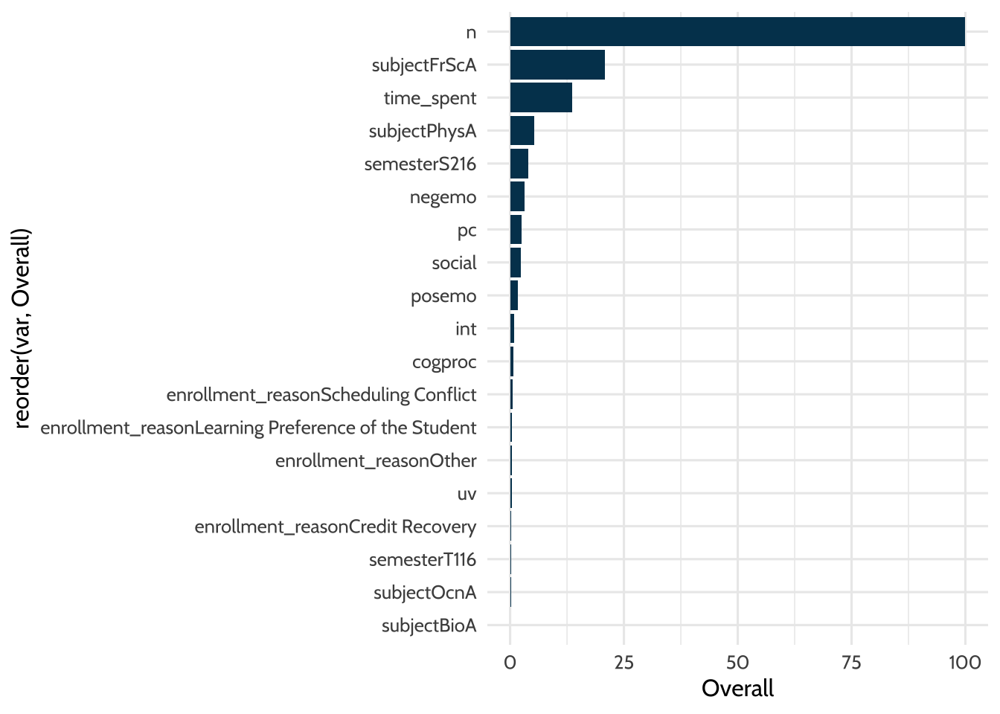

# Walkthrough 8: Predicting Students' Final Grades Using Machine Learning Methods with Online Course Data {#c14}

## Vocabulary

- listwise deletion
- machine learning
- parameters
- random forest
- research question
- resampling
- Root Mean Square Error
- rsquared
- training data
- test data
- tuning parameter
- variable importance

## Chapter Overview

In this chapter, we use the same dataset used in [Walkthrough 1/Chapter 7](#c07) and [Walkthrough 7/Chapter 13](#c13), but pursue a new aim. We focus on *predicting* an outcome, final grade, more than *explaining* how variables relate to an outcome, such as how the amount of time students spend on the course relates to their final grade. We illustrate a common but powerful machine learning method, random forest modeling. We'll explore their use in-depth rather than providing a more general overview of other machine learning methods. Though we focus on the use of random forests, many of the ideas explored in this chapter will likely extend and prove useful for other machine learning methods. Our goal is for you to finish this final walkthrough with the confidence to explore using machine learning to answer a question or to solve a problem of your own with respect to teaching, learning, and educational systems.

### Background

One area of interest for data scientists in education is the delivery of online instruction, which is becoming more prevalent: in 2007, over 3.9 million U.S. students were enrolled one or more online courses [@allen2008]. With the growth of online learning comes an abundance of new educational tools to facilitate that learning. Online learning platforms are used to submit assignments and quizzes in courses in which students and instructor meet face-to-face, but these interfaces are also used in fully online courses to deliver instruction and assessment.

In a face-to-face classroom, an educator might count on behavioral cues to help them effectively deliver instruction. Online, educators do not readily have access to the behavioral cues essential for effective face-to-face instruction. For example, in a face-to-face classroom, cues such as a student missing class repeatedly or many students seeming distracted during a lecture can trigger a shift in the delivery of instruction. Many educators find themselves looking for ways to understand and support students online in the same way that face-to-face instructors would. Educational technology affords unique opportunities to support student success online because it provides new methods of collecting and storing data. 

Online learning management systems often automatically track several types of student interactions with the system and feed that data back to the course instructor. For example, an instructor might be able to quickly see how many students logged into their course on a certain day, or they might see how long students engaged with a posted video before pausing it or logging out. The collection of this data is met with mixed reactions from educators. Some are concerned that data collection in this manner is intrusive, but others see a new opportunity to support students in online contexts in new ways. As long as data are collected and utilized responsibly, data collection can support student success.

One meaningful perspective from which to consider students' engagement with online courses is related to their motivation to achieve. It is important to consider how and why students are engaging with the course. Considering the psychological mechanisms behind achievement is valuable because they may help identify meaningful points of intervention. Educators, researchers, and administrators in both online *and* face-to-face courses can analyze and use the intersection between behavioral measures and students' motivational and emotional experiences in courses.

In this walkthrough, we examine the educational experiences of students attending online science courses at a virtual middle school in order to characterize their motivation to achieve and their tangible engagement with the course. We use a dataset that includes self-reported motivation as well as behavioral trace data collected from a learning management system (LMS) to identify predictors of final course grade. Our work examines educational success in terms of student interactions with an online science course.

We explore the following four questions:

1. Is motivation more predictive of course grades as compared to other online indicators of engagement?
2. Which types of motivation are most predictive of achievement?
3. Which types of trace measures are most predictive of achievement?
4. How does a random forest compare to a simple linear model (regression)?

### Data Sources

This dataset comes from 499 students who were enrolled in online middle school science courses in 2015-2016. The data were originally collected for use as a part of a research study, though the findings have not been published yet.

The setting of this study was a public provider of individual online courses in a Midwestern state. In particular, the context was two semesters (Fall and Spring) of offerings of five online science courses (Anatomy & Physiology, Forensic Science, Oceanography, Physics, and Biology), with a total of 36 classes. 

Specific information in the dataset included:

1. A self-report survey assessing three aspects of students’ motivation
2. Log-trace data, such as data output from the learning management system
3. Discussion board data
4. Academic achievement data

For discussion board responses, we were interested in calculating the number of posts per student and understanding the emotional tone of the discussion board posts. We used the Linguistic Inquiry and Word Count (LIWC; Pennebaker, Boyd, Jordan, & Blackburn, 2015) tool to calculate the number of posts per student and to categorize the emotional tone (positive or negative) and topics of those posts. Those linguistic categorization was conducted after the data was gathered from the discussion posts, but is not replicated here to protect the privacy of the students' posts. Instead, we present the already-categorized discussion board data, in its ready-to-use format. In the dataset used in this walkthrough, we will see pre-created variables for the mean levels of students' cognitive processing, positive emotions, negative emotions, and social-related discourse.

At the beginning of the semester, students were asked to complete the pre-course survey about their perceived competence, utility value, and interest. At the end of the semester, the time students spent on the course, their final course grades, and the contents of the discussion forums were collected.

### Methods

**Defining a Research Question**

When you begin a new project, there are often many approaches to analyzing data and answering questions you might have about it. Some projects have a clearly defined scope and question to answer. This type of project is characterized by 1) a defined number of variables (data inputs) and 2) specific directional hypotheses. For example, if we are studying the effect of drinking coffee after dinner on ability to quickly fall asleep, we might have a very specific directional hypothesis: we expect that drinking coffee after dinner would decrease the ability to fall asleep quickly. In this case, we might collect data by having some people drink coffee and having other people drink nothing or an herbal tea before bed. We could monitor how quickly people from each group fall asleep. Since we collected data from two clearly defined groups, we can then do a statistical analysis that compares the amount of time it takes to fall asleep for each group. One option would be a test called a t-test, which we could use to see if there is a significant difference in the average amount of minutes to fall asleep for the group. This approach works very well in controlled experimental situations, especially when we can change only one thing at a time (in our coffee example, the only thing we changed was the coffee-drinking behavior of our participants - all other life conditions were held equal for both groups). Rarely are educational data projects as clear-cut and simple.

For this walkthrough, we have many sources of data - survey data, learning management system data, discussion forum data, and academic achievement data as measured by final course grades. Luckily, having too much data is what we call a "good problem." In our coffee example above, we had one really specific idea that we wanted to investigate - does coffee affect time taken to fall asleep? In this walkthrough we have many ideas we are curious to explore: the relationships among motivation, engagement in the course (discussion boards, time spent online in the course site), and academic achievement. If we wanted to tackle a simpler problem, we could choose just one of these relationships. For example, we could measure whether students with high motivation earn higher grades than students with low motivation. However, we are being a bit more ambitious than that here - we are interested in understanding the complex relationships among the different types of motivation. Rather than simply exploring whether A affects B, we are interested in the nuances. We suspect that *many* factors affect B, and we would like to see which of those factors has most relative importance. To explore this idea, we will use a machine learning approach.

**Predictive Analytics and Machine Learning**

A buzzword in education software spheres these days is "predictive analytics." Administrators and educators alike are interested in applying the methods long utilized by marketers and other business professionals to try to determine what a person will want, need, or do next. "Predictive analytics" is a blanket term that can be used to describe any statistical approach that yields a prediction. We could ask a predictive model: "What is the likelihood that my cat will sit on my keyboard today?" and, given enough past information about your cat's computer-sitting behavior, the model could give you a probability of that computer-sitting happening today. Under the hood, some predictive models are not very complex. If we have an outcome with two possibilities, a logistic regression model could be fit to the data in order to help us answer the cat-keyboard question. In this chapter, we'll compare a machine learning model to another type of regression: multiple regression. We want to make sure to fit the simplest model as possible to our data. After all, the effectiveness in predicting the outcome is really the most important thing, not the fanciness of the model.
    
Data collection is an essential first step in any type of machine learning or predictive analytics. It is important to note here that machine learning only works effectively when (1) a person selects variables to include in the model that are anticipated to be related to the outcome and (2) a person correctly interprets the model's findings. There is an adage that goes, "garbage in, garbage out." This holds true here. If we do not feel confident that the data we collected are accurate, we will not be able to be confident in our conclusions no matter what model we build. To collect good data, we must first clarify what it is that we want to know (i.e., what question are we really asking?) and what information we would need in order to effectively answer that question. Sometimes, people approach analysis from the opposite direction - they might look at the data they have and ask what questions could be answered based on that data. That approach is okay, as long as you are willing to acknowledge that sometimes the pre-existing dataset may *not* contain all the information you need, and you might need to go out and find additional information to add to your dataset to truly answer your question.
    
When people talk about "machine learning," you might get the image in your head of a desktop computer learning how to spell. You might picture your favorite social media site showing you advertisements that are just a little too accurate. At its core, machine learning is the process of "showing" your statistical model only some of the data at once and training the model to predict accurately on that training dataset (this is the "learning" part of machine learning). Then, the model as developed on the training data is shown new data - data you had all along, but hid from your computer initially - and you see how well the model that you developed on the training data performs on this new testing data. Eventually, you might use the model on entirely new data.  

**Random Forest**

For our analyses, we use Random Forest modeling [@breiman2001]. Random forest is an extension of decision tree modeling, whereby a collection of decision trees are simultaneously "grown" and are evaluated based on out-of-sample predictive accuracy [@breiman2001]. Random forest is random in two main ways: first, each tree is only allowed to "see" and split on a limited number of predictors instead of all the predictors available; second, a random subsample of the data is used to grow each individual tree, such that no individual case is weighted too heavily in the final prediction. 

One thing about random forest that makes it quite different from other types of analysis we might do is that here, we are giving the computer a large amount of information and asking it to find connections that might not be immediately visible to the naked human eye. This is great for a couple of reasons. First, while humans are immensely creative and clever, we are not immune to biases. If we are exploring a dataset, we usually come in with some predetermined notions about what we think is true, and we might (consciously or unconsciously) seek evidence that supports the hypothesis we privately hold. By setting the computer loose on some data, we can learn that there are connections between areas that we did not expect. We must also be ready for our hypotheses to not be supported! Random forest is particularly well-suited to the research questions explored here because we do not have specific directional hypotheses. Machine learning researchers talk about this as "exploring the parameter space" - we want to see what connections exist, and we acknowledge that we might not be able to accurately predict all the possible connections. Indeed, we expect - and hope - that we will find surprising connections. 

Whereas some machine learning approaches (e.g., boosted trees) use an iterative model-building approach, random forest estimates all the decision trees at once. This way, each tree is independent of every other tree. The random forest algorithm provides a regression approach that is distinct from other modeling approaches. The final random forest model aggregates the findings across all the separate trees in the forest in order to offer a collection of "most important" variables as well as a percent variance explained for the final model.

500 trees are grown as part of our random forest. We partitioned the data before conducting the main analysis so that neither the training nor the testing data set would be disproportionately representative of high-achieving or low-achieving students. The training data set consisted of 80% of the original data (*n* = 400 cases), whereas the testing data set consisted of 20% of the original data (*n* = 99 cases). We built our random forest model on the training data set, and then evaluated the model on the testing data set. Three variables were tried at each node.

Note that the random forest algorithm does not accept cases with missing data, so we delete cases listwise (that is, an entire row is deleted if any single value is missing). This decision eliminated 60 cases from our original data set to bring us to our final sample size of 464 unique students. If you have a very small dataset with a lot of missing data, the random forest approach may not be well suited for your goals – you might consider a linear regression instead.

A random forest is well suited to the research questions that we had here because it allows for nonlinear modeling. We hypothesized complex relationships between students' motivation, their engagement with the online courses, and their achievement. For this reason, a traditional regressive or structural equation model would have been insufficient to model the parameter space we were interesting in modeling. Our random forest model had one outcome and eleven predictors. 

One term you will hear used in machine learning is "tuning parameter." People often think of tuning parameters as knobs or dials on a radio: they are features of the model that can be adjusted to get the clearest signal. A common tuning parameter for machine learning models is the number of variables considered at each split [@kuhn2008]; we considered three variables at each split for this analysis.  

The outcome was the final course grade that the student earned. The predictor variables included motivation variables (interest value, utility value, and science perceived competence) and trace variables (the amount of time spent in the course, the course name, the number of discussion board posts over the course of the semester, the mean level of cognitive processing evident in discussion board posts, the positive emotions evident in discussion board posts, the negative emotions evident in discussion board posts, and the social-related discourse evident in their discussion board posts). We used this random forest model to address all three of our research questions.

To interpret our findings, we will consider three main factors: (1) predictive accuracy of the random forest model, (2) variable importance, and (3) variance explained by the final random forest model. In this walkthrough, we will use the R package {caret} [@R-caret] to carry out the analysis. We also use the {tidylog} package [@R-tidylog] to help us to understand how the data processing steps we take have the desired effect. This is a handy package that tells us in words what our previously executed code changed in our dataset.

## Load Packages


```r
# install the new packages that will be used in this walkthrogh
# skip this if you have already installed these on your computer
# install.packages(c("caret", "tidylog"))

# load the packages
library(tidyverse)
library(caret)
library(tidylog)
library(dataedu)
```

First, we will load the data. Our data is stored in the {dataedu} package that is part of this book. Within that package, the data is stored as an `.rda` file. We note that this data is augmented to have some other - and additional - variables that the `sci_mo_processed` data used in [Chapter 7](#c7) does not.

## Import and View Data


```r
# Loading the data from the .rda file and storing it as an object named 'data'
df <- dataedu::sci_mo_with_text
```

It's a good practice to take a look at the data and make sure it looks the way you expect it to look. R is pretty smart, but sometimes we run into issues like column headers being read as datapoints. By using the `glimpse()` function from the {dplyr} package, we can quickly skim our data and see whether we have all the right variables and values. Remember that the {dplyr} package loads automatically when we load the {tidyverse} library, so there is no need to call the {dplyr} package separately. Now, we'll glimpse the data.


```r
glimpse(df)
```

```
## Rows: 606
## Columns: 74
## $ student_id            <dbl> 43146, 44638, 47448, 47979, 48797, 51943, 52326…
## $ course_id             <chr> "FrScA-S216-02", "OcnA-S116-01", "FrScA-S216-01…
## $ total_points_possible <dbl> 3280, 3531, 2870, 4562, 2207, 4208, 4325, 2086,…
## $ total_points_earned   <dbl> 2220, 2672, 1897, 3090, 1910, 3596, 2255, 1719,…
## $ percentage_earned     <dbl> 0.6768293, 0.7567261, 0.6609756, 0.6773345, 0.8…
## $ subject               <chr> "FrScA", "OcnA", "FrScA", "OcnA", "PhysA", "FrS…
## $ semester              <chr> "S216", "S116", "S216", "S216", "S116", "S216",…
## $ section               <chr> "02", "01", "01", "01", "01", "03", "01", "01",…
## $ Gradebook_Item        <chr> "POINTS EARNED & TOTAL COURSE POINTS", "ATTEMPT…
## $ Grade_Category        <lgl> NA, NA, NA, NA, NA, NA, NA, NA, NA, NA, NA, NA,…
## $ final_grade           <dbl> 93.45372, 81.70184, 88.48758, 81.85260, 84.0000…
## $ Points_Possible       <dbl> 5, 10, 10, 5, 438, 5, 10, 10, 443, 5, 12, 10, 5…
## $ Points_Earned         <dbl> NA, 10.00, NA, 4.00, 399.00, NA, NA, 10.00, 425…
## $ Gender                <chr> "M", "F", "M", "M", "F", "F", "M", "F", "F", "M…
## $ q1                    <dbl> 5, 4, 5, 5, 4, NA, 5, 3, 4, NA, NA, 4, 3, 5, NA…
## $ q2                    <dbl> 4, 4, 4, 5, 3, NA, 5, 3, 3, NA, NA, 5, 3, 3, NA…
## $ q3                    <dbl> 4, 3, 4, 3, 3, NA, 3, 3, 3, NA, NA, 3, 3, 5, NA…
## $ q4                    <dbl> 5, 4, 5, 5, 4, NA, 5, 3, 4, NA, NA, 5, 3, 5, NA…
## $ q5                    <dbl> 5, 4, 5, 5, 4, NA, 5, 3, 4, NA, NA, 5, 4, 5, NA…
## $ q6                    <dbl> 5, 4, 4, 5, 4, NA, 5, 4, 3, NA, NA, 5, 3, 5, NA…
## $ q7                    <dbl> 5, 4, 4, 4, 4, NA, 4, 3, 3, NA, NA, 5, 3, 5, NA…
## $ q8                    <dbl> 5, 5, 5, 5, 4, NA, 5, 3, 4, NA, NA, 4, 3, 5, NA…
## $ q9                    <dbl> 4, 4, 3, 5, NA, NA, 5, 3, 2, NA, NA, 5, 2, 2, N…
## $ q10                   <dbl> 5, 4, 5, 5, 3, NA, 5, 3, 5, NA, NA, 4, 4, 5, NA…
## $ time_spent            <dbl> 1555.1667, 1382.7001, 860.4335, 1598.6166, 1481…
## $ TimeSpent_hours       <dbl> 25.91944500, 23.04500167, 14.34055833, 26.64361…
## $ TimeSpent_std         <dbl> -0.18051496, -0.30780313, -0.69325954, -0.14844…
## $ int                   <dbl> 5.0, 4.2, 5.0, 5.0, 3.8, 4.6, 5.0, 3.0, 4.2, NA…
## $ pc                    <dbl> 4.50, 3.50, 4.00, 3.50, 3.50, 4.00, 3.50, 3.00,…
## $ uv                    <dbl> 4.333333, 4.000000, 3.666667, 5.000000, 3.50000…
## $ enrollment_status     <chr> "Approved/Enrolled", "Approved/Enrolled", "Appr…
## $ enrollment_reason     <chr> "Course Unavailable at Local School", "Course U…
## $ cogproc               <dbl> 15.069737, 7.106667, 15.165854, 14.508000, 16.6…
## $ male                  <dbl> 0.51210526, 0.00000000, 0.11121951, 0.00000000,…
## $ female                <dbl> 0.16657895, 0.00000000, 0.15219512, 0.00000000,…
## $ friend                <dbl> 0.00000000, 0.00000000, 0.01268293, 0.00000000,…
## $ family                <dbl> 0.006052632, 0.000000000, 0.084878049, 0.000000…
## $ social                <dbl> 6.200526, 6.140000, 5.052927, 6.133000, 7.53400…
## $ sad                   <dbl> 0.18078947, 0.00000000, 0.09097561, 0.00000000,…
## $ anger                 <dbl> 0.41868421, 0.00000000, 0.14097561, 0.10800000,…
## $ anx                   <dbl> 0.080000000, 0.000000000, 0.275365854, 0.788000…
## $ negemo                <dbl> 1.1363158, 0.0000000, 1.4187805, 1.1520000, 1.2…
## $ posemo                <dbl> 3.555526, 19.010000, 2.906098, 5.591000, 3.7940…
## $ affect                <dbl> 4.756053, 19.010000, 4.330732, 6.743000, 5.0750…
## $ quant                 <dbl> 2.046842, 2.743333, 3.245366, 3.214000, 2.55100…
## $ number                <dbl> 0.9131579, 3.4733333, 2.3065854, 0.2570000, 0.2…
## $ interrog              <dbl> 1.2857895, 0.4433333, 1.7868293, 1.1030000, 1.7…
## $ compare               <dbl> 2.4213158, 4.1466667, 3.9021951, 2.6990000, 3.9…
## $ adj                   <dbl> 5.106842, 5.480000, 5.614390, 5.213000, 4.61800…
## $ verb                  <dbl> 18.11368, 11.02333, 16.34366, 16.31100, 17.1170…
## $ negate                <dbl> 1.2060526, 0.0000000, 1.6809756, 1.1300000, 0.7…
## $ conj                  <dbl> 5.565526, 6.660000, 5.370244, 6.203000, 7.24400…
## $ adverb                <dbl> 6.243421, 6.660000, 5.824878, 5.314000, 6.49200…
## $ auxverb               <dbl> 11.298421, 9.246667, 10.226341, 8.890000, 9.494…
## $ prep                  <dbl> 12.301579, 11.850000, 12.132927, 13.626000, 12.…
## $ article               <dbl> 7.828947, 2.223333, 6.767805, 9.119000, 9.83000…
## $ ipron                 <dbl> 6.936316, 2.743333, 5.145122, 4.335000, 7.84100…
## $ they                  <dbl> 1.01026316, 0.00000000, 0.84341463, 1.86300000,…
## $ shehe                 <dbl> 0.54342105, 0.00000000, 0.16951220, 0.00000000,…
## $ you                   <dbl> 1.7442105, 3.4733333, 1.1487805, 2.0490000, 2.6…
## $ we                    <dbl> 0.06578947, 0.00000000, 0.03317073, 0.30200000,…
## $ i                     <dbl> 3.646579, 7.993333, 4.689268, 3.449000, 3.14200…
## $ ppron                 <dbl> 7.010000, 11.470000, 6.882927, 7.662000, 6.7790…
## $ pronoun               <dbl> 13.98868, 14.20667, 12.02756, 12.21900, 14.6190…
## $ `function`            <dbl> 55.15447, 44.63000, 49.40293, 53.12700, 57.5090…
## $ Dic                   <dbl> 86.27895, 86.31000, 80.72220, 86.49700, 90.4870…
## $ Sixltr                <dbl> 20.89316, 22.20333, 20.80780, 21.80200, 15.3060…
## $ WPS                   <dbl> 17.413947, 9.833333, 17.922439, 18.824000, 15.6…
## $ Tone                  <dbl> 56.62395, 96.38000, 49.41610, 78.36900, 55.3840…
## $ Authentic             <dbl> 44.13079, 70.25333, 41.22366, 49.03800, 42.2500…
## $ Clout                 <dbl> 49.52079, 53.58333, 40.11024, 53.08800, 54.0850…
## $ Analytic              <dbl> 55.70316, 56.04000, 58.98098, 69.95700, 55.8200…
## $ WC                    <dbl> 88.31579, 34.66667, 69.34146, 61.20000, 47.1000…
## $ n                     <dbl> 38, 3, 41, 10, 10, 2, 21, 18, 31, 37, 37, 18, 1…
```
Scanning the data we glimpsed, we see that we have 606 observations and 74 variables. Many of these variables - everything below `WC` except the variable `n` -  are related to the text content of the discussion board posts. Our analysis here is not focused on the specifics of the discussion board posts, so we will select just a few variables from the LIWC analysis. If you're interested in learning more about analyzing text, the text analysis walkthrough in [Chapter 11](#c11) would be a good place to start. 

As is the case with many datasets you'll work with in education contexts, there is lots of great information in this dataset - but we won't need all of it. Even if your dataset has many variables, for most analyses you will find that you are only interested in some of them. There are statistical reasons not to include twenty or more variables in a data analysis as well. At a certain point, adding more variables will *appear* to make your analysis more accurate, but will in fact obscure the truth from you. It's generally a good practice to select a few variables you are interested in and go from there. As we discussed above, the way to do this is to start with the research questions you are trying to answer.

## Process Data

Since we are interested in data from one specific semester, we'll need to narrow down the data to make sure that we only include datapoints relevant to that semester. For each step, we save over the previous version of the "df" object so that our working environment doesn't get cluttered with each new version of the dataset. Keep in mind that the original data will stay intact, and that any changes we make to it within R will not overwrite that original data (unless we tell R to specifically save out a new file with exactly the same name as the original file). Changes we make within our working environment are all totally reversible. 

Below, we will *select* only the variables we are interested in: motivation, time spent in the course, grade in the course, subject, enrollment information, positive and negative emotions, cognitive processing, and the number of discussion board posts. After this step, we see that 60 variables have been removed from the dataset.


```r
# selecting only the variables we are interested in: 
df <- 
    df %>%
    select(
        int,
        uv,
        pc,
        time_spent,
        final_grade,
        subject,
        enrollment_reason,
        semester,
        enrollment_status,
        cogproc,
        social,
        posemo,
        negemo,
        n
    )
```

```
## select: dropped 60 variables (student_id, course_id, total_points_possible, total_points_earned, percentage_earned, …)
```

## Analysis

### Use of {caret}

Here, we remove observations with missing data (per our note above about random forests requiring complete cases).


```r
# Checking how many rows are in our dataset
# We see that we have 606 rows
nrow(df)
```

```
## [1] 606
```


```r
# calling the na.omit function to eliminate ANY rows that have ANY missing data
df <- na.omit(df)
```


```r
# checking whether our na.omit call worked as expected
# after running the code above, we see that we now have 464 rows
nrow(df)
```

```
## [1] 464
```

Machine learning methods often involve using a large number of variables. Some of these variables will not be suitable to use: they may be highly correlated with other variables or may have very little - or no - variability. For the data set used in this study, one variable has the same (character string) value for all of the observations. We can detect this variable and any others using the following function:


```r
# run the nearZeroVar function to determine 
# if there are variables with NO variability
nearZeroVar(df, saveMetrics = TRUE)
```

```
##                   freqRatio percentUnique zeroVar   nzv
## int                1.314815     9.0517241   FALSE FALSE
## uv                 1.533333     6.4655172   FALSE FALSE
## pc                 1.488372     3.8793103   FALSE FALSE
## time_spent         1.000000   100.0000000   FALSE FALSE
## final_grade        1.333333    93.1034483   FALSE FALSE
## subject            1.648649     1.0775862   FALSE FALSE
## enrollment_reason  3.154762     1.0775862   FALSE FALSE
## semester           1.226601     0.6465517   FALSE FALSE
## enrollment_status  0.000000     0.2155172    TRUE  TRUE
## cogproc            1.000000    96.9827586   FALSE FALSE
## social             1.500000    96.1206897   FALSE FALSE
## posemo             1.000000    96.7672414   FALSE FALSE
## negemo            13.000000    90.7327586   FALSE FALSE
## n                  1.333333    10.1293103   FALSE FALSE
```
After conducting our zero variance check, we want to scan the `zeroVar` column to see if any of our variables failed this check. If we see any `TRUE` values for `zeroVar`, that means we should look more closely at that variable.

In the nearZeroVar() function we just ran, we see a result in the ZeroVar column of `TRUE` for the `enrollment_status` variable.  If we look at `enrollment_status`, we will see that it is "Approved/Enrolled" for *all* of the students. Using variables with no variability in certain models may cause problems, and so we remove them first.


```r
# taking the dataset and re-saving it as the same dataset, 
# but without the enrollment status variable
df <- 
    df %>% 
    select(-enrollment_status)
```

```
## select: dropped one variable (enrollment_status)
```

As we have discussed elsewhere in the book, the data will often come to you in a format that is not ready for immediate analysis. You may wish to pre-process the variables, such as by centering or scaling them.  For our current dataset, we can work on pre-processing with code below. We want to make sure our text data is in a format that we can then evaluate. To facilitate that, we change character string variables into factors. Factors store data as categorical variables, each with its own levels. Because categorical variables are used in statistical models differently than continuous variables, storing data as factors ensures that the modeling functions will treat them correctly.


```r
# converting the text (character) variables in our dataset into factors
df <- 
    df %>% 
    mutate_if(is.character, as.factor)
```

```
## mutate_if: converted 'subject' from character to factor (0 new NA)
```

```
##            converted 'enrollment_reason' from character to factor (0 new NA)
```

```
##            converted 'semester' from character to factor (0 new NA)
```

Now we will prepare the **train** and **test** datasets, using the {caret} function for creating data partitions. Here, the **p** argument specifies what proportion of the data we want to be in the **training** partition. Note that this function splits the data based upon the outcome, so that the training and test data sets will both have comparable values for the outcome. This means that since our outcome is final grade, we are making sure that we don't have either a training or testing dataset that has too many good grades *or* too many bad grades. Note the `times = 1` argument. This parameter can be used to create *multiple* train and test sets, something we will describe in more detail later. Before we create our training and testing datasets, we want to "set the seed" (introduced in [Chapter 11](#c11)). Setting the seed ensures that if we run this same code again, we will get the same results in terms of the data partition. The seed can be any number that you like - some people choose their birthday or another meaningful number. The only constraint is that when you open the same code file again to run in the future, you do not change the number you selected for your seed. This enables your code to be reproducible. If anyone runs the same code file on any computer, anywhere, they will get the same result. 

Now try running the code chunk below. Be sure to read the messages that R gives you to see what is happening with each step!
    

```r
# First, we set a seed to ensure the reproducibility of our data partition.
set.seed(2020)

# we create a new object called trainIndex that will take 80 percent of the data
trainIndex <- createDataPartition(df$final_grade,
                                  p = .8, 
                                  list = FALSE,
                                  times = 1)

# We add a new variable to our dataset, temporarily:
# this will let us select our rows according to their row number
# we populate the rows with the numbers 1:464, in order

df <- 
    df %>% 
    mutate(temp_id = 1:464)
```

```
## mutate: new variable 'temp_id' with 464 unique values and 0% NA
```

```r
# we filter our dataset so that we get only the 
# rows indicated by our "trainIndex" vector
df_train <- 
    df %>% 
    filter(temp_id %in% trainIndex)
```

```
## filter: removed 92 rows (20%), 372 rows remaining
```

```r
# we filter our dataset in a different way so that we get only the rows 
# NOT in our "trainIndex" vector 
# adding the ! before the temp_id variable achieves the opposite of 
# what we did in the line of code above

df_test <- 
    df %>% 
    filter(!temp_id %in% trainIndex)
```

```
## filter: removed 372 rows (80%), 92 rows remaining
```

```r
# We delete the temp_id variable from (1) the original data, 
# (2) the portion of the original data we marked as training, and 
# (3) the portion of the original data we marked as testing, 
# as we no longer need that variable

df <- 
    df %>% 
    select(-temp_id)
```

```
## select: dropped one variable (temp_id)
```

```r
df_train <- 
    df_train %>% 
    select(-temp_id)
```

```
## select: dropped one variable (temp_id)
```

```r
df_test <- 
    df_test %>% 
    select(-temp_id)
```

```
## select: dropped one variable (temp_id)
```

Finally, we will estimate the models. We will use the train function, passing *all* of the variables in the data frame (except for the outcome, or dependent variable, `final_grade`) as predictors.

The predictor variables include three indicators of motivation: interest in the course (`int`), perceived utility value of the course (`uv`), and perceived competence for the subject matter (`pc`). There are a few predictor variables that help differentiate between the different courses in the dataset: subject matter of the course (`subject`), reason the student enrolled in the course (`enrollment_reason`), and semester in which the course took place (`semester`). We have a predictor variable that indicates the amount of time each student spent engaging with the online learning platform of the course (`time_spent`).

We also have a number of variables associated with the discussion board posts from the course. Specifically, the variables include the average level of cognitive processing in the discussion board posts (`cogproc`), the average level of social (rather than academic) content in the discussion board posts (`social`), the positive and negative emotions evident in the discussion board posts (`posemo` and `negemo`), and finally, the number of discussion board posts in total (`n`). We are using all those variables discussed in this paragraph to predict the outcome of the final grade in the course (`final_grade`).

Note that you can read more about the specific random forest implementation chosen in [the {caret} bookdown page](http://topepo.github.io/caret/train-models-by-tag.html#random-forest) (http[]()://topepo.github.io/caret/train-models-by-tag.html#random-forest). To specify that we want to predict the outcome using every variable except the outcome itself, we use the formulation `outcome ~ .`. R interprets this code as: predict the outcome using all the variables except outcome itself. The outcome always comes before the `~`, and the `.` that we see after the `~` means that we want to use all the rest of the variables. An alternative specification of this model would be to write `outcome ~ predictor1, predictor2`. Anything that follows the `~` and precedes the comma is treated as predictors of the outcome.

We set the seed again to ensure that our analysis is reproducible. This step of setting the seed is especially important due to the "random" elements of random forest, because it's likely that the findings would change (just slightly) if the seed were not set. As we get into random forest modeling, you might notice that the code takes a bit longer to run. This is normal - just think of the number of decision trees that are "growing"!


```r
# setting a seed for reproducibility
set.seed(2020)

# we run the model here
rf_fit <- train(final_grade ~ .,
                data = df_train,
                method = "ranger")

# here, we get a summary of the model we just built
rf_fit
```

```
## Random Forest 
## 
## 372 samples
##  12 predictor
## 
## No pre-processing
## Resampling: Bootstrapped (25 reps) 
## Summary of sample sizes: 372, 372, 372, 372, 372, 372, ... 
## Resampling results across tuning parameters:
## 
##   mtry  splitrule   RMSE      Rsquared   MAE      
##    2    variance    15.26965  0.5646105  11.182943
##    2    extratrees  16.99412  0.5228177  12.064817
##   10    variance    13.96625  0.5926815  10.144724
##   10    extratrees  13.87205  0.6205291  10.068379
##   19    variance    14.05020  0.5886314  10.023326
##   19    extratrees  13.41310  0.6319288   9.766645
## 
## Tuning parameter 'min.node.size' was held constant at a value of 5
## RMSE was used to select the optimal model using the smallest value.
## The final values used for the model were mtry = 19, splitrule = extratrees
##  and min.node.size = 5.
```

We have some results! First, we see that we have 372 samples, or 372 observations, the number in the train data set. No pre-processing steps were specified in the model fitting, but note that the output of `preProcess` can be passed to `train()` to center, scale, and transform the data in many other ways. Next, we used a resampling technique. This resampling is not for validating the model but is rather for selecting the tuning parameters - the options that need to be specified as a part of the modeling. These parameters can be manually provided, or can be estimated via strategies such as the bootstrap resample or *k*-folds cross validation.

As we interpret these findings, we are looking to minimize the Root Mean Square Error (RMSE) and maximize the variance explained (rsquared).

It appears that the model with the value of the `mtry` tuning parameter equal to 19 seemed to explain the data best, the `splitrule` being "extratrees", and `min.node.size` held constant at a value of 5. We know this model fits best because the RMSE is the lowest of the options (12.76) and the Rsquared is the highest of the options (0.65).

The value of resampling here is that it allows for higher accuracy of the model [@james2013]. Without resampling (bootstrapping or cross-validation), the variance would be higher and the predictive accuracy of the model would be lower.

Let's see if we end up with slightly different values if we change the resampling technique to cross-validation, instead of bootstrap resampling. We set a seed again here, for reproducibility.


```r
set.seed(2020)

train_control <-
    trainControl(method = "repeatedcv",
                 number = 10,
                 repeats = 10)

rf_fit1 <-
    train(final_grade ~ .,
          data = df_train,
          method = "ranger",
          trControl = train_control)

rf_fit1
```

```
## Random Forest 
## 
## 372 samples
##  12 predictor
## 
## No pre-processing
## Resampling: Cross-Validated (10 fold, repeated 10 times) 
## Summary of sample sizes: 335, 334, 334, 336, 334, 334, ... 
## Resampling results across tuning parameters:
## 
##   mtry  splitrule   RMSE      Rsquared   MAE      
##    2    variance    14.64664  0.5896743  10.965898
##    2    extratrees  16.24513  0.5854833  11.787050
##   10    variance    13.29633  0.6181503   9.829458
##   10    extratrees  13.00986  0.6599769   9.655362
##   19    variance    13.25465  0.6167849   9.683722
##   19    extratrees  12.59520  0.6635394   9.363926
## 
## Tuning parameter 'min.node.size' was held constant at a value of 5
## RMSE was used to select the optimal model using the smallest value.
## The final values used for the model were mtry = 19, splitrule = extratrees
##  and min.node.size = 5.
```

### Tuning the Random Forest Model

When we look at this output, we are looking to see which values of the various tuning parameters were selected. We see at the bottom of the output above that the value of `mtry` was 19, the split rule was "extratrees," and the minimum node size is 5. We let this model explore which value of `mtry` was best and to explore whether extra trees or variance was a better split rule, but we forced all iterations of the model to a minimum node size of five (so that minimum node size value in the output shouldn't be a surprise to us). When we look at the bottom row of the output, it shows the final values selected for the model. We see also that this row has the lowest RMSE and highest Rsquared value, which means it has the lowest error and highest predictive power. 

We won't dive into the specifics of the statistics behind these decisions right now, but next we will try adjusting a few different parts of the model to see whether our performance improves. For a detailed statistical explanation of random forest modeling, including more about `mtry` and tuning a model, please see Chapter 8 in the book "An Introduction to Statistical Learning with Applications in R" [@james2013]. 

What would happen if we do not fix `min.node.size` to five? We're going to let `min.node.size` change and let `mtry` change as well.

Let's create our own grid of values to test for `mtry` and `min.node.size`. We'll stick with the default bootstrap resampling method to choose the best model. We will randomly choose some values to use for `mtry`, including the three that were used previously (2, 10, and 19). Let's try 2, 3, 7, 10, and 19.


```r
# setting a seed for reproducibility
set.seed(2020)

# Create a grid of different values of mtry, different splitrules, and different minimum node sizes to test
tune_grid <-
    expand.grid(
        mtry = c(2, 3, 7, 10, 19),
        splitrule = c("variance", "extratrees"),
        min.node.size = c(1, 5, 10, 15, 20)
    )

# Fit a new model, using the tuning grid we created above
rf_fit2 <-
    train(final_grade ~ .,
          data = df_train,
          method = "ranger",
          tuneGrid = tune_grid)

rf_fit2
```

```
## Random Forest 
## 
## 372 samples
##  12 predictor
## 
## No pre-processing
## Resampling: Bootstrapped (25 reps) 
## Summary of sample sizes: 372, 372, 372, 372, 372, 372, ... 
## Resampling results across tuning parameters:
## 
##   mtry  splitrule   min.node.size  RMSE      Rsquared   MAE      
##    2    variance     1             15.21257  0.5640999  11.115597
##    2    variance     5             15.26810  0.5638393  11.181907
##    2    variance    10             15.45130  0.5541338  11.348051
##    2    variance    15             15.56036  0.5497028  11.445290
##    2    variance    20             15.72194  0.5426742  11.573521
##    2    extratrees   1             16.92739  0.5217704  11.959970
##    2    extratrees   5             17.02815  0.5177077  12.076823
##    2    extratrees  10             17.28776  0.5060890  12.265775
##    2    extratrees  15             17.44764  0.5016608  12.390719
##    2    extratrees  20             17.67751  0.4891901  12.556140
##    3    variance     1             14.65669  0.5738730  10.730009
##    3    variance     5             14.71055  0.5718560  10.796714
##    3    variance    10             14.84534  0.5667383  10.938649
##    3    variance    15             15.01766  0.5573860  11.077530
##    3    variance    20             15.17448  0.5497694  11.222043
##    3    extratrees   1             15.73859  0.5602534  11.197195
##    3    extratrees   5             15.87463  0.5561978  11.312669
##    3    extratrees  10             16.18226  0.5450388  11.578177
##    3    extratrees  15             16.41014  0.5386357  11.749329
##    3    extratrees  20             16.64769  0.5297996  11.902915
##    7    variance     1             14.06354  0.5891298  10.265146
##    7    variance     5             14.05089  0.5901984  10.256999
##    7    variance    10             14.17334  0.5839552  10.372204
##    7    variance    15             14.24620  0.5806848  10.456265
##    7    variance    20             14.36375  0.5755600  10.560296
##    7    extratrees   1             14.27671  0.6067836  10.306448
##    7    extratrees   5             14.37512  0.6034048  10.371551
##    7    extratrees  10             14.54903  0.6000708  10.539154
##    7    extratrees  15             14.73613  0.5956554  10.679249
##    7    extratrees  20             14.99862  0.5858391  10.874959
##   10    variance     1             13.94020  0.5933172  10.118910
##   10    variance     5             13.95884  0.5925954  10.130894
##   10    variance    10             13.99612  0.5912951  10.177994
##   10    variance    15             14.06937  0.5871199  10.264013
##   10    variance    20             14.12505  0.5849011  10.326244
##   10    extratrees   1             13.81434  0.6225194  10.002114
##   10    extratrees   5             13.87943  0.6192667  10.082908
##   10    extratrees  10             14.07823  0.6131080  10.220691
##   10    extratrees  15             14.29597  0.6060346  10.383784
##   10    extratrees  20             14.42182  0.6028746  10.489607
##   19    variance     1             14.01330  0.5904613   9.988716
##   19    variance     5             14.04655  0.5882967  10.010647
##   19    variance    10             14.05683  0.5881496  10.029118
##   19    variance    15             14.07198  0.5876164  10.069665
##   19    variance    20             14.09864  0.5865583  10.079718
##   19    extratrees   1             13.35989  0.6335635   9.729254
##   19    extratrees   5             13.39873  0.6325685   9.746579
##   19    extratrees  10             13.51532  0.6285967   9.834457
##   19    extratrees  15             13.59740  0.6260692   9.903994
##   19    extratrees  20             13.74330  0.6213098  10.014353
## 
## RMSE was used to select the optimal model using the smallest value.
## The final values used for the model were mtry = 19, splitrule = extratrees
##  and min.node.size = 1.
```

The model with the same values as identified before for `mtry` (19) and `splitrule` (extratrees), but with `min.node.size` equal to 1 (not 5, as before) seems to fit best. We know this model fits best because the RMSE is lowest (13.36) and the variance explained is highest (0.63) for this model, though the improvement seems to be fairly small relative to the difference the other tuning parameters seem to make. 

While the output above gives us a good summary of the model, we might want to look more closely at what we found with our `rf_fit2` model. The code below is a way for us to zoom in and look specifically at the *final* random forest model generated by our `rf_fit2.`

In the code chunk below, you'll notice we are selecting the "finalModel" output using a `$` operator rather than the familiar `select`. We cannot use {dplyr} and the tidyverse here because of the structure of the `rf_fit2` object - we have stored a random forest model as a model, so it's not a normal data frame. So, we extract with a `$`. We want to select only the final model used and not worry about the prior iterations of the model.


```r
#Here, we select the "finalModel" output from the rf_fit2 model
rf_fit2$finalModel
```

```
## Ranger result
## 
## Call:
##  ranger::ranger(dependent.variable.name = ".outcome", data = x,      mtry = min(param$mtry, ncol(x)), min.node.size = param$min.node.size,      splitrule = as.character(param$splitrule), write.forest = TRUE,      probability = classProbs, ...) 
## 
## Type:                             Regression 
## Number of trees:                  500 
## Sample size:                      372 
## Number of independent variables:  19 
## Mtry:                             19 
## Target node size:                 1 
## Variable importance mode:         none 
## Splitrule:                        extratrees 
## Number of random splits:          1 
## OOB prediction error (MSE):       159.8603 
## R squared (OOB):                  0.6599865
```
In looking at this output, we see the same parameters we noted above: `mtry` is 19, the node size is 1, and the split rule is extra trees. We can also note the *OOB prediction error (MSE)*, of 159.86, and the proportion of the variance explained, or R squared, of 0.66. As before, we want the error to be low and the variance explained to be high.

Now that we understand how to develop a basic machine learning model and how to use different tuning parameters (such as node size and the splitting rule), we can explore some other related themes. We might wonder about how we could examine the predictive accuracy of the random forest model we just developed.

### Examining Predictive Accuracy on the Test Data Set

What if we use the test data set - data not used to train the model? Below, we'll create a new object that uses the `rf_fit2` model we developed above. We will put our testing data through the model, and assign the predicted values to a column called `pred`. At the same, time, we'll make a column called `obs` that includes the real final grades that students earned. Later, we'll compare these predicted and observed values to see how well our model did.


```r
# setting a seed for reproducibility
set.seed(2020)

# Create a new object for the testing data including predicted values 
df_test_augmented <-
    df_test %>%
    mutate(pred = predict(rf_fit2, df_test),
           obs = final_grade)
```

```
## mutate: new variable 'pred' with 92 unique values and 0% NA
```

```
##         new variable 'obs' with 90 unique values and 0% NA
```

```r
# Transform this new object into a data frame
defaultSummary(as.data.frame(df_test_augmented))
```

```
##       RMSE   Rsquared        MAE 
## 12.9821088  0.5517269  9.9735400
```

We can compare this to the values above to see how our model performs when given data that was not used to train the model. Comparing the RMSE values, we see that the RMSE is about the same when we use the model on the test data as it was on the training data. We get a value of 12.98 on the test data here, and it was 13.36 on the training data. The Rsquared value is 0.55 here, as compared to the 0.63 we got when we passed the training data through `rf_fit2` earlier. 

While we might have expected that the model performance would be worse for the testing data as compared to the training data, we actually are seeing marginal improvements here: the model does better with the test data than with the training data. These results suggest to us that the model is able to handle new data, as we get comparable - in fact, improved - results when running the model on data it has never "seen" before (the testing data). This is good news!

## Results

### Variable Importance

One helpful characteristic of random forest models is that we can learn about which variables contributed most strongly to the predictions in our model, across all the trees in our forest.

We can examine two different variable importance measures using the **ranger** method in {caret}.

Note that importance values are not calculated automatically, but that "impurity" or "permutation" can be passed to the `importance` argument in `train()`. See more on [this website](https://alexisperrier.com/datascience/2015/08/27/feature-importance-random-forests-gini-accuracy.html) (https[]()://alexisperrier.com/datascience/2015/08/27/feature-importance-random-forests-gini-accuracy.html).

We'll re-run the `rf_fit2` model with the same specifications as before, but this time we will add an argument to call the variable importance metric.


```r
# setting a seed for reproducibility
set.seed(2020)

# Specify the same model as earlier in the chapter (rf_fit2) with the addition of the variable importance metric
rf_fit2_imp <-
    train(
        final_grade ~ .,
        data = df_train,
        method = "ranger",
        tuneGrid = tune_grid,
        importance = "permutation"
    )

# Extract the variable importance from this new model
varImp(rf_fit2_imp)
```

```
## ranger variable importance
## 
##                                                      Overall
## n                                                   100.0000
## subjectFrScA                                         20.8268
## time_spent                                           13.6802
## subjectPhysA                                          5.2882
## semesterS216                                          4.0628
## negemo                                                3.1369
## pc                                                    2.5582
## social                                                2.3604
## posemo                                                1.7236
## int                                                   0.9332
## cogproc                                               0.7290
## enrollment_reasonScheduling Conflict                  0.5157
## enrollment_reasonLearning Preference of the Student   0.4661
## enrollment_reasonOther                                0.4123
## uv                                                    0.3871
## enrollment_reasonCredit Recovery                      0.2332
## semesterT116                                          0.2124
## subjectOcnA                                           0.1797
## subjectBioA                                           0.0000
```

Our results here give us a ranked order list of the variables in the order of their importance. Variables that appear at the top of the list are more important, and variables that appear at the bottom of the list are less important in the specification of our final random forest model. Remember that we are predicting final grade in the course, so this list will tell us which factors were most important in predicting final grade in online science courses. It can be a bit hard to visually scan a variable importance list, so we might be interested in doing a data visualization.

We can visualize this variable importance list with {ggplot2}. 


```r
varImp(rf_fit2_imp) %>%
    pluck(1) %>%
    rownames_to_column("var") %>%
    ggplot(aes(x = reorder(var, Overall), y = Overall)) +
    geom_col(fill = dataedu_colors("darkblue")) +
    coord_flip() +
    theme_dataedu()
```

<div class="figure">

<p class="caption">(\#fig:fig14-1)Variable Importance</p>
</div>

Cool! We can now visualize which variables are most important in predicting final grade. 

The first thing we notice is that the variable `n` is the most important. This variable indicates how much students write in their discussion posts. The second most important variable is the amount of time students spend in their course. The third most important variable is `subjectFrScA.` This is the course subject forensic science. Being enrolled in the forensic science course has a large impact on final grade. That would indicate to us that the forensic science course - more than the other science subjects in this dataset - is strongly correlated with students' final course grades. We can keep scanning down the list to see the other variables that were indicated as less and less important for the model's predictions. Variable importance can help us to better understand the inner workings of a random forest model.

Overall, there are some subject level differences in terms of how predictive subject is. Biology (`subjectBioA`) shows up pretty far down the list, whereas Physiology is in the middle (`subjPhysA`) and forensic science is towards the top (`subjectFrScA`). What this tells us is that the course students are in seems to have a different effect on final grade, depending on the course. Perhaps grades should be normalized within subject: would this still be an important predictor if we did that? We won't dive into that question here, but you can see how the line of research inquiry might progress as you start to explore your data with a machine learning model.

A quick statistical note: above, we selected our variable importance method to be "permutation" for our demonstrative example. There are other options available in the {caret} package if you would like to explore those in your analyses.

### Comparing Random Forest to Regression

You may be curious about comparing the predictive accuracy of the model to a linear model (a regression). Below, we'll specify a linear model and check out how the linear model performs in terms of predicting the real outcomes. We'll compare this with the random forest model's performance (`rf_fit2`). Note that we are not actually re-running our random forest model here, but instead we are just making a dataset that includes the values that the `rf_fit2` model predicted as well as the actual `rf_fit2` values.


```r
# Make sure all variables stored as characters are converted to factors
df_train_lm <- 
    df_train %>% 
    mutate_if(is.character, as.factor) 
```

```
## mutate_if: no changes
```

```r
# Create a linear regression model, 
# using the same formula approach as in the random forest: ~ .
lm_fit <-
    train(final_grade ~ .,
          data = df_train_lm,
          method = "lm")

# Append the predicted values to the training dataset for the linear model, 
# so we can see both the predicted and the actual values
df_train_lm <-
    df_train %>%
    mutate(obs = final_grade,
           pred = predict(lm_fit, df_train_lm))
```

```
## mutate: new variable 'obs' with 354 unique values and 0% NA
```

```
##         new variable 'pred' with 372 unique values and 0% NA
```

```r
# Append the predicted values to the training dataset for the random forest
df_train_randomfor <-
    df_train %>%
    mutate(pred = predict(rf_fit2, df_train),
           obs = final_grade)
```

```
## mutate: new variable 'pred' with 372 unique values and 0% NA
```

```
##         new variable 'obs' with 354 unique values and 0% NA
```

```r
# Summarize, as data frames, the training data with the predicted 
# and the actual values for both the linear model
defaultSummary(as.data.frame(df_train_lm))
```

```
##       RMSE   Rsquared        MAE 
## 14.4343171  0.5556582 10.8476760
```

```r
# and the random forest
defaultSummary(as.data.frame(df_train_randomfor))
```

```
##      RMSE  Rsquared       MAE 
## 4.6020505 0.9678801 3.3933523
```
Our output will come in the order we wrote the code, so the linear model output is displayed above the random forest output.

We can see that the random forest technique seems to perform better than regression. Specifically, the RMSE is lower for the random forest (13.36 as compared to 14.43 for the linear model). Second, the variance explained (`Rsquared`) is higher in the random forest (0.63 as compared to 0.56 for the linear model). 

It may be interesting to compare the results from the random forest to a more sophisticated model as well, like one using deep learning. As you expand your skills, you can explore and find out.

## Conclusion

In this chapter, we introduced both general machine learning ideas, like training and test datasets and evaluating the importance of specific variables, and specific ideas, like how a random forest works and how to tune specific parameters so that the model is as effective as possible at predicting an outcome. Like many of the topics in this book - but, perhaps *particularly* so for machine learning - there is much more to discover on the topic, and we encourage you to consult the books and resources in the [Learning More chapter](#c17) to learn about further applications of machine learning methods.
