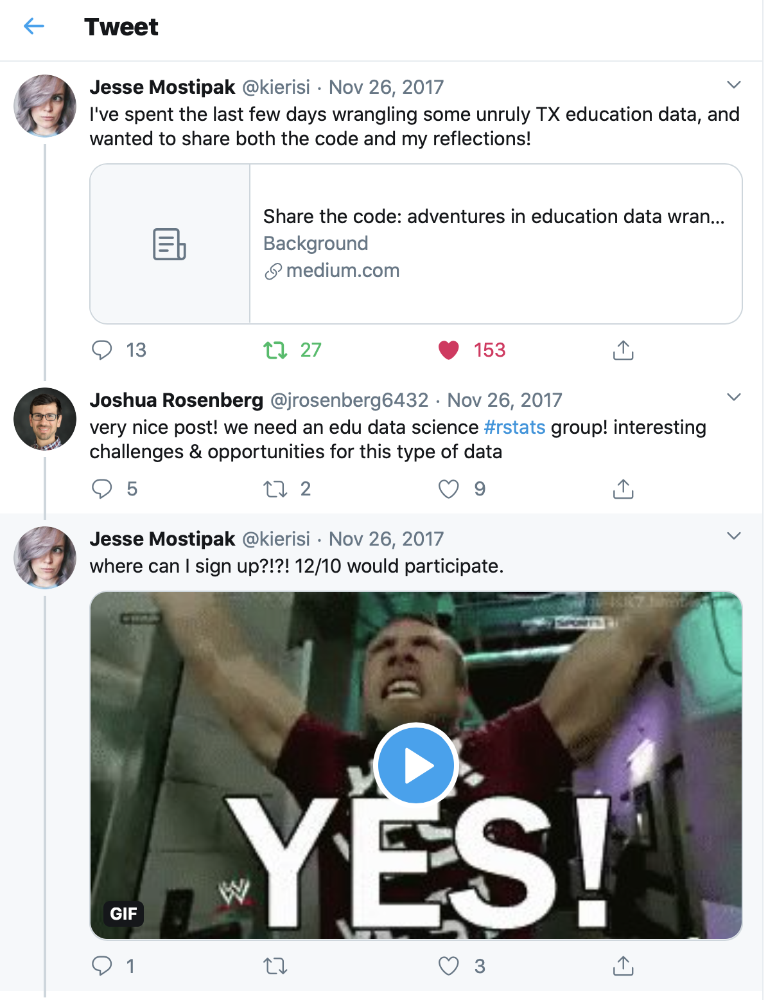

--- 
title: "Data Science in Education Using R"
subtitle: "Second Edition"
author: "Ryan A. Estrellado, Emily A. Freer, Joshua M. Rosenberg, and Isabella C. Velásquez"
site: bookdown::bookdown_site
output:
    bookdown::gitbook:
        number_sections: true
documentclass: book
bibliography: [book.bib, packages.bib]
biblio-style: "apalike"
link-citations: yes
github-repo: "data-edu/data-science-in-education"
description: "Bookdown for 'Data Science in Education Using R' by Ryan A. Estrellado, Emily A. Freer, Joshua M. Rosenberg, and Isabella C. Velásquez to be published by Routledge in 2024"
favicon: "favicon.ico"
url: "datascienceineducation.com/"
---

```{r include = FALSE, eval = TRUE}
# automatically create a bib database for R packages
# for packages

knitr::write_bib(c("bookdown", "tidyverse", "dplyr", "tidyr", 
                 "ggplot2", "sjPlot", "lme4", "ggraph", "tidygraph", 
                 "caret", "readxl", "here", "lubridate", "dummies",
                 "janitor", "dataedu", "tidyverse", 
                 "statnet", "amen", "ergm", "rJava", "tabulizer", 
                 dataedu:::dataedu_packages), "packages.bib")

library(RefManageR)

b <- ReadBib('book.bib')
b_packages <- ReadBib('packages.bib')

b <- sort(b)
b_packages <- sort(b_packages)

WriteBib(b, "book.bib")
WriteBib(b_packages, "packages.bib")
```

# Welcome {-}

> 📘 Notice!
> 
> This is the website for the second edition of Data Science in Education Using R. For the first edition, visit [datascienceineducation-1ed.netlify.app/](https://datascienceineducation-1ed.netlify.app/)

Welcome to Data Science in Education Using R! Inspired by {bookdown}, this book is open source. Its contents are reproducible and publicly accessible to people worldwide. The online version of the book is hosted at [datascienceineducation.com](https://datascienceineducation.com/).

```{r, echo = FALSE}
knitr::include_graphics("dsieur-cover-routledge.jpg")
```

## Prologue {-}

There’s this story going around the internet about an eagle egg that hatches on a chicken farm. The eagle egg hatches near the chicken eggs. The local hens are so busy doing their thing that they don’t notice the baby eagle egg is not their own. The eagle chick is born and, having no knowledge of its own eagleness, joins its new family on a nervous and exciting first day of life. Over the next few years the baby eagle lives as chickens live. It eats chicken feed, learns to fly in short, choppy hops, and masters the rapid head jabs of the chicken walk. 

One day, while strutting around the chicken farm, the young eagle sees something soaring through the sky. The flying creature has long wings, which it stretches wide before tucking them in and angling downward to dive toward the earth. The sight of this other-worldly bird stirs something in the young eagle. 

Over the next few weeks, the eagle can’t shake the vision of the soaring bird from its mind. At feeding time, it wonders out loud, “What if we tried to fly more than two feet off the ground?” The other chickens stare back. The young eagle isn't sure if these stares are ambivalence or the default chicken eye position. So, it begins to ponder the only way forward. It must learn to fly high while living with its chicken family.

This is both a book for educators and a book about learning to program in R. It’s for folks who feel at home in the education community but are also wondering how to use data better. It’s about being an educator and wondering if it’s too late to learn to code. And it’s about being an educator learning to code and wondering if there are others to learn with. 

We were on social media a lot in November of 2017. We talked about things like debugging code, interpreting model coefficients, and working on spreadsheets with too many rows. We kept coming back to these topics over and over again. It was like having an obscure hobby with online friends because it’s hard to find local knitters who only knit Friends characters or vinyl collectors who only collect Swedish disco albums. 

When you work as a data science consultant in education or as an educator learning data science, it’s hard to find a professional community that gets you. Attending education conferences is great, but the eyes glaze over when you talk about regression models. The data science conferences are super, but folks leave the cocktail table when you vent about the state of aggregate test score data. 

We started talking about data science in education online because we wanted to be around folks who do data science in education. We wrote this book for you, so you can learn data science with datasets you can find in education work. We don’t claim to be experts at education or data science, but we’re pretty good at talking about what it’s like to do both in a meaningful way. 

So give your chicken family a big hug, open up your laptop, and let’s start learning together. Turns out, there are a lot more hatchlings wanting to be eagles and chickens at the same time.

```{r, fig.cap = "The Tweet That Started It All", echo = FALSE}

```

## Acknowledgements {-}

This work was supported by many individuals from the [DataEdu Slack channel](https://dataedu.slack.com/) (https://dataedu.slack.com/). Thank you to everyone who contributed code, suggested changes, asked questions, filed issues, and even designed a logo for us: Daniel Anderson, Abi Aryan, Jason Becker, William Bork, Jon Duan, Ben Gibbons, Erin Grand, Ellis Hughes, Ludmila Janda, Jake Kaupp, Nathan Kenner, Zuhaib Mahmood, David Ranzolin, Kris Stevens, Bret Staudt Willet, and Gustavo Velásquez.

Thank you to the data scientists in education who took the time to share their stories with us: Isabella Fante, LaCole Foots, Tobie Irvine, Arpi Karapetyan, John LaPlante, and Andrew Morozov. 

Thank you to Hannah Shakespeare, the editor of this book at Routledge. We appreciated Hannah’s incisive, constructive feedback, interest, and support for the book and our unique approach to writing it - one that involved writing the book "in the open" (through GitHub) and sharing it on a freely available website.

## Dedications {-}

Emily:

> To my husband, Dan, who supports me every day and has believed in this book from day one. To my family and to Gus, who accompanied me on the journey.

Ryan:

> To my wife, Lucy, and my sons, Dylan and Adam, for enduring so much typing during dinner. And to Dan Winters, for enduring so many plots over coffee.

Jesse:

> To Mara and Sharla, for supporting me and cheering me on and reminding me that no matter how challenging it seemed, I could do the thing. To Hadley, for the retweet that changed my life and made this book possible. To Miriam, for the compassion and guidance and inspiration. And to Leo, Miles, Abby, and Jinx, who have all been a part of this journey with me.

Josh: 

> To Katie and Jonah and to Teri, Joel, Aaron, and Jess, who took an interest in it from its beginning through its completion. 

Isabella:

> To my loving family, in particular my older brother Gustavo E., who never tells me to go read the manual.

## Citation {-}

If you would like to cite this book, please use the citation below:

> Estrellado, R. A., Freer, J., Rosenberg, J. M., & Velásquez, I. C. (2020). *Data science in education using R, 2nd edition*. London, England: Routledge. *Nb.* All authors contributed equally. 

## Purchasing the book {-}

Purchase the book via:

- [Routledge](https://www.routledge.com/Data-Science-in-Education-Using-R/Estrellado-Freer-Mostipak-Rosenberg-Velasquez/p/book/9780367422257)
- [Amazon](https://www.amazon.com/Data-Science-Education-Using-R/dp/0367422255/ref=sr_1_2?dchild=1&keywords=data+science+in+education+using+r&qid=1593880609&sr=8-2)
- Your local or independent bookseller
